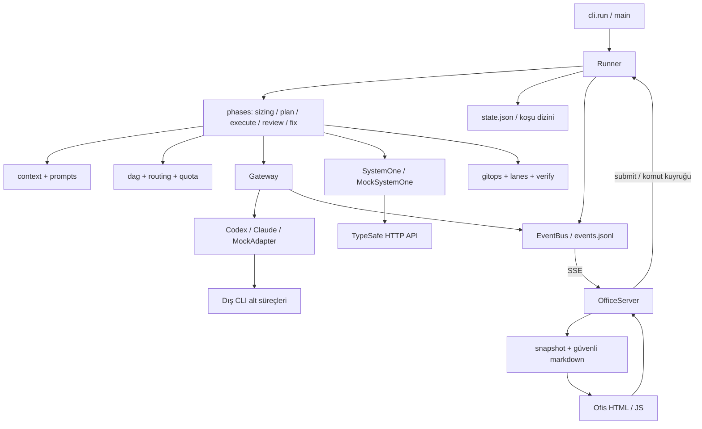
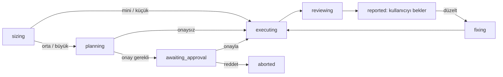

# JEV — AI Project Map / Codebase Guide

> İnceleme tarihi: 1 Ekim 2026. Bu rehber bu klasördeki **mevcut kaynak kodun** haritasıdır; dış sağlayıcıların güncel ürün belgeleri değildir. Önce görev yönlendirme tablosunu, sonra ilgili modülün açıklamasını ve sembol dizinini okuyun. Kod kopyaları yerine dosya, sembol, sözleşme ve etki alanı gösterilir.

## İçindekiler

1. [Hızlı kullanım ve değişiklik yönlendirmesi](#1-hızlı-kullanım-ve-değişiklik-yönlendirmesi)
2. [Amaç, kapsam ve mimari](#2-amaç-kapsam-ve-mimari)
3. [Klasörler ve giriş noktaları](#3-klasörler-ve-giriş-noktaları)
4. [Başlangıç ve koşunun uçtan uca akışı](#4-başlangıç-ve-koşunun-uçtan-uca-akışı)
5. [Modüllerin görevleri ve önemli semboller](#5-modüllerin-görevleri-ve-önemli-semboller)
6. [Veri sözleşmeleri ve kalıcı kayıtlar](#6-veri-sözleşmeleri-ve-kalıcı-kayıtlar)
7. [API, oturumlar ve dış araçlar](#7-api-oturumlar-ve-dış-araçlar)
8. [Canlı ofis arayüzü](#8-canlı-ofis-arayüzü)
9. [Önemli işlem zincirleri](#9-önemli-işlem-zincirleri)
10. [Hata teşhis rehberi](#10-hata-teşhis-rehberi)
11. [Değişikliklerin yayılma alanı ve yeni özellikler](#11-değişikliklerin-yayılma-alanı-ve-yeni-özellikler)
12. [Kritik bağlantılar ve korunacak davranışlar](#12-kritik-bağlantılar-ve-korunacak-davranışlar)
13. [Test haritası ve doğrulama](#13-test-haritası-ve-doğrulama)
14. [Dokümantasyonun güncel tutulması ve sınırları](#14-dokümantasyonun-güncel-tutulması-ve-sınırları)
15. [Kaynak dosya envanteri](#15-kaynak-dosya-envanteri)
16. [Python modül, sembol ve ters bağımlılık dizini](#16-python-modül-sembol-ve-ters-bağımlılık-dizini)
17. [JavaScript fonksiyon dizini](#17-javascript-fonksiyon-dizini)
18. [Doğrudan çözümlenebilen Python çağrıları](#18-doğrudan-çözümlenebilen-python-çağrıları)

## 1. Hızlı kullanım ve değişiklik yönlendirmesi

Bir yapay zekâ için önerilen çalışma şekli:

1. Bu belgenin tamamını her görevde okumayın. Bölüm 1'den ilgili modülü seçin; bölüm 16–18 içinde yalnız o dosya/sembolü arayın. İsteğin **JEV orkestratörüne mi, JEV'nin ürettiği hedef projeye mi** ait olduğunu belirleyin. Bu rehber orkestratörü anlatır.
2. Aşağıdaki tablodan en dar giriş noktalarını seçin. İlgili dosyaları ve bu rehberin ters bağımlılık dizinini okuyun.
3. Değişen alanın veri sözleşmesini, promptunu, kullanıcı ayarını, olay tüketicisini ve testini birlikte kontrol edin.
4. Sembolü bulmak için kaynakta `rg -n 'sembol_adı' jev tests tools` kullanın. Dizindeki satırlar bu incelemenin konumlarıdır; sonraki değişikliklerde kayabilir.
5. Yalnızca ilgili kodu derinlemesine okuyun; dinamik çağrılar ve güncellik için kaynak kodu son otorite sayın.

| İstek / özellik | İlk bakılacak dosya ve semboller | Birlikte kontrol edilecek yerler |
|---|---|---|
| Komut, bayrak, Türkçe komut eşanlamı | `jev/cli.py`: `Args`, `parse_args`, `main`, `HANDLERS` | `runner.parse_command`, `HELP_TEXT`, `README.md`, `tests/test_cli.py` |
| Yeni koşu, proje seçimi, dal oluşturma | `runner.prepare_project`, `create_run` | `state.new_state`, `ProjectLock`, `gitops.init_repo`, `start_branch` |
| Login / oturum sorunu | `adapters/base.py`: `AgentAdapter.classify`; `adapters/claude.py`, `adapters/codex.py` | `varsayilan.toml` `[kota].oturum_kaliplari`, `cli._login_hint`, `phases/common.call_fixed`, `execute.conclude` |
| TypeSafe API isteği, anahtar, yeniden deneme | `systemone.SystemOne._post`, `ask`, `parse_answers` | `[jev.model]`, `sizing.questions`, `brain.jev_decide`, `execute._jev_picker`, `acceptance` |
| Ofis API isteği / erişim anahtarı | `office/server.py`: `_Handler`, `OfficeServer.check_key` | `office/static/office.js`: `api`, `command`, `connect`; `snapshot.py` |
| Kayıt / veritabanı sorunu | `state.save_state`, `load_state`, `index_update`; `util.atomic_write_json` | `Runner.save`, `quota.QuotaBook`, `events.EventBus`, `systemone._record`, `Gateway._record_usage` |
| Ölçek, maliyet, efor, mini/küçük davranışı | `phases/sizing.py`, `config.Config.profile`, `cap_effort` | `[olcek.*]`, `routing.choose_agent`, `plan.raise_scale`, `review.pick_reviewer` |
| Plan, görev kartları, sözleşmeler | `phases/plan.py`, `dag.validate_tasks`, `context.plan_prompt`, `worker_prompt` | `tools/sema_uret.py`, `schemas/plan.schema.json`, `prompts/plan.md`, `isci_gorev.md` |
| Ajan seçimi, öncelik, kota dengesi | `routing.candidates`, `ordered_ready`, `choose_agent` | `[yonlendirme]`, `execute._jev_picker`, `parallel._choose`, `quota.py` |
| Görev çalıştırma / sonuç kabulü | `phases/execute.py`: `begin`, `work`, `conclude`, `verify_task`, `acceptance` | `Gateway.call`, `worker_result` şeması, `lanes.py`, `brain.py`, `verify.py` |
| Bir fonksiyon nereden çağrılıyor? | Son bölümdeki doğrudan çağrı dizini ve modülün ters bağımlılıkları | Callback ve `run.*` çağrılarını ayrıca arayın; `Runner.drive` aşama tablosuna bakın |
| Test komutları yanlış başarılı sayılıyor | `verify.run_command`, `_PRELUDE`, `_EPILOGUE` | `execute.worker_checks`, `verify_task`, `review.collect_checks`, `fresh_rows` |
| Aynı anda işler / worktree / birleştirme | `phases/parallel.py`, `lanes.py`, `execute._integrate`, `_carry` | `gitops.worktree_*`, `squash_merge`, `carry`, `dag.link_shared_files` |
| Hata kararları, bölme, yeniden atama | `phases/brain.py`: `consult`, `apply_decision`, `_apply_split`, `_apply_revise` | `jev_decision` şeması, `jev_karar.md`, `routing`, `lanes.rollback` |
| Duraklatma, Ctrl+C, çökme sonrası devam | `Runner.pause`, `interrupted`, `prepare_resume`, `mark_crashed` | `lanes.rollback`, `sweep`, `state.ProjectLock`, `cli.cmd_devam` |
| Güvenlik kuralı / yanlış koruma alarmı | `guard.check_command`, `check_tool`, `check_codex_item` | `kanca.py`, adaptörler, `GuardWatcher`, `execute.verify_task`, `test_guard.py` |
| Rapor, kanıt, yedek denetçi | `phases/review.py`: `run_review`, `pick_reviewer`, `authorship`, `text_diff`, `publish_report` | `context.review_prompt`, `denetim.md`, `review` şeması, `snapshot.report_view` |
| Görsel/PDF/video kareleri veya sonucu açma | `review.make_frames`, `_frames_of`, `outputs`, `open_result` | `machine.remotion_browser`, `_browser`, `_tool`, `[sinirlar].denetim_karesi` |
| Düzeltme turu | `phases/fix.py`: `start_fix`, `run_fix`, `single_fix` | `Runner.submit`, `session`, `duzelt.md`, `snapshot`, `office.js.fixBox` |
| Ofiste yanlış görev/ajan görünümü | `snapshot.build`, `_normalize_state` | `office.js.handleEvent`, `renderAll`, `normalizeState`, `onTaskUpdate`, `onAgentState` |
| Ofis tasarımı, karakter, yürüyüş | `office/static/office.js`, `scene.js`, `characters.js`, `office.css` | `index.html` DOM kimlikleri, `JevScene`, `JevChars` dışa açılan nesneleri |
| Prompt / ortak yardımcı kurallar | `context.py`, `prompts/*.md` | Kullanıcı `JEV_HOME/prompts/<ad>.md` geçersiz kılmaları, şemalar, `machine.environment_text` |
| Kurulu araç bulma, PATH, ortak kaynaklar | `machine.py`, `util.refresh_path`, `discovery.find_cli` | `context.environment_text` kullanımları, `review._tool`, `kur.ps1` |
| Yeni ayar veya varsayılan | `varsayilan.toml`, `config.validate_config`, `_validate_scales` | `unknown_keys`, `Config` erişim metotları, kullanan modül, README ayar tablosu |
| Kuru senaryo / entegrasyon testi | `adapters/mock.py`, `mock/senaryo_*.json` | `tools/senaryo_uret.py`, `mock/sablonlar`, `MockSystemOne`, `tests/_ortak.py` |
| Kurulum / dağıtılan pakette eksik kaynak | `pyproject.toml`, `tools/paketle.py`, `kur.ps1` | `__init__.__version__`, `test_paketle.py`, package data envanteri |

**Login ve veritabanı ayrımı:** JEV'nin kendi kullanıcı üyelik sistemi, parola tablosu, ORM'si veya SQL veritabanı yoktur. Login, dış CLI'ın oturumudur; TypeSafe için ortam değişkenindeki anahtardır; ofis için süreç başına üretilen erişim anahtarıdır. `mock/sablonlar/store*.py.sablon` dosyaları hedef uygulama örneğidir, JEV'nin kayıt katmanı değildir.

## 2. Amaç, kapsam ve mimari

JEV, doğal dilde verilen yazılım/çıktı üretme isteğini ajanlara yaptıran, Windows odaklı bir yerel **çok ajanlı yazılım ofisi**dir. Python orkestratörü işin boyunu ölçer, gerekirse plan ve görev kartları hazırlatır, ajan seçer, kod/araştırma işlerini yürütür, doğrular, görev commit'lerini oluşturur ve rapor yayınlar. Kullanıcı terminalden veya yerel canlı ofis arayüzünden izler ve komut verir.

Çalışma zamanı Python 3.11+ ve standart kütüphanedir; `pyproject.toml` bağımlılık listesi boştur. Web arayüzü frameworksüz HTML/CSS/JavaScript ve SVG'dir. Sunucu `http.server`, canlı yayın Server-Sent Events (SSE), doğrudan model istemcisi `urllib.request`, paralellik `threading` kullanır. Dış araçlar kurulu oldukları ölçüde kullanılır; Python paket kataloğundaki araçlar JEV'nin zorunlu paket bağımlılıkları değildir.

| Katman | Sorumluluk | Temel dosyalar |
|---|---|---|
| Kullanıcı girişi | Komut satırı, terminal, ofis komutları | `cli.py`, `terminal.py`, `office/server.py` |
| Orkestrasyon | Yaşam döngüsü ve aşamalar | `runner.py`, `phases/*.py` |
| Politika | Ölçek, grafik, aday seçimi, kararlar, kota | `config.py`, `dag.py`, `routing.py`, `quota.py`, `phases/brain.py`, `sizing.py` |
| Model sınırı | CLI çağrıları ve TypeSafe soruları | `gateway.py`, `adapters/*.py`, `systemone.py` |
| İşlem ve kayıt | Git, doğrulama, worktree, JSON, olaylar | `gitops.py`, `verify.py`, `lanes.py`, `state.py`, `util.py`, `events.py` |
| Bağlam ve sözleşme | Prompt, şema, plan/görev/rapor yapısı | `context.py`, `prompts/`, `schemas/`, `sema.py` |
| Sunum | API görünümü, rapor HTML'i, animasyonlu ofis | `office/snapshot.py`, `office/md.py`, `office/static/` |

Varsayılan ajanlar ayardan gelir: Opus planlayıcı/beyin/eskalasyon (`claude`), Sol işçi/denetçi (`codex`), Sonnet işçi (`claude`), Luna işçi (`codex`). TypeSafe Jev modeli bu dört CLI ajanından ayrı bir karar istemcisidir. Kodun belirli model adlarına değil rol ve sağlayıcıya göre çalışması amaçlanır; yine de bilinen ajan/sağlayıcı listeleri ve bazı şema enum'ları sabittir.

## 3. Klasörler ve giriş noktaları

| Konum | İşlev / ne zaman okunur |
|---|---|
| `jev/` | Uygulamanın kurulabilir Python paketi ve dağıtılan kaynakları |
| `jev/phases/` | İş akışının aşamaları ve sorun kararları; davranış değişikliklerinin çoğu burada |
| `jev/adapters/` | Dış CLI protokolleri, süreç kontrolü ve sahte ajan |
| `jev/office/` | Yerel sunucu, görünüm DTO'ları ve Markdown dönüştürücü |
| `jev/office/static/` | Ofis ekranı, SVG sahne/karakterler, animasyon ve API istemcisi |
| `jev/prompts/` | Altı rol/iş akışı şablonu; değerleri `context.py` doldurur |
| `jev/schemas/` | Beş yapılandırılmış model çıktısı şeması; üretim kaynağı `tools/sema_uret.py` |
| `jev/mock/` | Üç kuru senaryo JSON'u ve `sablonlar/` hedef ürün örnekleri |
| `tests/` | `unittest` testleri, ortak izolasyon, kuru entegrasyon/çökme/paralellik testleri |
| `tools/` | Paketleme arka ucu, şema üretimi, varsayılan senaryo üretimi |
| `docs/` | Belirtim, tasarım kararları, geliştirme durumu ve tarihli CLI bulguları |
| `docs/cli-yardim/` | Codex ve Claude komutlarının kayıtlı yardım çıktıları; canlı CLI sürümü için garanti değildir |
| `__pycache__/`, `*.pyc` | Üretilmiş Python önbelleği; mimari kaynağı değildir. Kaynağı olmayan eski `.pyc` adları mevcut modül kanıtı sayılmaz |
| `pyproject.toml` | Metadata, Python alt sınırı, bağımlılıklar, `jev = jev.cli:run`, yerel build backend |
| `kur.ps1` | Python seçimi, çevrimdışı editable kurulum, isteğe bağlı kullanıcı PATH değişikliği ve sürüm kontrolü |
| `.gitattributes` | Git metin/satır sonu politikası |
| `README.md` | Kullanıcı kurulum/komut/ayar/güvenlik rehberi |
| `AI_PROJECT_MAP.md` | Bu navigasyon rehberi; çalıştırılan uygulama kodu değildir |

**İki giriş noktası:** kurulu `jev` komutu `pyproject.toml` üzerinden `jev.cli:run` çalıştırır. `python -m jev` / `py -m jev` ise `jev/__main__.py` → `cli.run` yolunu izler. `jev/__init__.py` sürümü tanımlar. Claude güvenlik kancasının ayrı süreç girişi `jev/kanca.py` → `guard.main`'dir.

`tools/sema_uret.py` ve `tools/senaryo_uret.py` uygulama başlarken otomatik çalışmaz; geliştirme araçlarıdır. Paketleme `tools/paketle.py` PEP 517/660 arka ucuyla yapılır; setuptools bağımlılığı yoktur. Wheel `jev/` kaynaklarını içerir; sdist ayrıca test, araç ve dokümanları taşır. Editable kurulum, `JevFinder` içeren bulucu ve `.pth` ile yalnızca `jev` paketini depodan yükler.

## 4. Başlangıç ve koşunun uçtan uca akışı

### 4.1 Yeni koşu başlangıç sırası

1. `cli.run()` Windows Ctrl+Break davranışını kurar, `main()` çağırır ve çıkış kodunu döndürür.
2. `Terminal` konsol kodlamasını/renk desteğini hazırlar. `parse_args()` bayrakları ayrıştırır. Yardım ve sürüm gibi erken yollar ayar yüklemeden dönebilir.
3. `load_config()` paket varsayılanını, kullanıcı `JEV_HOME/jev.toml` dosyasını ve varsa programatik overrides'ı birleştirir; bilinmeyen anahtar ve geçersiz değerleri denetler.
4. `cmd_new()` isteği alır ve `create_run()` çağırır. `prepare_project()` yeni proje açar veya mevcut depo kökünü/temizliğini kontrol eder. Yeni veya Git'siz proje için ilk commit oluşturulur.
5. `new_run_id()` ve `new_state()` oluşturulur. `ProjectLock` alınır; `.jev/` Git exclude'a eklenir; `origin_branch`, `base_commit` kaydedilir; `jev/<run_id>` dalı açılır. Hazırlık kilidi bırakılır.
6. `<hedef-proje>/.jev/runs/<run_id>/state.json` ve kullanıcı koşu dizini yazılır. `Runner` kurulur: `EventBus` geçmişi yükler, kota defteri açılır, iptal olayı/komut kuyruğu oluşturulur, varsa `plan.json` okunur, `Gateway` ve `SystemOne` seçilir.
7. `cli._run_session()` → `Runner.open()` oturum kilidini alır; `GuardWatcher` başlar; ayara göre `OfficeServer` başlar ve tarayıcı açılır. CLI adaptörleri ilk ihtiyaçta `Gateway.adapter()` ile tembel oluşturulur.
8. `Runner.session()` terminal girdi okuyucusunu başlatır; `drive()` mevcut aşamanın fonksiyonuna geçer.
9. Oturum biterken `close()` koruma izleyicisini durdurur, sunucuyu kapatır, `ui_url` temizler, durumu kaydeder, olay dosyasını kapatır ve kilidi bırakır.

Kilit alınamazsa `_run_session()` yalnızca olay kanalını kapatır; başka süreçteki koşunun durumunu yanlışlıkla ezmemek için `Runner.close()` çağrılmaz.

### 4.2 Aşama makinesi

`Runner.drive()` tablosu aşamaları `phases.sizing.run_sizing`, `plan.run_plan`, `plan.await_approval`, `execute.run_execute`, `review.run_review`, `fix.run_fix` ile eşler. Eski `decomposing` durumu da `run_plan`'a yönlendirilir; mevcut kaynakta ayrı bir decompose modülü yoktur. `RunPaused`, `RunAborted`, `KeyboardInterrupt` akışı duraklama/iptal/kesinti olarak sonlandırır.

### 4.3 Ölçek ve plan

`run_sizing()` seçimi şu öncelikte yapar: `--olcek` → istekte açık ifade → Jev modeli → kelime kuralı. Boy (`mini/kucuk/orta/buyuk`) işlem törenini; zorluk (`kolay/orta/zor`) işçi havuzu ve görev karmaşıklığını belirler. `pick_level()` ölçek olasılıklarının kümülatif toplamı eşiği geçen en küçük seviyeyi seçer. Model yanıtı yoksa yeni proje varsayılanı küçük, mevcut proje orta olur.

Mini/küçük için `synthetic_plan`, `single_task`, `setup_single_task` tek `T01` hazırlar: planlayıcı çağrılmaz ama ofis/rapor için küçük bir plan kaydı vardır. İşçi doğrulama komutlarını üretir (`verify_from_worker`). Orta/büyükte `run_plan()` plan, ihtiyaç, sözleşme ve kartları **tek çağrıda** alır; `Gateway` JSON biçimini, `dag.validate_tasks()` anlamsal grafiği doğrular. Hata listesiyle sınırlı onarım yapılır. `link_shared_files()` okuma/yazma çakışmalarını bağımlılığa dönüştürür. Ortak `AGENTS.md`/`CLAUDE.md` bağlamı hedef projeye yazılır ve commit edilir.

`plan.raise_scale()` planlayıcının ölçek artırma önerisini uygular; kullanıcı bayrağı/açık ifadesi üstün kalır. Büyük işte profil plan onayı ister; kuru koşuda otomatik profil onayı uygulanmaz. Açık `--onay` davranışı ayrıca kontrol edilmelidir.

### 4.4 Uygulama, rapor ve düzeltme

`routing.refresh()` bağımlılığı biten görevleri hazır eder. `ordered_ready()` kritik yol ağırlığı, karmaşıklık ve liste sırasıyla seçer. `choose_agent()` zorlanan ajanı, aday havuzunu, tür/boy listelerini, başarısız ajanları ve kota durumunu dikkate alır; eşdeğer alternatiflerde sağlayıcı dengesi uygular. Birden çok serbest aday varsa `_jev_picker()` TypeSafe'e sorabilir; geçersiz/düşük güvenli seçimde kural kalır.

Bir deneme `begin()` → `work()` → `conclude()` biçimindedir. İşçi sonucu tek başına başarı kanıtı değildir: `verify_task()` JEV'nin kendi komutlarını çalıştırır, Git ve dosya değişikliklerini inceler. Başarı bir görev commit'ine dönüşür. Sorun `brain.handle_problem()` ile karara gider; kota ve auth önce kural katmanında ele alınır.

`review.run_review()` tüm doğrulama komutlarını toplar, uygun taze sonuçları yeniden kullanır, raporu üretir. Mini/küçükte raporu `jev_report()` kodla hazırlar; diğer ölçeklerde denetçi kanıt paketini yorumlar. `publish_report()` raporları kaydeder ve `reported` aşamasına geçer. Akış kullanıcı isteği olmadan yeni düzeltme turu açmaz.

`fix.start_fix()` yalnızca `reported` aşamasında, not veya eksik varsa tur numarasını artırır. Mini/küçük `single_fix()` ile tek kart açar. Diğer ölçeklerde planlayıcı `D<düzeltme-no>-NN` kartları üretir; doğrulama ve bağımlılık bağlama sonrası uygulama/rapor tekrar eder.

## 5. Modüllerin görevleri ve önemli semboller

Bu bölüm karar vermek için açıklamalı haritadır. Daha küçük yardımcılar, metotlar, satır konumları ve ters bağımlılıklar bölüm 16'dadır.

### 5.1 Kullanıcı girişi, ayar ve yaşam döngüsü

| Dosya | Önemli semboller ve görevleri | Ana bağlantılar |
|---|---|---|
| `jev/cli.py` | `Args` komut verisi; `parse_args` elle bayrak ayrıştırma; `main` komut seçimi/hata kodu; `cmd_new/devam/duzelt/ofis/durum/rapor/ajanlar/gecmis` işlemler; `_run_session` açma/kapatma; `_live_owner` canlı süreç kontrolü; `_agent_test` bağlantı denemesi | `Config`, `Runner`, `state.find_run`, `QuotaBook`, `discovery`, `SystemOne` |
| `jev/config.py` | `Config` ayar erişimi, rol ve ajan özellikleri, ölçek profilleri, efor/süre/paralel sınırları; `unknown_keys`, `deep_merge`, `validate_config`, `_validate_scales`, `load_config` | `varsayilan.toml`, kullanıcı TOML, `util.jev_home/expand_path`; hemen tüm davranış katmanı |
| `jev/runner.py` | `Runner` ortak koşu nesnesi; `save/set_phase` kayıt/geçiş; `open/close/start_office` yaşam döngüsü; `drive/session` aşama/komut yürütme; `submit` arayüz komut geçerliliği; `pause/abort/interrupted/prepare_resume/mark_crashed` devam politikası; `GuardWatcher` kanca kayıtlarını olaya çevirir | `Gateway`, `EventBus`, `QuotaBook`, `ProjectLock`, `SystemOne`, `lanes`, tüm aşamalar |
| `jev/terminal.py` | `setup_console` UTF-8 ve Windows VT; `Terminal.line` kilitli çıktı; `header/info/ok/warn/error/dim` sunum; `AGENT_COLORS` | CLI/Runner; `tests._ortak.QuietTerminal` sessiz test karşılığı |
| `jev/util.py` | `now/iso/parse_iso/local_hhmm/clock` zaman; `suffix/ek` Türkçe ek; `slugify`; `atomic_write_text/json`, `read_json`, `append_jsonl/read_jsonl`, kuyruk metni yardımcıları; `jev_home`, `expand_path`, `pid_alive`, `refresh_path` | Ortak altyapı; dosya kaydı, süreç canlılığı, ortam, ofis ve terminal |

### 5.2 Aşamalar ve görev politikası

| Dosya | Önemli semboller ve davranış | Değişiklik bağlantısı |
|---|---|---|
| `phases/common.py` | `RunPaused`, `RunAborted`, `Unavailable`; `RUNTIME_DEFAULTS`, `init_task`; `task_event`; `wait_or_pause`; `call_fixed` sabit rollü çağrıların kota/oturum/tekrar politikası | Yeni runtime görev alanı, event alanı veya hata türü bu dosyayı etkileyebilir |
| `phases/sizing.py` | `phrase_hits/rule_level/rule_difficulty`, `pick_level`, `project_info/questions`, `run_sizing`; `flow_note/flow_phases/announce`; `synthetic_plan/single_task/setup_single_task`; `should_escalate/escalate`; `record_history/history_examples` | Config profilleri, ofis akış şeridi, mini doğrulaması, geçmiş JSONL |
| `phases/plan.py` | `run_plan` plan ve kart çıktısını ayırır, grafiği doğrular, kaydeder; `raise_scale` ölçek artırır; `await_approval` terminal/ofis onayını bekler | `context`, `dag`, `common.call_fixed`, ortak hedef proje bağlamı |
| `phases/execute.py` | `run_execute/parallel_limit/wants_lanes/_run_sequential` uygulama döngüsü; `Job` bir deneme; `begin/work/conclude/attempt`; `verify_task/worker_checks`; `_succeed` commit; `_integrate/_carry` paralel birleştirme; `acceptance/_not_accepted`; `_jev_picker` modelle dağıtım | Çekirdek kodlama/doğrulama hattı; `lanes`, `routing`, `brain`, `Gateway`, guard, Git |
| `phases/parallel.py` | `run_parallel` görev iş parçacıklarını sürdürür; `_prepare` ana ağacı hazırlar; `_dispatch/_choose` serbest ajan ve dosya uygunluğu; `_work` ajan/doğrulama; `_collect` sonucu ana iş parçacığında uygular; `_stop` iptal eder; `_NoLanes` seri çalışma dönüşü | `execute.Job/begin/work/conclude`, `lanes`, `routing`; bir ajan aynı anda tek iş alır |
| `phases/brain.py` | `handle_problem/consult` karar kapısı; `jev_decide` sınırlı model soruları; `_text_brain` Opus/Sol; `simple_rule` son yedek; `apply_decision` karar uygulaması; `_apply_revise/_apply_split` kart değişimi; `_log` karar kaydı; `brain_limit/_count_call` sınır | Şema, `context.brain_prompt`, `systemone`, `dag`, `routing`, `lanes.rollback` |
| `phases/review.py` | `collect_checks/fresh_rows/run_review`; `pick_reviewer/set_reviewer/authorship`; `reviewer_review/jev_report`; `text_diff/make_frames`; `publish_report/latest_report/report_name`; `outputs/result_file/open_result`; `jev_appendix/run_hints` | Rapor şeması, Markdown, kare araçları, ofis rapor ekranı, düzeltme girişi |
| `phases/fix.py` | `nothing_to_fix/start_fix` tur açma; `run_fix` kartları doğrular ve ekler; `single_fix` mini/küçük alternatif | Kullanıcı komutu, önceki rapor, `tasks` şeması, mevcut görev grafiği |
| `jev/dag.py` | `validate_tasks` kimlik/bağımlılık/döngü/kapsam/sözleşme kontrolü; `norm_path`, `ancestors`, `link_shared_files`; `find_cycle`, `dependents_count`, `topo_order` | Plan, split, revise ve fix kartları; okunan/yazılan dosya eşleşmeleri |
| `jev/routing.py` | `Choice` ajan/efor/gerekçe/bekleme sonucu; `by_id`, `dep_status`, `refresh`, `ordered_ready`, `candidates`, `choose_agent`, `note_dispatch`, `progress` | Config, görev durumları, kota; model seçimi callback olarak enjekte edilir |

### 5.3 Çağrı sınırı, bağlam ve şema

| Dosya | Görev ve önemli semboller | Özel ayrıntı |
|---|---|---|
| `jev/gateway.py` | `Gateway.adapter` sağlayıcı seçimi; `check_allowed` rol koruması; `call` CallSpec kurma/olay/hata/kota; `_run`; `_ensure_schema` JSON onarımı; `_record_usage`; `ForbiddenCall` | **CLI ajan çağrılarının merkezi kapısıdır. TypeSafe çağrısı bunun dışındadır.** Adaptör ve kullanım/çağrı sayacı kilitleri vardır |
| `adapters/base.py` | `CallSpec`, `AgentResult`, `AgentActivity`, `ProcOutcome`, `AgentAdapter.classify`; `run_process`, `kill_tree`, `child_env`, `write_prompt/base_paths`; `command_activity` | stdin prompt, stdout JSONL, stderr dosyası; timeout/iptal/guard için tüm süreç ağacı sonlandırılır |
| `adapters/codex.py` | `CodexAdapter.exe/argv/run`; `CodexParser.feed/_item` Codex olaylarını etkinlik/sonuç/kullanıma dönüştürür | CLI output schema/out dosyası, olay öğesiyle guard, `kill_request` |
| `adapters/claude.py` | `ClaudeAdapter.exe/settings_path/argv/env/run`; `ClaudeParser.feed/usage`; `tool_activity`, `env_filter` | stream-json, `structured_output`, `rate_limit_event`; worktree başına ayrı hook settings |
| `adapters/mock.py` | `load_scenario/card/scenario_plan`; `MockAdapter.run` aşama seçimi; `_plan/_worker/_brain/_review/_fix/_repair`; `_step/_guard_step`; sayaç ve fallback yöntemleri | Gerçek modele gitmez; senaryodaki dosya/komut/guard/test adımlarını oynatır. Kuru çalışma hâlâ yerel dosya ve Git işlemleri yapar |
| `jev/systemone.py` | `choice/score/noul` soru kurucuları; `Answer`, `Result`; `parse_answers`; `SystemOne.ask/_post/_record`; `MockSystemOne`; `make` | TypeSafe doğrudan HTTP; ölçek, dağıtım, kabul ve sorun kararı için kullanılır |
| `jev/context.py` | `template/render/prompt`; `plan_prompt/mini_prompt/worker_prompt/brain_prompt/review_prompt/fix_prompt`; `deps_text/contract_text/criteria_text`; `plan_document`, `append_progress`, `write_shared_context/upsert_section`; not ve özet çıkarıcılar | İşçilere tüm repo verilmez: kartın reads/outputs/sözleşmeleri ve bağımlı iş özetleri verilir. Kullanıcı prompt dosyaları paket şablonunu geçersiz kılabilir |
| `jev/sema.py` | `load_schema`, `validate/_validate`, `extract_json`, `schema_text` | Harici jsonschema yok; desteklenen alt küme: type, enum, required, properties, additionalProperties, items, anyOf. Tam JSON Schema uygulaması değildir |
| `jev/discovery.py` | `CliInfo`, `_candidates/_package_caches`, `find_cli`, `cli_version` | Ayar yolu → PATH → bilinen masaüstü/paket önbellek konumları; sürüm sırasıyla aday seçimi |
| `jev/machine.py` | `TOOLS`, `PY_PACKAGES`; `_locate/_measure`; `environment/environment_text`; `catalog/catalog_topics/remotion_browser` | Ortam önbelleği, PATH değişimi ve süreyle yeniden bulma; GUI programlarını sürüm için açmaz |

### 5.4 Git, kayıt ve güvenlik

| Dosya | Önemli semboller | Korunacak bağ |
|---|---|---|
| `jev/state.py` | Aşama/durum sabitleri; `new_state`, `save_state/load_state`; `new_run_id/run_dir/jev_dir`; `ProjectLock`; `index_update/index_all/find_run`; `scale_level`; süre hesaplayıcıları | `state.json` devamın ana kaydıdır. Eski ölçek alanı olmayan koşu büyük sayılır; eski süre olay geçmişinden türetilir |
| `jev/events.py` | `EVENT_TYPES`; `EventBus.emit/subscribe/since/history/add_listener/close` | Seq atomik artar, JSONL flush edilir, her abonenin ayrı kuyruğu vardır; dinleyici hızlı olmalı ve yeni olay yaymamalıdır |
| `jev/quota.py` | `matches_any`, `parse_reset/epoch_reset`; `QuotaBook.mark/clear/until/available/all`; `log_unknown_error` | Gerçek kota kullanıcı klasöründe koşular arası paylaşılır; kuru kota koşuya özeldir |
| `jev/gitops.py` | `git/out`, depo/dal/HEAD yardımcıları; `identity_args`, `init_repo/ensure_exclude`; `checkpoint/rollback`; `commit_all/commit_paths/changes_since`; `file_tree/diff_stat/log_oneline`; worktree ve merge yardımcıları | Git subprocess merkezi; geçici kimlik kullanır, genel ayarı değiştirmez. `.jev` korunur. İşçi Git politikasıyla orkestratörün Git yetkisi farklıdır |
| `jev/lanes.py` | `lane_path/lane_branch`, `open_lane/close_lane`, `workdir/branch`, `rollback/sweep` | Bir görevin checkpoint'i şerit ağacındaysa geri alma ana projede çalıştırılamaz |
| `jev/verify.py` | `CmdResult`; `run_command`, `run_all`; BOM'lu geçici PowerShell betiği ve exit yorumlama | Kendiliğinden biten komut, iptal/süre aşımı, birleşik çıktı, son `False` satırını başarısız sayma |
| `jev/guard.py` | `Verdict`, `CATEGORY_TR`, `SERIOUS`; `classify_write/delete`, `scan_credentials`; komut parçalama yardımcıları; `check_command/check_tool/check_codex_item`; `record/hook_settings/main` | Claude için çağrı öncesi blok, Codex için başlamış işlemi durdurma; tam sandbox veya genel kabuk yorumlayıcısı değildir |
| `jev/kanca.py` | Dosya yolundan çalıştırılabilen küçük kanca başlatıcısı | Claude alt sürecinin paketi bulması ve `guard.main` çalıştırması |

### 5.5 Promptlar, senaryolar ve geliştirme araçları

| Kaynak | Tüketen / görevi |
|---|---|
| `prompts/plan.md` | `context.plan_prompt`: ihtiyaç, kısa/tam plan, sözleşme, kart ve araştırma tanımı |
| `prompts/isci_gorev.md` | `context.worker_prompt`: sınırlı görev kartı, reads/outputs, sözleşmeler, kabul ve doğrulama |
| `prompts/isci_mini.md` | `context.mini_prompt`: tek işçinin uçtan uca yapacağı iş, seçim/kurulum/çalıştırma notları |
| `prompts/jev_karar.md` | `context.brain_prompt`: sorun, geçmiş, mevcut ajanlar ve karar seçenekleri |
| `prompts/denetim.md` | `context.review_prompt`: kanıt, değişiklik metni, doğrulama ve karelere dayalı denetim |
| `prompts/duzelt.md` | `context.fix_prompt`: rapor eksikleri ve kullanıcı notundan düzeltme kartı |
| `mock/senaryo_varsayilan.json` | Standart kuru koşu, çeşitli başarısızlık/karar/düzeltme adımları; üreticisi `tools/senaryo_uret.py` |
| `mock/senaryo_mini.json` | Tek görevli mini akış; hesap makinesi örneği |
| `mock/senaryo_paralel.json` | Birbirinden bağımsız kartlar ve paralel koşu örneği |
| `mock/sablonlar/todo__*.py.sablon`, `cli*.sablon`, `store*.sablon`, `test_store*.sablon`, `test_uctan_uca*.sablon` | Üretilen yapılacaklar CLI ürününün örnek dosyaları; hatalı/temiz karşılıklar düzeltme akışını sınar |
| `mock/sablonlar/sicaklik*.sablon`, `uzunluk*.sablon`, `donustur*.sablon` ve testleri | Birim dönüştürme hedef ürün örnekleri |
| `mock/sablonlar/hesap*.sablon` | Mini HTML/JS hesap makinesi ve JS testi |
| `mock/sablonlar/README.md.sablon`, `test_smoke.py.sablon` | Hedef ürün belgesi ve basit kontrol |
| `tools/sema_uret.py` | `TASK`, `NEED`, `CONTRACT`, `SCHEMAS`, `obj`: tüm JSON şemalarının ortak üretim kaynağı |
| `tools/senaryo_uret.py` | Görev/plan/senaryo tanımları, `task/think/read/write/test/cmd` kurucuları; varsayılan senaryoyu üretir |
| `tools/paketle.py` | Metadata, RECORD/hash, wheel/editable/sdist oluşturma ve PEP build hook'ları |

Prompt değişikliği yalnız `.md` dosyasıyla sınırlı olmayabilir: `context.render` placeholder/koşullu bölümleri doldurur. Yeni placeholder için bağlam değerini de ekleyin. Kullanıcının aynı adlı prompt override'ı varsa paket değişikliği o kullanıcıda görünmeyebilir.

## 6. Veri sözleşmeleri ve kalıcı kayıtlar

### 6.1 Model çıktıları ve çalışma nesneleri

| Sözleşme | Temel alanlar | Üreten → tüketen |
|---|---|---|
| `plan.schema.json` | project_name, slug, summary, plan_markdown, stack, commands, modules, success_criteria, assumptions, out_of_scope, risks, conventions, scale, needs, contracts, tasks | Planlayıcı → Gateway/sema → plan.py/dag/context; `tasks` plan kaydından ayrılır |
| `tasks.schema.json` | tasks listesi; her kartta id, title, module, type, description, reads, outputs, contracts, acceptance, verify, depends_on, covers_criteria, complexity, suggested_agent, notes | Düzeltme planlayıcısı → fix.py; kart yapısı split/revise içinde de kullanılır |
| `worker_result.schema.json` | status (`done/blocked/failed`), summary, changed_files, verification, blocker, notes, follow_ups | İşçi → execute.work/verify_task/conclude; reported passed değeri bağımsız kontrolün yerine geçmez |
| `jev_decision.schema.json` | decision (`retry/reassign/split/revise/skip/pause/abort`), agent, effort, rollback, guidance, revised_task, new_tasks, rationale, deviation, report_note | Metin beyni → apply_decision; TypeSafe sonucu da aynı biçime çevrilir |
| `review.schema.json` | verdict (`basarili/kismen/basarisiz`), summary, report_markdown, criteria, gaps, risks, next_steps | Denetçi veya jev_report → publish_report → ofis/fix |
| `CallSpec` | agent/model/provider/prompt/cwd/mode/effort/timeout, şema, görev/tur, guard, cancel, images/tools/web | Gateway → CLI adaptörü |
| `AgentResult` | ok, structured, text, exit_code, usage, quota/reset/shared, error_kind/error_text, paths, guard | Adaptör → Gateway → ilgili aşama |
| `Job` | task/choice/deneme/checkpoint/prompt/workdir/paralel, sonuç/problemler/doğrulamalar/thread | execute.begin → work → conclude; parallel aynı modeli kullanır |
| `Choice` | agent, effort, reason, wait_until | routing → execute / parallel |
| `SystemOne.Answer/Result` | choice/score/noul değeri, probabilities, confidence; ok/error/usage | TypeSafe/mock → sizing/dispatch/acceptance/brain |
| Olay zarfı | seq, ts, run, type, data | EventBus → JSONL, terminal listener, SSE, snapshot ve office.js |

Kart şemasındaki alanlar model üretiminin sözleşmesidir; `common.init_task()` bunlara runtime alanları ekler. `state.tasks[]` içindeki status, agent, attempts, attempt_count, failed_agents, forced, guidance, checkpoint, commit, files, summary, decisions, origin, round, waiting_until gibi alanlar ilerleyen koşunun gerçek durumudur. Paralelde `lane={path,branch,base}`, devamda `keep_changes`, çatışmada `conflict_files/merge_conflicts` eklenir. Bunları modelin ham `tasks` çıktısıyla karıştırmayın.

### 6.2 Durumlar

Koşu durumları `state.RUN_PHASES`, terminal çevirileri `PHASE_TR`, çalışırken sayılan süre aşamaları `WORK_PHASES`, Runner etkin aşamaları `ACTIVE_PHASES` içindedir. UI da aynı kümelerin karşılıklarını tutar. `phase_since/work_s` onay, rapor ve duraklama beklemesini çalışma süresine katmaz.

Görev yolu genellikle `pending → ready → running → verifying → done` olur. Sorunda `needs_decision`; kotada `waiting_quota`; karar veya bağımlılık nedeniyle `split/skipped/failed/blocked` olabilir. `TERMINAL_TASK` kapanmış görev kümesidir. Atlanmış (`skipped`) bağımlılık sonraki kartı engellemez; failed/blocked engeller. Bölünen kartın bağımlıları alt kartlara yeniden bağlanır.

### 6.3 Depolama alanları

**JEV kaynak kökü**, **hedef proje kökü** ve **kullanıcı JEV_HOME** üç farklı konumdur. Varsayılan yeni hedef proje kökü `~/jev-projeler`; kullanıcı ayar/kayıt kökü `~/.jev`; koşu verileri hedef projenin `.jev/` klasörüdür. `JEV_HOME` değişkeni kullanıcı kökünü değiştirir.

| Yer / dosya | Yazan | Okuyan / kullanım |
|---|---|---|
| `JEV_HOME/jev.toml` | Kullanıcı | `config.load_config` |
| `JEV_HOME/kosular.json` | `state.index_update` | `find_run`, CLI geçmiş/durum, kullanım toplamı; koşu konum dizini |
| `JEV_HOME/kota.json` | `QuotaBook` | Sonraki koşular dahil ajan seçimi ve sabit rol bekleme |
| `JEV_HOME/olcek_gecmisi.jsonl` | `sizing.record_history` | `history_examples`: geçmiş sonuçlardan ölçek bağlamı; model eğitimi değildir |
| `JEV_HOME/bilinmeyen-hatalar.log` | `quota.log_unknown_error` | Tanınmayan CLI hatası metin günlüğü |
| `JEV_HOME/prompts/<ad>.md` | Kullanıcı | `context.template` öncelikli şablon |
| `JEV_HOME/kaynaklar/KATALOG.md` ve `kaynaklar/npm/...` | Harici/kullanıcı kaynak düzeni | `machine.catalog`, `catalog_topics`, `remotion_browser`; JEV otomatik paket kurulum listesi değildir |
| `JEV_HOME/ajan-testi/<zaman>/` | `cli._agent_test`, Gateway | CLI bağlantı denemesinin prompt/çıktı/kullanım kayıtları |
| `<proje>/.jev/lock` | `ProjectLock` | Aynı hedef projeyi tek JEV sürecinin yönetmesi; PID canlılığı kontrolü |
| `<proje>/.jev/runs/<id>/state.json` | `Runner.save → state.save_state` | `load_run`, resume, snapshot; **çalışma durumunun ana kaydı** |
| Aynı koşuda `plan.json`, `plan.md` | plan.py veya sizing.py | context, rapor, fix, ofis |
| Aynı koşuda `tasks.json` | plan.py | Planlayıcılı akışın başlangıç kart kaydı; mini/küçükte kart state içinde hazırlanır. Canlı durum/sonraki split/fix için `state.json` esas alınır |
| `progress.md` | `context.append_progress` | Tamamlanan işlerin okunabilir özeti |
| `events.jsonl` | `EventBus` | Seq geçmişi, yeniden bağlantı, snapshot ve çökme sonrası süre/ajan görünümü |
| `decisions.jsonl` | brain/context karar kaydı | Rapor eki, Jev log ekranı, sorun kök nedeni |
| `guard.jsonl` | guard.record / ayrı kanca süreci | GuardWatcher, görev güvenlik kontrolü, rapor eki |
| `usage.json` | Gateway ve SystemOne | Ajan/model token/çağrı/süre maliyeti; CLI ve ofis |
| `jev-model.jsonl` | SystemOne._record | Ölçek/dağıtım/kabul/karar yanıtları, güven ve hata |
| `report.json/md`, `report-2.json/md`… | `review.publish_report` | `latest_report`, CLI, snapshot, fix |
| `<proje>/.jev/son-rapor.md` | `publish_report` | Kullanıcının son raporu kolay bulması |
| `dogrulama-<tur>.json` | `run_review` | Turun son kontrol sonuçları |
| `kareler/tur-<N>/` | `review.make_frames` ve alt yardımcıları | Denetçiye verilen ekran/PDF/video/görsel kareleri |
| `dogrulama/` | `verify.run_command` geçici betikleri | Çalıştırma sırasında kullanılır; geçici `.ps1` dosyaları sonra kaldırılır; sonuç kuyrukları attempts/tur kaydına girer |
| `calls/<seq>-<phase>-<task>-<agent>.*` | Gateway/adaptör | `.prompt.md`, `.stdout.jsonl`, `.stderr.txt`, `.out.json`, `.result.json`; Codex gerektiğinde `.schema.json` |
| `jev-guard-settings*.json` | ClaudeAdapter.settings_path | Claude `--settings`; şerit proje yolu farklıysa farklı dosya |
| `kuru-sayac.json`, `kuru-kota.json` | MockAdapter / MockSystemOne / kuru QuotaBook | Kuru senaryonun devam sonrası aynı sırada sürmesi |
| `<proje>--jev-wt/<koşu-etiketi>-<görev>/` | lanes/gitops | Paralel kartların ayrı çalışma ağaçları; kullanıcı ayar klasörü değildir |

Atomik JSON/metin yazımı dosyanın yarım görünmesini azaltır; dosyalar arası transaction sağlamaz. `read_json` bozuk/kayıp dosyada varsayılan döndürebilir; `load_state` sözlük değilse açık hata verir. JSONL okuyucuları yarım/bozuk satırları ele alır; EventBus yeniden başlarken yarım son satırı kapatır. `tasks.json`, `state.json`, olay geçmişi ve koşu dizini aynı amaçla kullanılmaz.

## 7. API, oturumlar ve dış araçlar

### 7.1 TypeSafe

Doğrudan ağ bağlantısı `SystemOne._post()` içindedir. Depodaki varsayılan URL `https://api.typesafe.ai/v1/systemone`, model `jev-latest`, anahtar değişkeni `TYPESAFE_API_KEY`'dir; `[jev.model]` bunları değiştirir. POST gövdesi `state/model/questions`, başlık `Authorization: Bearer …`; yanıt `answers/model/usage` bekler. Bu ifadeler **kaynakta kayıtlı değerlerdir**, dış API'nin güncel uygunluk/sürüm garantisi değildir.

401/403 auth; 400/404/422 invalid; 429/500/502/503/504/529 ve ağ hataları sınırlı exponential backoff ile yeniden denenir. Sonuç `Result.error_kind` ile geri döner. Anahtar yoksa veya model kapalıysa çağrı yapılmaz; ölçek/dağıtım/kabul/karar çağıranlarının kendi fallback'leri vardır. TypeSafe kota hatası CLI ajanlarının QuotaBook soğumasıyla aynı mekanizma değildir.

`SystemOne` metin üretmek yerine choice/score/noul soruları sorar. Split/revise kararının görev metnini Opus/Sol yazar. `adapters.base.child_env()` `TYPESAFE_*` değişkenlerini alt süreçlere aktarmaz. Özel `anahtar_ortam` adı bu öneki kullanmıyorsa filtreyi ayrıca inceleyin; filtre isim öneki temellidir.

### 7.2 Codex ve Claude

JEV, bu sağlayıcılar için doğrudan model HTTP istemcisi içermez; kurulu CLI'ı başlatır. `find_cli()` executable'ı bulur; adaptör `argv()` komutu kurar; ortak `run_process()` promptu stdin'den verir ve çıktıları kaydeder. Oturum açma CLI'ın işidir; JEV hata sınıflandırır, Türkçe yönerge gösterir ve koşuyu duraklatır.

Codex yolu `exec --json`, model/efor, `--ephemeral`, cwd, şema/out, çalışma izni ve kullanıcı config tercihlerini içerir. Claude yolu `-p --output-format stream-json --verbose --no-session-persistence`, model/efor, şema, tool/permission ve hook settings içerir. `tools=""` değerinin sağlayıcı uygulamalarını inceleyin: Claude `--tools` listesini doğrudan kurar; Codex adaptörü aynı araçsızlık değerini eşdeğer CLI bayrağına dönüştürmez, read-only kipini uygular.

`ClaudeAdapter.env()` abonelik ortamını korumak için ayara bağlı ANTHROPIC ve oturum değişkenlerini temizler. `ClaudeParser` ortak quota penceresini tanır; Gateway aynı sağlayıcının diğer ajanlarını da soğumaya alabilir. Hata desenleri modelin sıradan mesajından değil CLI hata kanallarından sınıflandırılmalıdır.

### 7.3 Sistem araçları

| Araç / bağlantı | Konum / kullanım |
|---|---|
| Git | `gitops.py`: proje hazırlama, checkpoint, commit, diff, worktree, squash merge; executable PATH'ten |
| Windows PowerShell 5.1 | `verify.py`: doğrulama; `kur.ps1`: kurulum. Windows dışı bazı yardımcılar olsa da doğrulama hattı `powershell.exe` bekler |
| `taskkill /T /F` | `adapters/base.kill_tree`: timeout/iptal/guard sonrası alt süreç ağacı |
| Windows kayıt defteri / Win32 | `util.refresh_path`, `machine._os_name/_file_version`, `terminal.setup_console`, `Runner._stdin_is_tty` |
| ImageMagick, ffmpeg/ffprobe, PDF araçları, tarayıcı | `review.py` kare üretim yardımcıları; olmayan araçta kareler azaltılabilir/atlanabilir |
| Chrome/Edge/Remotion headless shell | `review._browser/_screenshot`; `machine.remotion_browser` ortak kaynak yolu |
| Pandoc, Typst, Graphviz, LaTeX, Inkscape, Blender, LibreOffice ve Python paketleri | `machine.TOOLS/PY_PACKAGES`, ortam/prompt bilgisi; tümü zorunlu JEV bağımlılığı değildir |
| Kullanıcı tarayıcısı / dosya ilişkilendirmesi | `Runner.start_office`, CLI ofis; `review.open_result` teslim çıktısı |

## 8. Canlı ofis arayüzü

### 8.1 Sunucu ve API sözleşmesi

`OfficeServer` orkestratörle aynı süreçte ayrı thread'de çalışır; varsayılan yalnız `127.0.0.1`'e bağlanır ve başlangıç portundan itibaren 20 aday dener. Süreç başına rastgele key üretir. **Statik sayfalar key istemez; `/api/` çağrıları key ister.** Host doğrulaması statik isteklerde de vardır; favicon özel yanıt alır. POST, query key yerine `X-Jev-Key` başlığı ister ve Origin kontrol eder.

| Endpoint | Girdi | Çıktı / bağlantı |
|---|---|---|
| `GET /api/durum` | Header veya `?k=` | `snapshot.build`: run, tasks, agents, plan, report/reports, feed, decisions, progress, controls, labels, server_now, last_seq |
| `GET /api/olaylar` | Key; `Last-Event-ID` veya `?from=` | SSE backlog + canlı EventBus; `id=seq`; Last-Event-ID öncelikli; ping ve kapanışta `kapandi` olayı |
| `GET /api/rapor?tur=N` | Key, opsiyonel tur | `snapshot.report_view`: güvenli rapor HTML'i ve yapılandırılmış alanlar |
| `GET /api/plan` | Key | `snapshot.plan_view`: plan HTML'i, modüller, ölçütler ve komutlar |
| `GET /api/ajan/<ad>/log?tail=N` | Key; tail 1–400 | `snapshot.agent_log`: etkinlikler, çağrı özetleri, denemeler, kota/kullanım, Jev için kararlar |
| `POST /api/komut/duzelt` | Header key, JSON `{"not":"…"}` | `Runner.submit("duzelt", arg)` kuyruğa alır; not 4000 karaktere sınırlandırılır |
| `POST /api/komut/onayla`, `/reddet`, `/devam` | Header key; opsiyonel JSON gövde | İlgili aşama koşulu ve `_pending` denetimi; kabul 200, uygunsuz durum 409 |

Sunucu gövde üst sınırı `MAX_BODY=64_000`; yanlış JSON/Content-Type/Host/Origin/key/path için açık HTTP hataları üretir. `/api/olaylar` HEAD ile açılmaz. SSE aboneliği geçmiş kopyasıyla aynı EventBus kilidinde açılır; arada olay kaybını önleyen bağ budur.

### 8.2 Dosyalar ve istemci fonksiyonları

| Dosya | Görev / ana semboller |
|---|---|
| `office/server.py` | `OfficeServer`, `_Server`, `_Handler`: route, key/Host/Origin, static dosyalar, SSE ve komut kuyruğu |
| `office/snapshot.py` | `build`, `_state_copy`, `_task_view`, `_normalize_state`, `_scale_view`, `report_view`, `plan_view`, `agent_log`: ham durumu kullanıcı görünümüne dönüştürür; mutlak yollar/raw stdout/key yaymama amacı |
| `office/md.py` | `to_html`, `_render`, `_inline`, `_table`, `_list`, `_code_block`, `_em`: kısıtlı, kaçışlanmış Markdown; link/görseli aktif uzak kaynak olarak açmaz |
| `static/index.html` | DOM iskeleti, sahne, kanban, akış/kararlar, dialoglar, tema/plan/rapor/komut düğmeleri; script sırası characters → scene → office |
| `static/office.js` | Ana IIFE ve `start/boot`; `api/command/connect/resync/refresh`; `handleEvent/on*`; `renderAll/syncTasks/syncAgents`; kanban/dialog/render, yürüyüş/efekt, tema/sekme ve timer yönetimi |
| `static/scene.js` | `window.JevScene`: W/H, DESKS, SPOTS, PLATES, AISLE, ROOM ve back/glass/front/backdrop katmanları; mobilya ve hareket koordinatları |
| `static/characters.js` | `window.JevChars`: SVG karakter gövdesi ve parçaları; office.js'in çağırdığı karakter üreticisi |
| `static/office.css` | Layout, tema, responsif görünüm, dialog, kanban ve `data-*` tabanlı karakter duruşu/efekt animasyonları |

İstemci sırası: `start()` tema/sekme/etkileşimleri kurar; key ve JevScene/JevChars varlığını kontrol eder; sahne/sayaç başlar; `boot()` ilk snapshot'ı alır → `renderAll()` → `connect()` SSE açar. `lastSeq` tekrar olayları ayıklar. SSE sorununda snapshot refresh/resync yapılır; server_now farkı istemci saatini düzeltir. `kapandi` olayı yeniden bağlanmayı bırakır.

İşlev kümeleri: `renderTasks/fillCard/renderNotes` görev panosu; `renderHeader/renderPhases/renderPills/renderProgress/renderElapsed/renderControls` üst görünüm; `feedPush/feedItem` akış; `decPush/decCard` karar; `openAgent/loadAgent/renderAgentDlg`, `openTask/renderTaskDlg`, `openReport/loadReport/renderReportDlg/fixBox`, `openPlan/renderPlanDlg` detay ekranları. `route/walk/settle/pump/look/applyActivity/renderAgent` görsel hareket ve durumun karşılığıdır. `initTheme/applyTheme`, `initTabs/selectTab`, `wire` etkileşim kurulumudur.

Ofis durum normalizasyonu Python `_normalize_state` ve JS `normalizeState` içinde paralel tutulur; birini değiştirince diğerini kontrol edin. Feed filtreleri, durum kümeleri, çalışma süreleri ve UI etiketleri de iki tarafta bulunur. DOM kimliği/class veya JevScene/JevChars API değişikliği CSS/HTML/JS üçlüsünü etkiler.

## 9. Önemli işlem zincirleri

### 9.1 Plan → görev → model çağrısı → commit

`Runner.drive → run_plan → context.plan_prompt → call_fixed → Gateway.call → adaptör → sema.validate → dag.validate_tasks/link_shared_files → state.tasks → routing.refresh/choose_agent → execute.begin → context.worker_prompt → execute.work → Gateway.call(worker) → worker_result → verify_task → conclude → _succeed → gitops.commit_all/squash_merge → append_progress/save/task.update`.

Görev metninde veri akışı: plan sözleşmesi → kart `contracts` kimlikleri → `context.contract_text` ile tanım ekleme; önceki kart `summary/files` → `deps_text` → yeni işçi; araştırma kartı bulguları → `outputs` dosyası → sonraki kart `reads` ve bağımlılık. Plan/kart, işçinin tüm projeyi yeniden okumasını azaltan yerleşik mekanizmadır.

### 9.2 Paralel çalışma ve birleştirme

`run_execute → wants_lanes → parallel.run_parallel → _dispatch/_choose → execute.begin(parallel=True) → lanes.open_lane → gitops.worktree_add/link_shared → thread execute.work → _collect → conclude → _integrate → _succeed → squash_merge → close_lane`.

Şerit tabanı ana koşu HEAD'idir. Başka iş ana dala eklenmişse şerit güncellenir ve birleşik tam test çalışır. Conflict → `_carry` görevin işini son ana tabana, conflict marker'larıyla taşır → aynı ajana zorlanmış tekrar → marker/test kontrolü. İlk iki conflict deneme hakkına yazılmaz; fazlası karar mekanizmasına gider. Worktree açılamazsa `_NoLanes` / dönüş değeri koşunun seri çalışmasını sağlar. Paylaşılan `node_modules/.venv/venv` bağlantıları kopya değildir; temizlemede bağlantı hedefi silinmemelidir.

### 9.3 Sorun → karar → yeni iş

`conclude → status=needs_decision → handle_problem → consult → jev_decide veya _text_brain → apply_decision`. Retry/reassign ajan/efor/guidance ayarlar; rollback tercihi `lanes.rollback` ile uygulanır. Revise kart alanlarını doğrular; split alt kartları ekler, eski kartı terminal split yapar ve bağımlıları yeni kimliklere bağlar. Skip kapsam sapmasını rapora taşır. Pause/abort exception ile Runner yaşam döngüsüne döner.

Kota/auth deneme hakkı harcamaz. Kota başka işçiye geçebilir; sabit planlayıcı/denetçi çağrısı bekler veya duraklar. Beyin ulaşılmazsa bir kez alternatif işçi sonra duraklama kuralı vardır. Mini deneme hakkı dolunca `sizing.escalate` ayrı arşiv dalı/geri alma üzerinden küçük ölçekte yeniden başlatır. TypeSafe kabul kontrolü doğrulaması geçen tek görevde yetersiz kalite/biçim bulursa aynı işçiye değişiklikleri koruyarak bir tekrar verir.

### 9.4 Kayıt → ofis → kullanıcı komutu

`run.emit/Gateway.bus.emit → EventBus.emit → events.jsonl + listener + subscriber queue → server._stream → office.js.handleEvent → on*/render*`. İlk açılış/reconnect: `snapshot.build → renderAll`. Kullanıcı düğmesi: `office.js.command → POST → _route_post → Runner.submit → controls queue → next_command/session/await_approval → aşama değişimi → run.phase`.

### 9.5 Son kontrol ve düzeltme

`run_review → collect_checks/fresh_rows → run_command veya taze satır → dogrulama-N.json → pick_reviewer/authorship → make_frames/text_diff/review_prompt → reviewer_review veya jev_report → publish_report → report.ready/reported → start_fix → run_fix/single_fix → executing`.

`fresh_rows` yalnız görev commit'i mevcut HEAD ile eşleşen doğrulama satırlarını yeniden kullanır. Commit dışındaki ortam değişimi tek başına bu anahtarı değiştirmez; önbellek politikası düzenlenirken bunu dikkate alın.

## 10. Hata teşhis rehberi

Önce `state.json` phase/pause_kind/paused_reason, ilgili task attempts ve en son `.result.json` ile problemi sınıflandırın. Sonra ilgili ham stderr/stdout, doğrulama çıktısı, guard veya karar kaydına inin. Ofisteki kısa metinler ham kayıtların tamamı değildir.

| Belirti | Kontrol sırası | İlgili kayıt / test |
|---|---|---|
| JEV açılmıyor / bilinmeyen bayrak | cli.parse_args → load_config → prepare_project | `test_cli`, `test_ayar`; kullanım kodu 2, kurulum/ayar kodu 1 |
| CLI bulunamadı | discovery.find_cli → ayar tam yolu/PATH/paket önbellekleri → adapter.exe | `test_discovery`, `test_etkinlik` |
| Giriş gerekli / expired token | AgentAdapter.classify → adaptör hata kanalı → call_fixed veya execute.conclude | `.stderr.txt`, `.stdout.jsonl`, `[kota].oturum_kaliplari`; `test_etkinlik`, `test_quota`, `test_cli` |
| TypeSafe auth/ağ/hatalı JSON | SystemOne._post → parse_answers → çağıranın fallback'i | `jev-model.jsonl`, `test_jev_model` |
| Kota dolu, yanlış ajanlar uyuyor | Claude rate_limit_event → Gateway quota_shared → QuotaBook → routing/call_fixed | `kota.json`, quota olayları, `test_etkinlik`, `test_quota`, `test_routing` |
| Planın JSON'u şemaya uymuyor | sema.extract_json/validate → Gateway._ensure_schema → şema üreticisi/prompt | çağrı out/stdout/repair; `test_etkinlik`, `test_kosucu`, `test_roller` |
| Kartlar döngü/kapsam/sözleşme hatası | dag.validate_tasks → link_shared_files → plan/fix/split | plan/tasks/state; `test_dag`, `test_beyin` |
| İşler sonsuza kadar pending/blocked | routing.dep_status/refresh → split bağımlı yeniden bağlaması → terminal task kümeleri | state.tasks depends_on/status; `test_routing`, `test_dag`, `test_beyin` |
| Yanlış işçi / Opus doğrudan çalışıyor | candidates/choose_agent → forced → Gateway.check_allowed → config roller | jev.dispatch/decisions; `test_roller`, `test_routing` |
| Ajan done diyor, görev başarısız | execute.verify_task → verify.run_command → outputs/diff/audit/guard | task.attempts.verify/problem, guard.jsonl; `test_olcek`, `test_paralel` |
| PowerShell kontrolü yanlış exit veriyor | verify._EPILOGUE → komutun son deyimi → False kontrolü | `.result.json` değil gerçek CmdResult; `test_kuru_uctan_uca`, `test_olcek` ve ilgili doğrulama testleri |
| Mevcut tam test kırık, görev yine kabul ediliyor | execute.verify_task full_test_ok politikası → review.run_review | full_test_ok, verify notes; önce hiç geçmemiş test tek başına gerileme sayılmayabilir |
| Üretilen test/komut pencere veya sunucu açıyor | worker_checks `_OPENS`/guard → prompt SELF_TERMINATING | işçi verification/notes; `test_olcek.WorkerChecksTests` |
| Paralelde kayıp iş / yanlış geri alma | lanes.workdir/rollback → checkpoint/lane → gitops.rollback | state lane/checkpoint/keep_changes; `test_paralel`, `test_gitops` |
| Birleştirme çakışması veya marker kaldı | execute._integrate/_carry → gitops.carry → verify_task conflict_files | merge_conflicts, forced, attempts; `test_paralel.ConflictRunTests` |
| Ctrl+C'den sonra devam bozuk | Runner.interrupted/prepare_resume/mark_crashed → lanes.sweep → kilit PID | state.resume_phase, lock, events; `test_kosucu`, `test_kuru_uctan_uca` |
| Başka süreç çalışıyor uyarısı | ProjectLock.acquire → cli._live_owner → pid_alive | `<proje>/.jev/lock`; `test_state`, `test_kosucu` |
| Durum/JSON kaydı eksik veya sıfırlanmış | util.read_json/atomic_write_* → Runner.save → ilgili writer | state, kosular, usage, kota ayrı ayrı; `test_state`, `test_util` |
| Kullanım sayıları tutarsız | Gateway._record_usage + SystemOne._record → usage dosyasına ortak yazım | `usage.json`, events agent.usage, `test_jev_model`, `test_cli` |
| Guard yanlış alarm | guard komut-konum/veri ayrımı → path normalization → provider girişleri | `guard.jsonl`; `test_guard` |
| Ofis 403 / bağlantı yok | server key/Host/Origin → office.js.api/connect → yeni süreç key'i | `test_olaylar_ofis.AccessTests/CommandTests` |
| SSE eksik/çift olay | EventBus.subscribe/seq → _stream from/id → handleEvent lastSeq → resync | events.jsonl; `test_olaylar_ofis.StreamTests/EventBusTests` |
| Ofiste durmuş ajan çalışıyor görünüyor | snapshot._normalize_state + JS normalizeState → all_idle/mark_crashed | agent.state geçmişi; `test_olaylar_ofis`, `test_kosucu` |
| Plan/rapor açılmıyor, HTML garip | report_name/latest_report → snapshot.report_view/plan_view → md.to_html → JS dialog | report-N/plan dosyaları; `test_md`, `test_olaylar_ofis` |
| Raporu beklenen denetçi yazmıyor | pick_reviewer → authorship filtreleri → backup kota/optional call | review_note/reviewer/report.by; `test_yedek_denetci` |
| Kareler yok / sonuç açılmıyor | outputs/make_frames/_frames_of → araç keşfi → open_result verdict/ayar/kuru kontrolü | kare dosyaları/rapor eki; `test_yedek_denetci`, `test_olcek`, `test_ortam` |
| Yeni kurulan araç bulunmuyor | refresh_path → machine.environment cache/locate → discovery (CLI için ayrı) | `test_ortam`, `test_util`, `test_discovery` |
| Kurulumda şema/prompt/static eksik | paketle._tree/build_wheel/build_sdist → skip listesi → package yolları | `test_paketle` |

## 11. Değişikliklerin yayılma alanı ve yeni özellikler

| Değişiklik | Etkilenebilecek yerler / birlikte yapılacak iş |
|---|---|
| Görev kartına alan eklemek | `tools/sema_uret.py TASK` → üretilen plan/tasks/decision şemaları → prompt/context → `dag` doğrulaması → common runtime → execute/brain/fix → snapshot/JS → mock senaryoları ve test fixture'ları |
| Yeni task type | TASK enum → dag CODE_TYPES/doğrulama → routing tür listesi → execute web/test/diff davranışı → state.TYPE_TR → ofis etiketleri → araştırma/rapor kuralları |
| Yeni ajan | config.KNOWN_AGENTS/roller ve defaults → şema suggested_agent/decision enum → discovery/sağlayıcı adaptörü → context.DISPLAY → terminal renkleri → scene desk/office.js uzman masası → kota ve rol testleri |
| Yeni CLI sağlayıcısı | config.VALID_PROVIDERS → discovery → yeni AgentAdapter → Gateway.adapter (şu an mock/codex/else Claude) → hata/guard/usage parser → argv/env ve fake executable testleri |
| Yeni aşama | state.RUN_PHASES/PHASE_TR/WORK_PHASES → Runner.ACTIVE_PHASES/drive → Gateway rol/state eşlemesi gerekiyorsa → sizing.flow_phases → snapshot ve JS akış/süre/kontrol kümeleri → resume/fix/test |
| Yeni görev veya karar durumu | TASK_STATUSES/TERMINAL_TASK → dep_status/refresh → brain → execute → task_event → snapshot → JS COLUMN/FINISHED/FEED_TASK_STATUSES/STATUS_TAG |
| Yeni karar türü | karar şeması → brain.JEV_DECISIONS/EXHAUSTED_ALLOWED/apply_decision → TypeSafe sorusu → karar promptu → context.DECISION_TR → snapshot/JS → mock fallback ve test |
| Yeni kullanıcı ayarı | varsayilan.toml → unknown_keys/validate_config → Config getter/profil → kullanım yeri → README/CLI açıklaması → ayar testleri; serbest tabloların istisnasını düşünün |
| Kayıt alanı/formatı | state.new_state/common defaults → tüm writer/readers → eski koşu fallback/migration → snapshot ve kullanım toplamı → devam/çökme/paralellik testleri |
| JSON yerine veritabanı | state/index/quota/event/usage writer'ları için ortak depolama katmanı gerekir; dosya tüketen report/snapshot/mock/calls kodu da etkilenir. Mevcut kodda hazır repository/ORM arayüzü yoktur |
| Yeni HTTP endpoint/komut | server route/access/body → Runner.submit aşama gate'i → queue/session/await_approval → JS api/command/dialog → API erişim ve tekrar-komut testleri |
| Yeni event alanı/türü | emitter → events.EVENT_TYPES → task_event varsa → snapshot/FEED_TYPES/normalize → office.js.handleEvent/feed/on* → seq/reconnect testi |
| Yeni teslim çıktı türü | review uzantı kümeleri/outputs/result_file/open_result → make_frames/_frames_of → machine araçları → worker kalite/format promptu → rapor/run_hints |
| Rapor biçimi | review şeması → denetim promptu/context → jev_report → publish_report → snapshot.report_view → md/JS dialog → fix.gaps tüketimi |
| Paralellik politikası | config profil sınırı → execute.parallel_limit/wants_lanes → parallel dispatch → dag dosya bağlantısı → lanes/Git entegrasyonu → doğrulama kilidi ve cleanup |
| Guard kuralı | guard analyzer/public entrypoints → Claude hook matcher/settings → Codex item parser/kill → verify_task serious → GuardWatcher/snapshot/rapor → her iki sağlayıcı için test |

Örnek dar incelemeler: "API retry süresini değiştir" TypeSafe için systemone+config+test_jev_model; CLI için Gateway transient bekleme+adaptör classify+quota desenleri. "Kayıt sistemi bozuk" önce dosya türünü ayırın: resume state.py, geçmiş index_update, olay events.py, kota quota.py, kullanım Gateway/SystemOne. "Login ekranını değiştir" JEV'de üyelik ekranı bulunmadığından hedef uygulama veya ofis key mesajı kastedilip kastedilmediğini netleştirin.

## 12. Kritik bağlantılar ve korunacak davranışlar

1. **Görev gerçekliği:** Modelin done/verification/passed beyanı JEV'nin doğrulamasının yerine geçmez. Şema doğruluğu işin doğruluğu değildir; `dag` ve `verify_task` ayrıca gerekir.
2. **Rol sınırı:** Opus varsayılanda işçi değildir; yalnız escalation yetkisiyle kodlar. Gateway bütün CLI çağrılarında rol kontrol eder; repair çağrısı da özgün rolü korur. Yedek beyin/denetçi istisnalarını kaldırmak geçerli akışı bozabilir.
3. **Doğru çalışma ağacı:** Prompt cwd, guard project, verify cwd, checkpoint ve rollback aynı görevin ağacına ait olmalıdır. Şerit checkpoint'ini ana projede kullanmak tamamlanmış işleri geri alabilir.
4. **Paylaşılan bağımlılık klasörleri:** Worktree junction/symlink cleanup bağlantıyı kaldırmalı, kaynak node_modules/venv içeriğine girmemelidir. Bu klasörler fiziksel olarak paylaşıldığı için tam işlem izolasyonu varsaymayın.
5. **Grafik uyumu:** reads/outputs tam yol eşleşmesiyle sıralanır; dinamik dosya erişimi ve klasör/glob kapsamı otomatik olarak eksiksiz çıkarılmaz. Sözleşme kimliği, module, criteria ve dependency kimliği farklı şeylerdir.
6. **Split/revise:** Split alt kartları ölçütleri kaybetmemeli; bağımlılar ebeveyn yerine alt kartları beklemelidir. Revise kimlik/kapsamı ve geçerli bağımlılıkları korumalıdır.
7. **Kota/auth:** Kota deneme hakkını tüketmez; ortak sağlayıcı penceresi diğer ajanları da etkileyebilir. CLI auth duraklatır; TypeSafe auth kendi fallback yoluna döner. İkisini aynı hata yönetimine zorlamayın.
8. **Dosya kayıt eşzamanlılığı:** Runner ve Gateway içinde kilitler vardır; bunlar bütün dosyalar için tek transaction/çok süreçli kilit değildir. `usage.json` hem Gateway hem SystemOne tarafından read-modify-write edilir; paralel model/ajan kullanım kaydı değişikliğinde ortak kilit ihtiyacını değerlendirin.
9. **Olay ve snapshot tutarlılığı:** Yeni alan sadece SSE'ye eklenirse yenilenen sayfa bilgiyi kaybeder; sadece snapshot'a eklenirse canlı ekran geç güncellenir. Başlangıç snapshot'ı ile seq/replay davranışı birlikte korunmalıdır.
10. **Kayıt dayanıklılığı sınırı:** Atomik dosya replace, event append ve index güncellemesi aynı işlem değildir. Kesinti sonrası kısmi kayıtları resume/mark_crashed yolları ele alır; format değiştirmek bu yolları etkiler.
11. **Guard farkı:** Claude önleyici PreToolUse; Codex başladıktan sonra olay izleme/kill. Guard geniş yetkili işçiler için sınırlı felaket korumasıdır; betik yan etkilerini ve genel ağ erişimini tam denetlemez. Kanca iç hata/bozuk girdi durumunda izin veren davranış mevcut kodun parçasıdır.
12. **Prompt paket sınırı:** `worker_prompt` bağlı işler/deneme geçmişini küçültür, gerekirse son metni keser. Yeni uzun sözleşmeler/alanlar paket_karakter sınırı altında eksik bağlam doğurabilir.
13. **Üretilen şema:** JSON dosyalarını yalnız elle değiştirmek sonraki `sema_uret.py` çalışmasında kaybolabilir. Kaynak TASK/SCHEMAS ile çıktıları birlikte güncelleyin; `load_schema` süreç içi cache'ini hatırlayın.
14. **Sabit adaylar:** Yeni sağlayıcı/ajanı yalnız TOML'a eklemek yeterli değildir; validation, JSON enum ve UI varsayımları da vardır. `Gateway.adapter` bilinmeyen sağlayıcı için genelleştirilmiş registry değildir.
15. **UI güvenli metin:** Ajan kaynaklı içerik textContent/güvenli Markdown yolundan geçmelidir. CSP, Host/Origin/key kontrolü, statik allowlist ve ham kayıtların sunulmaması beraber değerlendirilir.
16. **PowerShell davranışı:** UTF-8 BOM, `$?/$LASTEXITCODE`, son PipelineAst/denetim deyimi ayrımı ve False kontrolünü basitleştirmek sessiz hatalara yol açabilir. Windows dışı destek varsaymayın.
17. **Commit ve kod payı:** `jev(Txx): … [ajan]` biçimi denetçi authorship hesabında okunur; mesaj formatını değiştirince COMMIT_AGENT ayrıştırıcısını da güncelleyin. Lock/veri/minified/ikili filtreleri hesabı etkiler.
18. **Eski koşular:** decomposing→planning, eksik scale→buyuk, eski work_s→events ve eski report.by fallback'leri mevcuttur. `.pyc` içinde görülen eski isimler yeni özellik olarak geri getirilmemelidir.
19. **Akışın bitişi:** reported kullanıcıyı bekler; düzeltme yalnız komutla açılır. JEV push/rebase veya kullanıcının başlangıç dalına otomatik birleştirme yapmaz; şeritleri kendi koşu dalına ekler.
20. **Doğrulama önbelleği:** fresh_rows HEAD eşitliğine dayanır; commit edilmeyen değişiklik/ortam farklılığı için ayrı fingerprint yoktur. Önceden geçmeyen tam test gerileme sayılmaz; görev başarı kararıyla final rapor sonucu ayrıdır.

## 13. Test haritası ve doğrulama

Testler standart `unittest` kullanır. `tests/_ortak.py` önce içe aktarılır; JEV_HOME geçici dizine yönlendirilir, TypeSafe anahtarı kaldırılır, Git global/system ayarları test için yalıtılır. `tests/__init__.py` modül biçiminde çalıştırmada `_ortak` import yolunu hazırlar. Gerçek model çağıran `jev ajanlar --test`, unit test süitinin yerine kullanılmamalıdır.

| Test dosyası | Koruduğu davranış |
|---|---|
| `test_ayar.py` | Varsayılan/override/deep merge, bilinmeyen ayar, ajan/rol/efor/profil doğrulama |
| `test_cli.py` | Args, eşanlamlar, handler dispatch, giriş/çıkış kodları, canlı koşu seçimi, geçmiş, ajan listesi/testi |
| `test_kosucu.py` | Proje hazırlama, create_run, open/close, aşama/session, pause/resume/Ctrl+C/crash, komutlar, fix ve GuardWatcher |
| `test_state.py` | Koşu klasörü/state, kilit, index/find_run |
| `test_util.py` | Türkçe ek, zaman, metin, atomik/JSONL dosya davranışı, ortam |
| `test_dag.py` | Kimlik/döngü/kapsam/sözleşme, grafik sırası, readers/writers otomatik bağlama |
| `test_routing.py` | Aday listeleri, zorlanmış ajan, efor, kota, denge, ready/blocked ve ilerleme |
| `test_beyin.py` | ApplyDecision, split/revise, rollback/keep, sınırlar, beyin/yedek/kural |
| `test_jev_model.py` | HTTP gövdesi/başlık/yanıt, retry/auth/ağ, anahtar filtresi, karar/dağıtım ve mock |
| `test_olcek.py` | Eşik/ifade/kural, profil/efor, mini tek iş, kabul tekrar, küçük ölçeğe yükselme, Jev raporu, sonucu açma |
| `test_roller.py` | Kaynak ve Gateway rol sınırları, karar hedefleri, kuru koşu, config roller |
| `test_etkinlik.py` | Codex/Claude parser, araç etkinliği, argv/env, structured result ve CLI hata/kota kanalları |
| `test_quota.py` | Regex/reset parsing/epoch, kota defteri, hata sınıflandırma |
| `test_discovery.py` | Config/PATH/masaüstü/MSIX CLI bulma ve sürüm tercihleri |
| `test_ortam.py` | Araç sürümü/lokasyonu, environment cache, katalog/Remotion, prompt ortamı |
| `test_gitops.py` | Repo/dal/commit/checkpoint/diff/exclude, worktree, merge/carry ve paylaşılan bağlantı temizliği |
| `test_paralel.py` | ParallelLimit/Choose, lanes, task-specific guard, save_main/cleanup, eşzamanlı koşu ve conflict |
| `test_guard.py` | Komut/yol/kimlik/Git/yayın/download-exec, Codex item, Claude hook ve kayıt |
| `test_olaylar_ofis.py` | EventBus eşzamanlılık/replay, snapshot, key/Host/Origin/body, POST gates, SSE/reconnect/kapanış, canlı kuru koşu |
| `test_md.py` | HTML kaçış/link güvenliği, blok/inline/table/list, nesting ve fuzz |
| `test_yedek_denetci.py` | Kod payı/denetçi seçimi, optional çağrı, kota/auth/hata fallback ve kuru koşu |
| `test_paketle.py` | Wheel/editable/sdist, metadata, build sistemi ve kaynakların paketlenmesi |
| `test_kuru_uctan_uca.py` | Plan→görev→karar→commit→rapor→kullanıcı düzeltmesi, üretilen ürün ve process kill sonrası devam |

İlgili test modülleriyle başlayın: `py -m unittest tests.test_dag tests.test_routing` gibi. Tam süit: `py -m unittest discover -s tests`. Hızlı süit için PowerShell'de `$env:JEV_HIZLI = "1"` ardından aynı komut; `_ortak.slow` ile işaretlenen uzun testler atlanır. README yaklaşık tam çalışma süresi verir; gerçek süre makineye bağlıdır.

Bu haritanın hazırlanması kaynak analizi ve belge tutarlılığı denetimidir; sağlayıcı oturumları, gerçek model erişimi, tüm GUI davranışları veya tüm uygulama testlerinin geçtiği iddiasını taşımaz. Yeni bir davranış değişikliğinde yukarıdaki testleri ilgili kapsamda çalıştırın.

## 14. Dokümantasyonun güncel tutulması ve sınırları

Bu belge kaynak, import ve AST sembol/çağrı analizi; yapılandırma/şema/prompt/senaryo/test envanteri; başlangıç, Git, API ve ofis işlem zincirlerinin incelemesine dayanır. Dış servislerle gerçek istek yapılmadı. Kaynak dosyaları dışındaki kullanıcı profilleri, giriş dosyaları ve gerçek projelerin koşu klasörleri bu rehberin kapsamına alınmadı. Gizli anahtar değerleri içermez.

Mevcut belgelerin rolü: `docs/jev-sistem-promptu.md` belirtim; `docs/tasarim.md` tasarım/istek değişiklikleri ve özet modül haritası; `docs/ilerleme.md` geliştirme durumu; `docs/cli-notlari.md` ve `docs/cli-yardim/*` tarihli CLI gözlemleri; README kullanıcı rehberidir. Uygulamadaki gerçek davranış için kaynak ve testler esas alınır. Bu harita eski belirtim ile güncel uygulama ayrımını korur.

Her mimari değişiklikte ilgili açıklamayı, değişiklik tablosunu, veri sözleşmesini ve test yönlendirmesini güncelleyin. Dosya taşınırsa envanter/import/ters bağımlılık ve sembol satırlarını yenileyin. Yeni bir gerçek veri kaynağı veya servis eklenirse writer→reader zincirini ve hata/fallback davranışını kaydedin. Yalnız model adı/sağlayıcı sürümü değişiminde dahi defaults/argv/parser/CLI bulguları arasındaki uyumu kontrol edin.

Sonraki dizinler **statik navigasyon** sağlar. Modül import'u o modüle bağlılığı gösterir; her fonksiyonun çalıştırıldığını göstermez. Ters bağımlılıklar doğrudan import edenleri gösterir; dolaylı etki için bir sonraki tüketicilere ilerleyin. Çağrı dizini yalnız çözümlenebilen import/local/self çağrılarını kapsar; callback, `run.gw`, `run.jev`, aşama tablosu, event listener ve JavaScript DOM olayları için açıklamalı zincirleri ve dar kaynak aramasını kullanın.

## 15. Kaynak dosya envanteri

Bu taramada **123 kaynak/ayar/test/belge dosyası**, **69 Python dosyası**, **30,231 metin satırı** bulunmuştur. Haritanın kendisi ve önbellekler bu sayıya dahil değildir. Aşağıdaki kısa SHA-256 değerleri inceleme anındaki içerik kimliğidir; satır konumları değişirse ilgili dosyanın hash değişimi güncellik işareti olur. README bağlantısı bu envantere dahildir.

Birleşik envanter SHA-256: `72588da46458113d731ec368938963f565fd4bb47564e53516536b99bf64efe9`

| Dosya | Satır | SHA-256 (ilk 12) |
|---|---:|---|
| [.gitattributes](.gitattributes) | 5 | `1378e760052d` |
| [docs/cli-notlari.md](docs/cli-notlari.md) | 88 | `463a29bd4557` |
| [docs/cli-yardim/claude-auth-help.txt](docs/cli-yardim/claude-auth-help.txt) | 12 | `07245cbb719a` |
| [docs/cli-yardim/claude-help.txt](docs/cli-yardim/claude-help.txt) | 306 | `06f5c4560d04` |
| [docs/cli-yardim/codex-exec-help.txt](docs/cli-yardim/codex-exec-help.txt) | 112 | `0e82cfde0122` |
| [docs/cli-yardim/codex-help.txt](docs/cli-yardim/codex-help.txt) | 137 | `4a7f0188d4d6` |
| [docs/cli-yardim/codex-login-help.txt](docs/cli-yardim/codex-login-help.txt) | 35 | `06ef70370c92` |
| [docs/ilerleme.md](docs/ilerleme.md) | 45 | `27e1e7c05430` |
| [docs/jev-sistem-promptu.md](docs/jev-sistem-promptu.md) | 1010 | `d19bbc426c66` |
| [docs/tasarim.md](docs/tasarim.md) | 119 | `fb599b671b66` |
| [jev/__init__.py](jev/__init__.py) | 2 | `cdc1ce4597f1` |
| [jev/__main__.py](jev/__main__.py) | 3 | `f635a87a5973` |
| [jev/adapters/__init__.py](jev/adapters/__init__.py) | 0 | `e3b0c44298fc` |
| [jev/adapters/base.py](jev/adapters/base.py) | 308 | `5edec254a3ee` |
| [jev/adapters/claude.py](jev/adapters/claude.py) | 255 | `f8a89001751f` |
| [jev/adapters/codex.py](jev/adapters/codex.py) | 200 | `b3dfc10fae00` |
| [jev/adapters/mock.py](jev/adapters/mock.py) | 409 | `383536aaef53` |
| [jev/cli.py](jev/cli.py) | 748 | `a885a4f7565a` |
| [jev/config.py](jev/config.py) | 323 | `6d02995ed138` |
| [jev/context.py](jev/context.py) | 565 | `92617a4e4f90` |
| [jev/dag.py](jev/dag.py) | 208 | `50767bdf58ec` |
| [jev/discovery.py](jev/discovery.py) | 80 | `a7be85ea63c0` |
| [jev/events.py](jev/events.py) | 109 | `27b4323d25f8` |
| [jev/gateway.py](jev/gateway.py) | 256 | `ecd35346ffd1` |
| [jev/gitops.py](jev/gitops.py) | 429 | `dc0a8d885778` |
| [jev/guard.py](jev/guard.py) | 885 | `b342f5713141` |
| [jev/kanca.py](jev/kanca.py) | 14 | `2dcbbf06d941` |
| [jev/lanes.py](jev/lanes.py) | 134 | `fe02d7b5c818` |
| [jev/machine.py](jev/machine.py) | 299 | `666634763161` |
| [jev/mock/sablonlar/cli.py.sablon](jev/mock/sablonlar/cli.py.sablon) | 50 | `6ddbb885c121` |
| [jev/mock/sablonlar/cli_temizle.py.sablon](jev/mock/sablonlar/cli_temizle.py.sablon) | 54 | `a525c545994e` |
| [jev/mock/sablonlar/donustur.py.sablon](jev/mock/sablonlar/donustur.py.sablon) | 30 | `a84fd268c449` |
| [jev/mock/sablonlar/hesap.js.sablon](jev/mock/sablonlar/hesap.js.sablon) | 55 | `486c2cabb413` |
| [jev/mock/sablonlar/hesap_index.html.sablon](jev/mock/sablonlar/hesap_index.html.sablon) | 54 | `86f9151ad048` |
| [jev/mock/sablonlar/hesap_test.js.sablon](jev/mock/sablonlar/hesap_test.js.sablon) | 26 | `8bde3b49b4da` |
| [jev/mock/sablonlar/README.md.sablon](jev/mock/sablonlar/README.md.sablon) | 34 | `3984a393b6bf` |
| [jev/mock/sablonlar/sicaklik.py.sablon](jev/mock/sablonlar/sicaklik.py.sablon) | 15 | `62ee6be86fbb` |
| [jev/mock/sablonlar/store.py.sablon](jev/mock/sablonlar/store.py.sablon) | 66 | `8fb0ba1eca62` |
| [jev/mock/sablonlar/store_hatali.py.sablon](jev/mock/sablonlar/store_hatali.py.sablon) | 65 | `11ccc5ef6886` |
| [jev/mock/sablonlar/test_cli.py.sablon](jev/mock/sablonlar/test_cli.py.sablon) | 49 | `e69f46133de5` |
| [jev/mock/sablonlar/test_cli_temizle.py.sablon](jev/mock/sablonlar/test_cli_temizle.py.sablon) | 58 | `356fe62820b7` |
| [jev/mock/sablonlar/test_donustur.py.sablon](jev/mock/sablonlar/test_donustur.py.sablon) | 27 | `f927018085c5` |
| [jev/mock/sablonlar/test_sicaklik.py.sablon](jev/mock/sablonlar/test_sicaklik.py.sablon) | 22 | `16b9781ffdcb` |
| [jev/mock/sablonlar/test_smoke.py.sablon](jev/mock/sablonlar/test_smoke.py.sablon) | 12 | `bf3bc3375162` |
| [jev/mock/sablonlar/test_store.py.sablon](jev/mock/sablonlar/test_store.py.sablon) | 56 | `86b45fb8df10` |
| [jev/mock/sablonlar/test_uctan_uca.py.sablon](jev/mock/sablonlar/test_uctan_uca.py.sablon) | 49 | `90766ba3b9d6` |
| [jev/mock/sablonlar/test_uzunluk.py.sablon](jev/mock/sablonlar/test_uzunluk.py.sablon) | 22 | `14581a192507` |
| [jev/mock/sablonlar/todo__init__.py.sablon](jev/mock/sablonlar/todo__init__.py.sablon) | 3 | `426eddd7427b` |
| [jev/mock/sablonlar/todo__main__.py.sablon](jev/mock/sablonlar/todo__main__.py.sablon) | 3 | `935a1c1166b0` |
| [jev/mock/sablonlar/uzunluk.py.sablon](jev/mock/sablonlar/uzunluk.py.sablon) | 10 | `f0f75e5d9f4b` |
| [jev/mock/senaryo_mini.json](jev/mock/senaryo_mini.json) | 33 | `1cc51e3b6758` |
| [jev/mock/senaryo_paralel.json](jev/mock/senaryo_paralel.json) | 265 | `2b3ba83c2d2c` |
| [jev/mock/senaryo_varsayilan.json](jev/mock/senaryo_varsayilan.json) | 752 | `336d80828c91` |
| [jev/office/__init__.py](jev/office/__init__.py) | 0 | `e3b0c44298fc` |
| [jev/office/md.py](jev/office/md.py) | 248 | `de4412b8c52d` |
| [jev/office/server.py](jev/office/server.py) | 304 | `7016a8129685` |
| [jev/office/snapshot.py](jev/office/snapshot.py) | 492 | `140fb52255d6` |
| [jev/office/static/characters.js](jev/office/static/characters.js) | 336 | `0e24b712e004` |
| [jev/office/static/index.html](jev/office/static/index.html) | 152 | `db9742f83407` |
| [jev/office/static/office.css](jev/office/static/office.css) | 1018 | `1ba6d589ea62` |
| [jev/office/static/office.js](jev/office/static/office.js) | 2308 | `6b2c0eec7c0b` |
| [jev/office/static/scene.js](jev/office/static/scene.js) | 423 | `6cf0ff583e1b` |
| [jev/phases/__init__.py](jev/phases/__init__.py) | 0 | `e3b0c44298fc` |
| [jev/phases/brain.py](jev/phases/brain.py) | 525 | `b62860fc6f76` |
| [jev/phases/common.py](jev/phases/common.py) | 113 | `bbd6c432aba1` |
| [jev/phases/execute.py](jev/phases/execute.py) | 842 | `c4490e624115` |
| [jev/phases/fix.py](jev/phases/fix.py) | 120 | `bf5ade296b10` |
| [jev/phases/parallel.py](jev/phases/parallel.py) | 184 | `4780b3048016` |
| [jev/phases/plan.py](jev/phases/plan.py) | 127 | `fb7f9d751a11` |
| [jev/phases/review.py](jev/phases/review.py) | 734 | `c32e943200bd` |
| [jev/phases/sizing.py](jev/phases/sizing.py) | 421 | `47a87c3c8760` |
| [jev/prompts/denetim.md](jev/prompts/denetim.md) | 68 | `c39f264689f0` |
| [jev/prompts/duzelt.md](jev/prompts/duzelt.md) | 28 | `bb490d4b4f54` |
| [jev/prompts/isci_gorev.md](jev/prompts/isci_gorev.md) | 75 | `ee97bb860af1` |
| [jev/prompts/isci_mini.md](jev/prompts/isci_mini.md) | 55 | `8f05ad382c73` |
| [jev/prompts/jev_karar.md](jev/prompts/jev_karar.md) | 44 | `ecb47310d5c6` |
| [jev/prompts/plan.md](jev/prompts/plan.md) | 104 | `1d0cbfce039d` |
| [jev/quota.py](jev/quota.py) | 167 | `739f7dfad965` |
| [jev/routing.py](jev/routing.py) | 161 | `fa0a3c164431` |
| [jev/runner.py](jev/runner.py) | 690 | `930b03255087` |
| [jev/schemas/jev_decision.schema.json](jev/schemas/jev_decision.schema.json) | 307 | `19b233371145` |
| [jev/schemas/plan.schema.json](jev/schemas/plan.schema.json) | 360 | `2aabb1f2ddca` |
| [jev/schemas/review.schema.json](jev/schemas/review.schema.json) | 107 | `774f9ead1d6a` |
| [jev/schemas/tasks.schema.json](jev/schemas/tasks.schema.json) | 122 | `5e07cc832b1e` |
| [jev/schemas/worker_result.schema.json](jev/schemas/worker_result.schema.json) | 70 | `534c3d82a7d3` |
| [jev/sema.py](jev/sema.py) | 110 | `1985541cfffd` |
| [jev/state.py](jev/state.py) | 205 | `85662ffccf39` |
| [jev/systemone.py](jev/systemone.py) | 300 | `a9dddb824ade` |
| [jev/terminal.py](jev/terminal.py) | 86 | `44c95b4537f2` |
| [jev/util.py](jev/util.py) | 271 | `6a4382b2875d` |
| [jev/varsayilan.toml](jev/varsayilan.toml) | 196 | `2836b728cc4c` |
| [jev/verify.py](jev/verify.py) | 162 | `9419691f765a` |
| [kur.ps1](kur.ps1) | 234 | `91377695b295` |
| [pyproject.toml](pyproject.toml) | 23 | `7421743d8cb8` |
| [README.md](README.md) | 529 | `9a94173afe63` |
| [tests/__init__.py](tests/__init__.py) | 7 | `14a2d8f35ce9` |
| [tests/_ortak.py](tests/_ortak.py) | 121 | `3ef3c2cc7481` |
| [tests/test_ayar.py](tests/test_ayar.py) | 227 | `f2efc2a4b983` |
| [tests/test_beyin.py](tests/test_beyin.py) | 430 | `1aa0456005dd` |
| [tests/test_cli.py](tests/test_cli.py) | 760 | `068ca7e6e907` |
| [tests/test_dag.py](tests/test_dag.py) | 156 | `43f21a87409e` |
| [tests/test_discovery.py](tests/test_discovery.py) | 81 | `3558599550fb` |
| [tests/test_etkinlik.py](tests/test_etkinlik.py) | 465 | `b2c9b3ca8515` |
| [tests/test_gitops.py](tests/test_gitops.py) | 339 | `23b983779ad3` |
| [tests/test_guard.py](tests/test_guard.py) | 266 | `6b6922c08e64` |
| [tests/test_jev_model.py](tests/test_jev_model.py) | 311 | `2e137d9bee59` |
| [tests/test_kosucu.py](tests/test_kosucu.py) | 720 | `5b8c7aeb1553` |
| [tests/test_kuru_uctan_uca.py](tests/test_kuru_uctan_uca.py) | 282 | `8d85891c8e4b` |
| [tests/test_md.py](tests/test_md.py) | 210 | `92fd37fb11a3` |
| [tests/test_olaylar_ofis.py](tests/test_olaylar_ofis.py) | 798 | `01ab56f39463` |
| [tests/test_olcek.py](tests/test_olcek.py) | 581 | `18ebc22c798b` |
| [tests/test_ortam.py](tests/test_ortam.py) | 199 | `e640a9a844ee` |
| [tests/test_paketle.py](tests/test_paketle.py) | 160 | `a6880a53c8e1` |
| [tests/test_paralel.py](tests/test_paralel.py) | 426 | `25a6c91f4855` |
| [tests/test_quota.py](tests/test_quota.py) | 147 | `284bffb1562c` |
| [tests/test_roller.py](tests/test_roller.py) | 346 | `5809f9d8731d` |
| [tests/test_routing.py](tests/test_routing.py) | 202 | `76c34237998d` |
| [tests/test_state.py](tests/test_state.py) | 179 | `715febde6f7e` |
| [tests/test_util.py](tests/test_util.py) | 170 | `bd17ef122868` |
| [tests/test_yedek_denetci.py](tests/test_yedek_denetci.py) | 220 | `2b33855d984a` |
| [tools/paketle.py](tools/paketle.py) | 188 | `aca282637b34` |
| [tools/sema_uret.py](tools/sema_uret.py) | 84 | `1b280230f332` |
| [tools/senaryo_uret.py](tools/senaryo_uret.py) | 429 | `366bfb11bd82` |

## 16. Python modül, sembol ve ters bağımlılık dizini

Üretim paketi ve geliştirme araçlarındaki tüm class/function/method tanımları listelenir; iç içe fonksiyonlar nitelikli adla gösterilir. Satır, tanımın başladığı satırdır. Açıklama kaynak docstring özeti; docstring olmayan küçük yardımcıda doğrudan çağırdığı semboller gösterilir. Bu çağrılar amacı anlamak için ipucudur, tam davranış açıklaması değildir. Testler bölüm 13 ve ters tüketici listelerinde yer alır. Importlar fonksiyon içindeki tembel importları da kapsar.

### `jev/__init__.py`

Kaynak: [jev/__init__.py](jev/__init__.py). Jev: çok ajanlı yazılım ofisi.

**İç bağımlılıklar:** Yok (veya yalnız çalışma zamanı/dosya bağlantısı).

**Doğrudan import edenler:** `jev/adapters/base.py`, `jev/adapters/claude.py`, `jev/adapters/codex.py`, `jev/adapters/mock.py`, `jev/cli.py`, `jev/lanes.py`, `jev/phases/brain.py`, `jev/phases/execute.py`, `jev/phases/fix.py`, `jev/phases/parallel.py`, `jev/phases/plan.py`, `jev/phases/review.py`, `jev/phases/sizing.py`, `jev/runner.py`, `tests/test_beyin.py`, `tests/test_cli.py`, `tests/test_gitops.py`, `tests/test_guard.py`, `tests/test_jev_model.py`, `tests/test_kosucu.py`, `tests/test_olcek.py`, `tests/test_ortam.py`, `tests/test_paketle.py`, `tests/test_paralel.py`, `tests/test_roller.py`, `tests/test_yedek_denetci.py`

**Dış/standart kütüphane importları:** Yok.

Sembol tanımı yok; paket işaretleyicisi, sürüm veya doğrudan giriş işlemleri içerir.

### `jev/__main__.py`

Kaynak: [jev/__main__.py](jev/__main__.py).

**İç bağımlılıklar:** `jev/cli.py`

**Doğrudan import edenler:** Statik import eden yok; giriş noktası, build hook, dosya başlatıcısı veya dinamik tüketim olabilir.

**Dış/standart kütüphane importları:** Yok.

Sembol tanımı yok; paket işaretleyicisi, sürüm veya doğrudan giriş işlemleri içerir.

### `jev/adapters/__init__.py`

Kaynak: [jev/adapters/__init__.py](jev/adapters/__init__.py).

**İç bağımlılıklar:** Yok (veya yalnız çalışma zamanı/dosya bağlantısı).

**Doğrudan import edenler:** Statik import eden yok; giriş noktası, build hook, dosya başlatıcısı veya dinamik tüketim olabilir.

**Dış/standart kütüphane importları:** Yok.

Sembol tanımı yok; paket işaretleyicisi, sürüm veya doğrudan giriş işlemleri içerir.

### `jev/adapters/base.py`

Kaynak: [jev/adapters/base.py](jev/adapters/base.py). Ajan adaptörleri için ortak parçalar: çağrı tanımı, sonuç, etkinlik, süreç yürütme.

**İç bağımlılıklar:** `jev/__init__.py`, `jev/guard.py`, `jev/quota.py`

**Doğrudan import edenler:** `jev/adapters/claude.py`, `jev/adapters/codex.py`, `jev/adapters/mock.py`, `jev/gateway.py`, `jev/phases/common.py`, `jev/verify.py`, `tests/test_beyin.py`, `tests/test_cli.py`, `tests/test_etkinlik.py`, `tests/test_jev_model.py`, `tests/test_quota.py`, `tests/test_roller.py`, `tests/test_yedek_denetci.py`

**Dış/standart kütüphane importları:** `dataclasses`, `datetime`, `os`, `pathlib`, `re`, `signal`, `subprocess`, `threading`, `time`, `typing`

| Sembol | Tanım satırı | İşlev / doğrudan çağrı ipucu |
|---|---:|---|
| `AgentActivity` | 39 | Alanlar: kind, text, path; Sınıf tanımı / sabit veya istisna türü. |
| `CallSpec` | 46 | Bir ajan çağrısının tanımı. Gateway doldurur, adaptör çalıştırır. |
| `CallSpec.path` | 74 | Yerel veri dönüşü/hesabı veya giriş-çıkış arayüzü; üstteki modül açıklamasıyla birlikte inceleyin. |
| `AgentResult` | 79 | Alanlar: ok, structured, text, exit_code, duration_s, usage, quota_hit, reset_at, quota_shared, error_kind, error_text, paths, guard; Metotlar: summary |
| `AgentResult.summary` | 94 | Doğrudan çağrılar: round, self.reset_at.isoformat |
| `empty_usage` | 101 | Yerel veri dönüşü/hesabı veya giriş-çıkış arayüzü; üstteki modül açıklamasıyla birlikte inceleyin. |
| `AgentAdapter` | 106 | Metotlar: __init__, run, classify |
| `AgentAdapter.__init__` | 109 | Yerel veri dönüşü/hesabı veya giriş-çıkış arayüzü; üstteki modül açıklamasıyla birlikte inceleyin. |
| `AgentAdapter.run` | 112 | Yerel veri dönüşü/hesabı veya giriş-çıkış arayüzü; üstteki modül açıklamasıyla birlikte inceleyin. |
| `AgentAdapter.classify` | 116 | Doğrudan çağrılar: self.cfg.get, matches_any, kota.get, parse_reset |
| `is_test_command` | 129 | Doğrudan çağrılar: bool, _TEST_RX.search |
| `unwrap_shell` | 133 | Codex'in `powershell.exe -Command "..."` sarmalını açar; görüntüleme içindir. |
| `command_activity` | 150 | Doğrudan çağrılar: unwrap_shell, is_test_command, AgentActivity, re.split, _WRITE_RX.match, m.group, _READ_RX.match |
| `ProcOutcome` | 167 | Alanlar: exit_code, duration_s, timed_out, cancelled, killed, stderr_tail, start_error; Sınıf tanımı / sabit veya istisna türü. |
| `kill_tree` | 177 | Doğrudan çağrılar: subprocess.run, str, getattr, os.killpg, os.getpgid |
| `child_env` | 192 | Ajan alt sürecinin ortamı. Jev modelinin anahtarı (TYPESAFE_*) hiçbir ajana geçmez. |
| `run_process` | 203 | Süreci çalıştırır; stdout satırlarını `on_line`a verir. KeyboardInterrupt'ta ağacı kapatıp yeniden yükseltir. |
| `run_process.feed_stdin` | 222 | Doğrudan çağrılar: proc.stdin.write, stdin_text.encode, proc.stdin.close |
| `run_process.read_stdout` | 229 | Doğrudan çağrılar: stdout_path.open, iter, raw.write, raw.flush, on_line, bline.decode('utf-8', 'replace').rstrip, bline.decode |
| `run_process.read_stderr` | 239 | Doğrudan çağrılar: stderr_path.open, iter, hasattr, proc.stderr.read1, proc.stderr.read, raw.write, raw.flush |
| `write_prompt` | 299 | Doğrudan çağrılar: spec.path, p.parent.mkdir, p.write_text |
| `base_paths` | 306 | Doğrudan çağrılar: str, spec.path |

### `jev/adapters/claude.py`

Kaynak: [jev/adapters/claude.py](jev/adapters/claude.py). Claude Code adaptörü (`claude -p --output-format stream-json`).

**İç bağımlılıklar:** `jev/__init__.py`, `jev/adapters/base.py`, `jev/discovery.py`, `jev/guard.py`, `jev/quota.py`, `jev/sema.py`, `jev/util.py`

**Doğrudan import edenler:** `jev/gateway.py`, `tests/test_etkinlik.py`

**Dış/standart kütüphane importları:** `hashlib`, `json`, `os`, `pathlib`

| Sembol | Tanım satırı | İşlev / doğrudan çağrı ipucu |
|---|---:|---|
| `env_filter` | 30 | Alt sürece geçmeyecek değişkenler. Claude Code oturumunun içinden çalışıyorsak o oturuma ait CLAUDE_CODE_* değişkenleri de temizlenir; kullanıcının kendi terminalinde ise onun ayarlarına dokunulmaz. |
| `env_filter.strip` | 33 | Doğrudan çağrılar: k.upper, ku.startswith |
| `_rel` | 43 | Doğrudan çağrılar: Path, p.is_absolute, str(p).lower().startswith, str(p).lower, str, str(cwd).lower, os.path.relpath |
| `tool_activity` | 53 | Doğrudan çağrılar: isinstance, command_activity, str, inp.get, _rel, AgentActivity |
| `_block_text` | 76 | Doğrudan çağrılar: isinstance, '\n'.join, str, b.get |
| `ClaudeParser` | 84 | Metotlar: __init__, feed, usage |
| `ClaudeParser.__init__` | 85 | Yerel veri dönüşü/hesabı veya giriş-çıkış arayüzü; üstteki modül açıklamasıyla birlikte inceleyin. |
| `ClaudeParser.feed` | 95 | Doğrudan çağrılar: line.strip, line.startswith, json.loads, isinstance, ev.get, self.on_activity, AgentActivity |
| `ClaudeParser.usage` | 141 | Doğrudan çağrılar: empty_usage, r.get, int, ru.get, float |
| `ClaudeAdapter` | 154 | Metotlar: __init__, exe, settings_path, argv, env, run |
| `ClaudeAdapter.__init__` | 157 | Doğrudan çağrılar: super().__init__, super |
| `ClaudeAdapter.exe` | 161 | Doğrudan çağrılar: find_cli, self.cfg.get |
| `ClaudeAdapter.settings_path` | 166 | Koruma kancasının ayar dosyası. Kanca proje klasörünü bilir; paralel görev kendi çalışma ağacında (projenin kardeş klasöründe) çalıştığı için o ağacın dosyası ayrıdır. |
| `ClaudeAdapter.argv` | 182 | Doğrudan çağrılar: str, schema_text, self.cfg.get |
| `ClaudeAdapter.env` | 203 | Doğrudan çağrılar: self.cfg.get, env_filter, bool, os.environ.get, child_env |
| `ClaudeAdapter.run` | 209 | Doğrudan çağrılar: base_paths, write_prompt, self.exe, AgentResult, ClaudeParser, run_process, self.argv |

### `jev/adapters/codex.py`

Kaynak: [jev/adapters/codex.py](jev/adapters/codex.py). Codex CLI adaptörü (`codex exec --json`). Olay biçimi M0'da doğrulandı (docs/cli-notlari.md).

**İç bağımlılıklar:** `jev/__init__.py`, `jev/adapters/base.py`, `jev/discovery.py`, `jev/guard.py`, `jev/sema.py`, `jev/util.py`

**Doğrudan import edenler:** `jev/gateway.py`, `tests/test_etkinlik.py`

**Dış/standart kütüphane importları:** `json`, `pathlib`, `threading`

| Sembol | Tanım satırı | İşlev / doğrudan çağrı ipucu |
|---|---:|---|
| `CodexParser` | 16 | `--json` satırlarını etkinliğe, kullanıma ve hata metnine çevirir. Koruma denetimi de burada. |
| `CodexParser.__init__` | 19 | Doğrudan çağrılar: empty_usage |
| `CodexParser.feed` | 29 | Doğrudan çağrılar: line.strip, line.startswith, json.loads, isinstance, ev.get, self.on_activity, AgentActivity |
| `CodexParser._item` | 59 | Doğrudan çağrılar: item.get, str, self.on_item, self.on_activity, command_activity, self.commands.append, isinstance |
| `CodexAdapter` | 95 | Metotlar: __init__, exe, argv, run |
| `CodexAdapter.__init__` | 98 | Doğrudan çağrılar: super().__init__, super |
| `CodexAdapter.exe` | 102 | Doğrudan çağrılar: find_cli, self.cfg.get |
| `CodexAdapter.argv` | 107 | Doğrudan çağrılar: self.cfg.get, str, g, a.append |
| `CodexAdapter.run` | 134 | Doğrudan çağrılar: base_paths, write_prompt, self.exe, AgentResult, spec.path, schema_path.write_text, json.dumps |
| `CodexAdapter.run.on_item` | 152 | Doğrudan çağrılar: guard.check_codex_item, item.get, json.dumps, guard.record, str, guard_hits.append, on_activity |

### `jev/adapters/mock.py`

Kaynak: [jev/adapters/mock.py](jev/adapters/mock.py). Sahte adaptör: `--kuru` modu ve testler için. Gerçek model çağırmaz.

**İç bağımlılıklar:** `jev/__init__.py`, `jev/adapters/base.py`, `jev/guard.py`, `jev/quota.py`, `jev/util.py`, `jev/verify.py`

**Doğrudan import edenler:** `jev/cli.py`, `jev/gateway.py`, `tests/test_olcek.py`, `tests/test_paralel.py`

**Dış/standart kütüphane importları:** `datetime`, `json`, `pathlib`, `subprocess`, `sys`, `threading`, `time`

| Sembol | Tanım satırı | İşlev / doğrudan çağrı ipucu |
|---|---:|---|
| `load_scenario` | 34 | Doğrudan çağrılar: Path, json.loads, p.read_text |
| `card` | 43 | Görev kartı şemadaki alanlarla: eski senaryolardaki eksik reads ve contracts boş liste olur. |
| `scenario_plan` | 48 | Planlayıcının tek çıktısı: plan + görev kartları. Kartları ayrı `tasks` girdisinde tutan eski senaryolar da okunur; eksik needs ve contracts boş liste olur. |
| `_Cancelled` | 61 | Sınıf tanımı / sabit veya istisna türü. |
| `MockAdapter` | 65 | Metotlar: __init__, _counter_path, _counts, _bump, _sleep, _usage, _finish, run, _say, _test, _plan, _brain, _fallback_decision, _review, _fallback_review, _fix, _fallback_fix, _repair, _pick_worker, _generic_worker_result, _generic_steps, _worker, _step, _guard_step |
| `MockAdapter.__init__` | 68 | Doğrudan çağrılar: super().__init__, super, load_scenario, max, float, Path, threading.RLock |
| `MockAdapter._counter_path` | 80 | Doğrudan çağrılar: Path |
| `MockAdapter._counts` | 83 | Doğrudan çağrılar: self._counter_path, read_json, isinstance |
| `MockAdapter._bump` | 91 | Doğrudan çağrılar: self._counts, d.setdefault, int, g.get, self._counter_path, atomic_write_json |
| `MockAdapter._sleep` | 103 | Doğrudan çağrılar: time.monotonic, max, float, spec.cancel.is_set, _Cancelled, time.sleep, min |
| `MockAdapter._usage` | 113 | Doğrudan çağrılar: empty_usage, max, len |
| `MockAdapter._finish` | 119 | Doğrudan çağrılar: base_paths, spec.call_dir.mkdir, spec.path('prompt.md').write_text, spec.path, json.dumps, spec.path('stdout.jsonl').write_text, spec.path('stderr.txt').write_text |
| `MockAdapter.run` | 137 | Doğrudan çağrılar: time.monotonic, {'plan': self._plan, 'brain': self._brain, 'review': self._review, 'fix': self._fix, 'repair': self._repair, 'worker': self._worker, 'test': self._test}.get, handler, self._finish |
| `MockAdapter._say` | 148 | Doğrudan çağrılar: on_activity, AgentActivity, self._sleep |
| `MockAdapter._test` | 154 | Doğrudan çağrılar: self._say, self._finish |
| `MockAdapter._plan` | 158 | Doğrudan çağrılar: scenario_plan, self._say, plan.get, self._finish |
| `MockAdapter._brain` | 169 | Doğrudan çağrılar: int, self._counts(spec).get('brain', {}).get, self._counts(spec).get, self._counts, (self.scenario.get('brain') or {}).get, self.scenario.get, self._say |
| `MockAdapter._fallback_decision` | 189 | Doğrudan çağrılar: set, hints.get, int |
| `MockAdapter._review` | 208 | Doğrudan çağrılar: self.scenario.get, reviews.get, str, max, self._fallback_review, self._say, rv.get |
| `MockAdapter._fallback_review` | 222 | Doğrudan çağrılar: self.scenario.get, plan.get |
| `MockAdapter._fix` | 232 | Doğrudan çağrılar: self.scenario.get, fixes.get, str, self._fallback_fix, card, out.get, self._say |
| `MockAdapter._fallback_fix` | 244 | Doğrudan çağrılar: (spec.extra or {}).get, max, enumerate, tasks.append, card, g.get, str |
| `MockAdapter._repair` | 259 | Doğrudan çağrılar: self._say, (spec.extra or {}).get, self._pending.pop, self._generic_worker_result, self._finish |
| `MockAdapter._pick_worker` | 270 | Doğrudan çağrılar: enumerate, self.scenario.get, e.get, self._counts(spec).get, self._counts, used.get, str |
| `MockAdapter._generic_worker_result` | 284 | Yerel veri dönüşü/hesabı veya giriş-çıkış arayüzü; üstteki modül açıklamasıyla birlikte inceleyin. |
| `MockAdapter._generic_steps` | 289 | Doğrudan çağrılar: (spec.extra or {}).get, isinstance |
| `MockAdapter._worker` | 295 | Doğrudan çağrılar: self._pick_worker, self._generic_steps, entry.get, self._step, str, on_activity, AgentActivity |
| `MockAdapter._step` | 334 | Doğrudan çağrılar: st.get, float, self._say, str, on_activity, AgentActivity, (self.template_dir / st['template']).read_text |
| `MockAdapter._guard_step` | 375 | Koruma yolunu gerçekten dener. Claude ajanında gerçek kanca betiği (kanca.py) çalıştırılır; Codex ajanında canlı izlemenin kullandığı kural denetimi çağrılır (kuru koşuda komut çalıştırılmaz). |

### `jev/cli.py`

Kaynak: [jev/cli.py](jev/cli.py). jev komut satırı (§5.12).

**İç bağımlılıklar:** `jev/__init__.py`, `jev/adapters/mock.py`, `jev/config.py`, `jev/context.py`, `jev/discovery.py`, `jev/events.py`, `jev/gateway.py`, `jev/gitops.py`, `jev/phases/fix.py`, `jev/quota.py`, `jev/runner.py`, `jev/state.py`, `jev/systemone.py`, `jev/terminal.py`, `jev/util.py`

**Doğrudan import edenler:** `jev/__main__.py`, `tests/test_cli.py`, `tests/test_olcek.py`

**Dış/standart kütüphane importları:** `dataclasses`, `os`, `pathlib`, `re`, `signal`, `sys`, `time`, `typing`, `webbrowser`

| Sembol | Tanım satırı | İşlev / doğrudan çağrı ipucu |
|---|---:|---|
| `UsageError` | 84 | Hatalı komut satırı kullanımı (çıkış kodu 2). |
| `Args` | 89 | Alanlar: positional, proje, onay, kuru, kuru_hiz, ayrintili, arayuz_yok, bitince_cik, test, surum, yardim, olcek; Sınıf tanımı / sabit veya istisna türü. |
| `parse_args` | 116 | Elle ayrıştırma: `--x=değer` desteklenir, `--` sonrası her şey istek metnidir. |
| `run` | 166 | `jev` komutunun giriş noktası (pyproject ve `py -m jev`). |
| `_break_to_interrupt` | 178 | Yerel veri dönüşü/hesabı veya giriş-çıkış arayüzü; üstteki modül açıklamasıyla birlikte inceleyin. |
| `_quiet_stdout` | 182 | Çıktı bir boruya gidip boru erken kapandıysa (ör. `\| head`) kapanışta gürültülü hata basılmasın. |
| `main` | 195 | Doğrudan çağrılar: Terminal, parse_args, list, term.error, str, term.dim, print |
| `cmd_new` | 233 | Doğrudan çağrılar: ' '.join(a.positional).strip, ' '.join, _stdin_is_tty, print, term.header, term.line, term.dim |
| `_run_session` | 263 | Kilidi alır, oturumu yürütür, her durumda kapatır. open() başarısızsa close() çağrılmaz: close() durumu kaydeder ve kilidi tutan başka bir sürecin state.json'unu ezebilir. |
| `_scenario_name` | 286 | Doğrudan çağrılar: str, load_scenario(cfg.get('kuru', 'senaryo', default='') or None).get, load_scenario, cfg.get, name.split(' (')[0].strip, name.split |
| `_intro` | 295 | Doğrudan çağrılar: term.header, term.line, shorten, st.get, _fmt_num, _scenario_name, term.dim |
| `_resume_hint` | 313 | Doğrudan çağrılar: st.get |
| `_fmt_num` | 323 | Doğrudan çağrılar: float, x.is_integer, str, int |
| `_single_id` | 330 | Doğrudan çağrılar: len, UsageError |
| `_split_run_and_note` | 337 | `jev duzelt [koşu] ["not"]`: ilk sözcük bir koşu kimliğiyse koşu, gerisi not. |
| `_resolve` | 347 | Doğrudan çağrılar: expand_path(a.proje).resolve, expand_path, Path.cwd, find_run |
| `_live_owner` | 352 | Projenin kilidini tutan canlı (başka) bir jev süreci varsa kilit bilgisi. |
| `_busy_error` | 364 | Doğrudan çağrılar: term.error, owner.get, st.get, term.line, term.dim |
| `cmd_devam` | 375 | Doğrudan çağrılar: _resolve, _single_id, load_state, run_dir, _live_owner, _busy_error, st.get |
| `cmd_devam.body` | 393 | Doğrudan çağrılar: runner.state.get, runner.mark_crashed, runner.prepare_resume, runner.session |
| `cmd_duzelt` | 403 | Doğrudan çağrılar: _split_run_and_note, _resolve, load_state, run_dir, _live_owner, _busy_error, load_run |
| `cmd_duzelt.body` | 414 | Doğrudan çağrılar: runner.state.get, runner.mark_crashed, term.warn, term.error, start_fix, runner.session |
| `cmd_durum` | 431 | Doğrudan çağrılar: _resolve, _single_id, run_dir, load_state, _live_owner, bool, owner.get |
| `cmd_rapor` | 452 | Doğrudan çağrılar: _resolve, _single_id, run_dir, show_report, load_state |
| `cmd_ofis` | 458 | Doğrudan çağrılar: UsageError, _resolve, _single_id, load_state, run_dir, _live_owner, owner.get |
| `cmd_ofis.body` | 477 | Doğrudan çağrılar: term.error, runner.state.get, runner.mark_crashed, term.header, term.line, shorten, term.dim |
| `cmd_ajanlar` | 492 | Doğrudan çağrılar: list, r.strip().lower, r.strip, UsageError, ', '.join, QuotaBook().all, QuotaBook |
| `_scale_table` | 567 | [olcek.*] profilleri: işin boyu akışı, efor tavanlarını ve süreleri belirler (büyük = bugünkü tam hat). Tavan yoksa adımın ajan tablosundaki eforu yazılır; işçi ve beyin için "tablo" (ajanın kendi tablosu). |
| `_scale_table.step` | 572 | Doğrudan çağrılar: cfg.skips_step, cfg.effort, cfg.step_cap |
| `_usage_totals` | 606 | Doğrudan çağrılar: index_all().items, index_all, rec.get, read_json, run_dir, Path, data.items |
| `_fmt_tokens` | 623 | Doğrudan çağrılar: int, str |
| `_fmt_duration` | 632 | Doğrudan çağrılar: int, round |
| `_agent_test` | 641 | Her ajana en düşük eforla "Yalnızca OK yaz" gönderir (§5.12). |
| `_agent_test.show` | 654 | Doğrudan çağrılar: term.dim, context.display, d.get, shorten |
| `_login_hint` | 697 | Giriş komutu. CLI PATH'te değilse PowerShell'de doğrudan çalışan tam yollu biçim. |
| `cmd_gecmis` | 709 | Doğrudan çağrılar: len, rest[0].isdigit, int, UsageError, index_all, term.info, sorted |

### `jev/config.py`

Kaynak: [jev/config.py](jev/config.py). Ayarlar: varsayilan.toml + %USERPROFILE%\.jev\jev.toml, doğrulama.

**İç bağımlılıklar:** `jev/util.py`

**Doğrudan import edenler:** `jev/cli.py`, `jev/context.py`, `jev/office/snapshot.py`, `jev/phases/brain.py`, `jev/phases/plan.py`, `jev/phases/review.py`, `jev/phases/sizing.py`, `tests/_ortak.py`, `tests/test_ayar.py`, `tests/test_cli.py`, `tests/test_jev_model.py`, `tests/test_olcek.py`

**Dış/standart kütüphane importları:** `copy`, `fnmatch`, `pathlib`, `tomllib`, `typing`

| Sembol | Tanım satırı | İşlev / doğrudan çağrı ipucu |
|---|---:|---|
| `cap_effort` | 30 | Eforu ölçek tavanıyla sınırlar; tavan yoksa ("tablo", boş) ya da tanınmıyorsa efor aynen kalır. |
| `_scaled` | 37 | Profil değeri genel ayarın üstüne çıkamaz; 0 (ya da boş) genel ayar demektir. |
| `ConfigError` | 46 | Sınıf tanımı / sabit veya istisna türü. |
| `unknown_keys` | 50 | `over` içinde olup varsayılanlarda (`ref`) bulunmayan anahtarlar: jev.toml'daki yazım hatalarını yakalar. |
| `deep_merge` | 63 | Doğrudan çağrılar: copy.deepcopy, over.items, isinstance, out.get, deep_merge |
| `Config` | 73 | Metotlar: __init__, get, project_root, limit, timeout_s, agents, agent, provider, label, has_role, workers, effort, profile, step_cap, skips_step, jev_review, worker_cap, brain_cap, attempts, max_tasks, verify_timeout_s, parallel, pool, brain, planner, reviewer, backup_reviewer, backup_review, fallback_brain |
| `Config.__init__` | 74 | Doğrudan çağrılar: validate_config |
| `Config.get` | 79 | Doğrudan çağrılar: isinstance |
| `Config.project_root` | 88 | Doğrudan çağrılar: expand_path, self.raw.get |
| `Config.limit` | 91 | Doğrudan çağrılar: int |
| `Config.timeout_s` | 94 | Doğrudan çağrılar: int, float |
| `Config.agents` | 99 | Yerel veri dönüşü/hesabı veya giriş-çıkış arayüzü; üstteki modül açıklamasıyla birlikte inceleyin. |
| `Config.agent` | 102 | Doğrudan çağrılar: ConfigError, dict |
| `Config.provider` | 109 | Yerel veri dönüşü/hesabı veya giriş-çıkış arayüzü; üstteki modül açıklamasıyla birlikte inceleyin. |
| `Config.label` | 112 | Doğrudan çağrılar: self.agents[name].get |
| `Config.has_role` | 115 | Doğrudan çağrılar: self.agents.get(name, {}).get, self.agents.get |
| `Config.workers` | 118 | Doğrudan çağrılar: self.has_role |
| `Config.effort` | 121 | Ajanın efor tablosundaki değer; `cap` (ölçek tavanı) verilirse ondan yüksek olamaz. |
| `Config.profile` | 127 | [olcek.<seviye>] profili. Bilinmeyen ya da boş seviye büyük sayılır: ölçeği olmayan eski koşular bugünkü tam hattan geçer. |
| `Config.step_cap` | 133 | plan / denetim adımının efor tavanı: None = tavansız (ajan tablosu). "yok" ve "jev" ayrıca sorulur (skips_step, jev_review). |
| `Config.skips_step` | 139 | Doğrudan çağrılar: self.profile(level).get, self.profile |
| `Config.jev_review` | 142 | Son kontrolü denetçi ajan değil Jev mi yapar (mini, küçük): komutları Jev çalıştırır, raporu da kendisi yazar. |
| `Config.worker_cap` | 146 | Doğrudan çağrılar: (self.profile(level).get('isci_tavan') or {}).get, self.profile(level).get, self.profile |
| `Config.brain_cap` | 150 | Doğrudan çağrılar: self.profile(level).get, self.profile |
| `Config.attempts` | 154 | Doğrudan çağrılar: int, _scaled, self.profile(level).get, self.profile, self.limit |
| `Config.max_tasks` | 157 | Doğrudan çağrılar: int, _scaled, self.profile(level).get, self.profile, self.limit |
| `Config.verify_timeout_s` | 160 | Doğrudan çağrılar: int, _scaled, self.profile(level).get, self.profile, float |
| `Config.parallel` | 163 | Doğrudan çağrılar: max, int, _scaled, self.profile(level).get, self.profile, self.raw.get |
| `Config.pool` | 166 | Tek görevli işin aday işçileri (zorluğa göre); yalnızca 'isci' rolü olanlar ilk denemede aday olur. |
| `Config.brain` | 172 | Yerel veri dönüşü/hesabı veya giriş-çıkış arayüzü; üstteki modül açıklamasıyla birlikte inceleyin. |
| `Config.planner` | 176 | Planı ve görev kartlarını yazan ajan. |
| `Config.reviewer` | 181 | Orta ve büyük işin son kontrolünü yapan ajan. |
| `Config.backup_reviewer` | 186 | Yedek denetçi ([jev] yedek_denetci): kodun çoğunu denetçi kendisi yazdıysa son kontrolü yapan ajan. Kapalıysa (ölçek listesi boş ya da yedek denetçinin kendisi) None. |
| `Config.backup_review` | 193 | Bu ölçekte yedek denetçi devreye girebilir mi: girebilirse adı. Bilinmeyen seviye büyük sayılır. |
| `Config.fallback_brain` | 200 | Doğrudan çağrılar: self.raw['jev'].get, fb.get |
| `validate_config` | 205 | Doğrudan çağrılar: raw.get, isinstance, errs.append, agents.items, ', '.join, a.get, (a.get('efor') or {}).items |
| `_validate_scales` | 271 | Doğrudan çağrılar: float, ol.get, errs.append, isinstance, all, x.strip, (ol.get('havuz') or {}).items |
| `load_config` | 306 | Doğrudan çağrılar: tomllib.loads, DEFAULT_PATH.read_text, jev_home, p.exists, p.read_text, ConfigError, unknown_keys |

### `jev/context.py`

Kaynak: [jev/context.py](jev/context.py). Bağlam yönetimi (belirtim §5.11, §8): rol promptları, görev paketi, AGENTS.md/CLAUDE.md, progress.md.

**İç bağımlılıklar:** `jev/config.py`, `jev/machine.py`, `jev/state.py`, `jev/util.py`

**Doğrudan import edenler:** `jev/cli.py`, `jev/office/snapshot.py`, `jev/phases/brain.py`, `jev/phases/execute.py`, `jev/phases/fix.py`, `jev/phases/plan.py`, `jev/phases/review.py`, `jev/phases/sizing.py`, `jev/runner.py`, `tests/test_cli.py`, `tests/test_ortam.py`

**Dış/standart kütüphane importları:** `json`, `pathlib`, `re`

| Sembol | Tanım satırı | İşlev / doğrudan çağrı ipucu |
|---|---:|---|
| `template` | 33 | Kullanıcının %USERPROFILE%\.jev\prompts\<ad>.md dosyası varsa o, yoksa paketteki şablon. |
| `render` | 40 | `{{ad}}` yer tutucularını doldurur. `{{#ad}}…{{/ad}}` bölümü yalnızca değer doluysa kalır. |
| `render.block` | 42 | Doğrudan çağrılar: values.get, m.group |
| `prompt` | 49 | Doğrudan çağrılar: render(template(name), values).strip, render, template |
| `display` | 53 | Doğrudan çağrılar: DISPLAY.get, agent.capitalize |
| `sen_kimsin` | 57 | "Sol'sun", "Sonnet'sin", "Luna'sın": Türkçe ünlü uyumuna göre. |
| `format_rule` | 84 | Alışılmış biçim kuralı: kodla üretilebilen her iş için beklenen çıktı biçimi. |
| `quality_rule` | 96 | Kalite kuralı: gerçek kaynak, doğru içerik, görsel öz denetim. Ortak kaynak kataloğu varsa önce o okunur. |
| `worker_quality_rule` | 114 | Kart işçisinin kalite kuralı: kaynak ve veri kararlarını planlayıcı karta yazdı; işçi uygular ve kendi çıktısına bakar. Katalog yolu ortam satırında (yalnızca görsel, video, harita ve belge işlerinde okunur). |
| `scale_text` | 125 | Doğrudan çağrılar: state.get, scale_level, SCALE_TR.get, SCALE_NOTE.get, sc.get, DIFFICULTY_TR.get |
| `project_state_text` | 134 | Yerel veri dönüşü/hesabı veya giriş-çıkış arayüzü; üstteki modül açıklamasıyla birlikte inceleyin. |
| `stack_text` | 140 | Doğrudan çağrılar: plan.get, s.get, parts.append, ', '.join, ' · '.join |
| `module_section` | 150 | Doğrudan çağrılar: plan.get, m.get, ', '.join |
| `criteria_text` | 159 | Doğrudan çağrılar: plan.get, c.get, rows.append, '\n'.join |
| `bullet` | 169 | Doğrudan çağrılar: str, str(i).strip, '\n'.join |
| `attempt_history` | 176 | Doğrudan çağrılar: task.get, a.get, isinstance, rows.append, display, OUTCOME_TR.get, shorten |
| `_indent` | 201 | Doğrudan çağrılar: '\n'.join, text.splitlines |
| `append_progress` | 207 | Doğrudan çağrılar: p.exists, p.open, f.write, task.get, display, ', '.join, len |
| `deps_text` | 223 | Kartın doğrudan bağlı olduğu kartlarda yapılanlar (özet ve dosyalar). İşçi yalnızca bunları bilir; projenin geri kalanını taramaz. |
| `contract_text` | 242 | Kartın sözleşmeleri: Jev plandaki tanımları karta olduğu gibi koyar; işçi planı açmaz. |
| `plan_document` | 256 | plan.md: planlayıcının düzyazısına Jev JSON alanlarından modülleri, ölçütleri, sözleşmeleri, ihtiyaçları ve (verilirse) kartları ekler; planlayıcı bunları ikinci kez yazmaz. Sözleşmesiz eski planlar olduğu gibi kalır. |
| `plan_document.section` | 264 | Doğrudan çağrılar: out.extend |
| `plan_prompt` | 295 | Planlayıcının tek çağrısı: ihtiyaçlar, kısa plan, sözleşmeler ve görev kartları. Yeni projede klasör taranmaz (dosya ağacı yok). Onarımda hata listesi ve önceki çıktı eklenir. |
| `mini_prompt` | 310 | Tek görevli iş (mini, küçük): plan ve başka ajan yok; işçi isteği baştan sona yapar, gerekirse kendisi araştırır ve açık kalan noktalarda kendisi seçer (SEÇİM satırları). |
| `worker_prompt` | 326 | Görev kartı: işçi yalnızca kartı ve kartta adı geçen dosyaları okur; planı açmaz, klasörü taramaz. Sözleşme tanımlarını ve doğrudan bağlı kartların özetini Jev karta koyar. `workdir`: paralel görevin kendi çalışma kopyası (verilirse işçiye aynı anda çalışma kuralı eklenir). |
| `graph_summary` | 362 | Doğrudan çağrılar: state.get, ','.join, t.get, rows.append, ' '.join |
| `dependents_of` | 370 | Doğrudan çağrılar: state.get, t.get |
| `task_public` | 375 | Doğrudan çağrılar: task.get |
| `brain_prompt` | 381 | Doğrudan çağrılar: cfg.attempts, scale_level, int, task.get, max, cfg.limit, state.get |
| `task_digest` | 404 | Doğrudan çağrılar: state.get, t.get, display, ', '.join, rows.append, shorten, '\n'.join |
| `decisions_digest` | 416 | Doğrudan çağrılar: read_jsonl, rows.append, d.get, shorten, '\n'.join |
| `verify_digest` | 427 | Doğrudan çağrılar: r.get, rows.append, _indent, tail_lines, '\n'.join |
| `review_prompt` | 437 | Denetçinin kanıt paketi: istek, plan, kart özetleri, kararlar, Jev'in doğrulama sonuçları, değişikliklerin metni ve sonucun kareleri. Dosya ağacı yok: denetçi klasörü taramaz, gerekirse birkaç belirli dosyayı okur. |
| `_note_kind` | 453 | Not satırının türü: k (kurulum), s (seçim), c (çalıştırma). |
| `note_lines` | 459 | İşçi notlarındaki "KURULUM: …", "ÇALIŞTIRMA: …" ya da "SEÇİM: …" satırları (kind: kurulum \| calistirma \| secim). |
| `install_lines` | 466 | İşçi notlarındaki kurulumlar (tekrarsız, sırayla). Olmayan denemeler ve mini'den yükseltilen iş de sayılır: sisteme kurulan araç geri almada kaldırılmaz. |
| `choice_lines` | 479 | İşçilerin "SEÇİM: …" satırları: istekte ya da kartta açık kalan noktalarda verdikleri kararlar (birden çok kart varsa kart kimliğiyle). |
| `run_lines` | 492 | Görevin işçi notlarındaki "ÇALIŞTIRMA: …" satırları (kullanıcı sonucu nasıl açar ya da çalıştırır). |
| `fix_prompt` | 497 | Doğrudan çağrılar: report.get, c.get, prompt, sen_kimsin, plan_document, json.dumps, task_digest |
| `agents_md_section` | 509 | Doğrudan çağrılar: plan.get, cmds.get, '\n'.join([f"# {plan.get('project_name', 'Proje')}", '', plan.get('summary', ''), '', '## Yığın', stack_text(plan) or '-', '', '## Komutlar (Windows PowerShell)', *(cmd_rows or ['- (henüz yok)']), '', '## Kodlama kuralları', plan.get('conventions') or '-', '', '## Çok ajanlı çalışma kuralları (Jev)', '- Bu proje Jev adlı bir orkestratörle, birden çok yapay ze |
| `upsert_section` | 531 | Dosyada JEV bölümünü ekler ya da günceller. Değiştiyse True. |
| `write_shared_context` | 555 | Doğrudan çağrılar: upsert_section, agents_md_section, changed.append |
| `log_decision` | 564 | Doğrudan çağrılar: append_jsonl |

### `jev/dag.py`

Kaynak: [jev/dag.py](jev/dag.py). Görev grafiği doğrulaması ve sıralama yardımcıları (belirtim §4, §5.6).

**İç bağımlılıklar:** Yok (veya yalnız çalışma zamanı/dosya bağlantısı).

**Doğrudan import edenler:** `jev/phases/brain.py`, `jev/phases/execute.py`, `jev/phases/fix.py`, `jev/phases/plan.py`, `jev/routing.py`, `tests/test_dag.py`

**Dış/standart kütüphane importları:** `re`

| Sembol | Tanım satırı | İşlev / doğrudan çağrı ipucu |
|---|---:|---|
| `validate_tasks` | 11 | Görev listesini doğrular; Türkçe hata listesi döndürür (boşsa geçerli).  existing: önceden var olan görevler (bölme ve düzeltme turlarında). Yeni görevler bunlara bağlanabilir; kimlikler bunlarla çakışamaz. require_coverage: her başarı ölçütü ve modül en az bir görevle karşılanmalı. |
| `_natural` | 77 | Doğrudan çağrılar: p.isdigit, int, re.split |
| `norm_path` | 81 | Dosya yolunu karşılaştırmak için sadeleştirir: ters bölü, baştaki ./ ve büyük-küçük harf (Windows) fark etmez. |
| `ancestors` | 89 | `tid`'in doğrudan ya da dolaylı bağımlı olduğu görevler. |
| `link_shared_files` | 105 | Kartlardaki dosya ilişkilerinden eksik bağımlılıkları Jev kendisi ekler (planlayıcıya geri dönmeden): bir görevin okuduğu dosyayı başka bir görev yazıyorsa okuyan onu bekler; iki görev aynı dosyayı yazıyorsa listede sonra gelen öncekini bekler. Döngü doğuracak bağ eklenmez. Bölünmüş, başarısız ya da engellenmiş eski görevlere bağ kurulmaz (bağımlıyı sonsuza dek bekletir ya da engeller). Görevleri  |
| `link_shared_files.link` | 120 | Doğrudan çağrılar: t.get, ancestors, list, notes.append |
| `find_cycle` | 139 | Varsa bir döngüyü (kimlik listesi) döndürür. |
| `find_cycle.visit` | 146 | Doğrudan çağrılar: stack.append, graph.get, stack.index, visit, stack.pop |
| `dependents_count` | 170 | Her görevi geçişli olarak bekleyen görev sayısı (kritik yol ağırlığı). |
| `dependents_count.reach` | 178 | Doğrudan çağrılar: frozenset, set, rev.get, out.add, reach |
| `topo_order` | 193 | Doğrudan çağrılar: t.get, set, len, all, done.append, placed.add |

### `jev/discovery.py`

Kaynak: [jev/discovery.py](jev/discovery.py). CLI yürütülebilirlerini bulma: önce ayardaki yol, sonra PATH, sonra bilinen klasörler.

**İç bağımlılıklar:** Yok (veya yalnız çalışma zamanı/dosya bağlantısı).

**Doğrudan import edenler:** `jev/adapters/claude.py`, `jev/adapters/codex.py`, `jev/cli.py`, `tests/test_cli.py`, `tests/test_discovery.py`

**Dış/standart kütüphane importları:** `dataclasses`, `os`, `pathlib`, `re`, `shutil`, `subprocess`

| Sembol | Tanım satırı | İşlev / doğrudan çağrı ipucu |
|---|---:|---|
| `CliInfo` | 13 | Alanlar: name, path, version, source; Sınıf tanımı / sabit veya istisna türü. |
| `_version_key` | 20 | Doğrudan çağrılar: re.findall, tuple, int |
| `_package_caches` | 25 | Paketli (MSIX, Microsoft Store) masaüstü uygulamalarının AppData klasörleri.  Claude masaüstü uygulaması gibi paketli bir uygulamanın %APPDATA% ya da %LOCALAPPDATA% altına yazdıkları aslında %LOCALAPPDATA%\Packages\<paket>\LocalCache\<Roaming\|Local> altında durur. Uygulamanın içinden başlayan işlemler onları eski yerde görür; kullanıcının kendi terminali göremez. Bu yüzden aynı sürümde önce burada |
| `_candidates` | 36 | Doğrudan çağrılar: Path.home, Path, os.environ.get, _package_caches, (base / 'OpenAI' / 'Codex' / 'bin').glob, found.sort, p.stat |
| `find_cli` | 56 | Doğrudan çağrılar: Path, os.path.expandvars, os.path.expanduser, CliInfo, p.exists, shutil.which, _candidates |
| `cli_version` | 69 | Doğrudan çağrılar: subprocess.run, str, getattr, (r.stdout or r.stderr).strip().splitlines, (r.stdout or r.stderr).strip |

### `jev/events.py`

Kaynak: [jev/events.py](jev/events.py). Olay kanalı: her olay hem events.jsonl'a yazılır hem de abonelere yayınlanır.

**İç bağımlılıklar:** `jev/util.py`

**Doğrudan import edenler:** `jev/cli.py`, `jev/runner.py`, `tests/test_olaylar_ofis.py`

**Dış/standart kütüphane importları:** `json`, `pathlib`, `queue`, `threading`, `typing`

| Sembol | Tanım satırı | İşlev / doğrudan çağrı ipucu |
|---|---:|---|
| `EventBus` | 24 | Metotlar: __init__, emit, add_listener, subscribe, unsubscribe, since, last_seq, history, close |
| `EventBus.__init__` | 25 | Doğrudan çağrılar: threading.RLock, path.parent.mkdir, path.exists, read_jsonl, max, int, e.get |
| `EventBus.emit` | 47 | Doğrudan çağrılar: iso, self._fh.write, json.dumps, self._fh.flush, self._history.append, list, q.put |
| `EventBus.add_listener` | 64 | Doğrudan çağrılar: fn, self._listeners.append |
| `EventBus.subscribe` | 75 | Yeni bir kuyruk ve `from_seq`'ten sonraki geçmiş olayları döndürür (kayıpsız). |
| `EventBus.unsubscribe` | 83 | Doğrudan çağrılar: self._subs.remove |
| `EventBus.since` | 88 | Yerel veri dönüşü/hesabı veya giriş-çıkış arayüzü; üstteki modül açıklamasıyla birlikte inceleyin. |
| `EventBus.last_seq` | 93 | Yerel veri dönüşü/hesabı veya giriş-çıkış arayüzü; üstteki modül açıklamasıyla birlikte inceleyin. |
| `EventBus.history` | 96 | Doğrudan çağrılar: list |
| `EventBus.close` | 100 | Doğrudan çağrılar: self._fh.close |
| `short` | 107 | Doğrudan çağrılar: isinstance, json.dumps, len |

### `jev/gateway.py`

Kaynak: [jev/gateway.py](jev/gateway.py). Tek çağrı kapısı: her model çağrısı buradan geçer.

**İç bağımlılıklar:** `jev/adapters/base.py`, `jev/adapters/claude.py`, `jev/adapters/codex.py`, `jev/adapters/mock.py`, `jev/quota.py`, `jev/sema.py`, `jev/util.py`

**Doğrudan import edenler:** `jev/cli.py`, `jev/runner.py`, `tests/test_cli.py`, `tests/test_roller.py`

**Dış/standart kütüphane importları:** `datetime`, `json`, `pathlib`, `threading`, `time`, `typing`

| Sembol | Tanım satırı | İşlev / doğrudan çağrı ipucu |
|---|---:|---|
| `ForbiddenCall` | 34 | Kurallara aykırı çağrı (ör. planlayıcı rolü olmayan ajana plan yazdırmak). |
| `Gateway` | 38 | Metotlar: __init__, adapter, check_allowed, _next_name, call, _run, _ensure_schema, _record_usage, _sleep |
| `Gateway.__init__` | 39 | Doğrudan çağrılar: Path, threading.Event, threading.Lock |
| `Gateway.adapter` | 58 | Doğrudan çağrılar: self.cfg.provider, self.cfg.get, load_scenario, MockAdapter, CodexAdapter, ClaudeAdapter |
| `Gateway.check_allowed` | 78 | Doğrudan çağrılar: ForbiddenCall, cfg.has_role, PHASE_ROLE.get |
| `Gateway._next_name` | 104 | Doğrudan çağrılar: int, self.state.get, self.save |
| `Gateway.call` | 111 | `workdir`: ajanın çalıştığı klasör (paralel görevde görevin kendi git çalışma ağacı); verilmezse proje. `images`: ajanın bakacağı resimler · `tools`: "" ise araçsız çağrı · `web`: internette arama izni. |
| `Gateway.call.on_activity` | 140 | Doğrudan çağrılar: self.bus.emit, shorten |
| `Gateway._run` | 183 | Doğrudan çağrılar: time.monotonic, self.adapter(spec.agent).run, self.adapter, AgentResult, self._record_usage, atomic_write_json, spec.path |
| `Gateway._ensure_schema` | 199 | Doğrudan çağrılar: extract_json, validate, int, self.cfg.get, json.dumps, self.bus.emit, '\n'.join |
| `Gateway._record_usage` | 237 | Doğrudan çağrılar: read_json, data.setdefault, empty_usage, int, u.get, round, float |
| `Gateway._sleep` | 253 | Doğrudan çağrılar: time.monotonic, self.cancel.is_set, time.sleep, min |

### `jev/gitops.py`

Kaynak: [jev/gitops.py](jev/gitops.py). Git yardımcıları (belirtim §5.9).

**İç bağımlılıklar:** Yok (veya yalnız çalışma zamanı/dosya bağlantısı).

**Doğrudan import edenler:** `jev/cli.py`, `jev/lanes.py`, `jev/phases/execute.py`, `jev/phases/fix.py`, `jev/phases/parallel.py`, `jev/phases/plan.py`, `jev/phases/review.py`, `jev/phases/sizing.py`, `jev/runner.py`, `tests/test_beyin.py`, `tests/test_cli.py`, `tests/test_gitops.py`, `tests/test_kosucu.py`, `tests/test_paralel.py`, `tests/test_yedek_denetci.py`

**Dış/standart kütüphane importları:** `_winapi`, `os`, `pathlib`, `shutil`, `stat`, `subprocess`, `sys`

| Sembol | Tanım satırı | İşlev / doğrudan çağrı ipucu |
|---|---:|---|
| `GitError` | 39 | Sınıf tanımı / sabit veya istisna türü. |
| `_env` | 43 | Doğrudan çağrılar: dict, env.setdefault |
| `git` | 51 | Doğrudan çağrılar: subprocess.run, str, _env, getattr, GitError, ' '.join, subprocess.CompletedProcess |
| `out` | 67 | Doğrudan çağrılar: git(args, cwd, **kw).stdout.strip, git |
| `is_repo` | 73 | Doğrudan çağrılar: git, Path, r.stdout.strip, os.path.samefile |
| `inside_repo` | 84 | Doğrudan çağrılar: git |
| `has_commits` | 88 | Doğrudan çağrılar: git |
| `identity_args` | 92 | Depoda (ya da genel ayarda) kimlik yoksa commit için geçici kimlik. |
| `ensure_exclude` | 101 | `.jev/` her zaman .git/info/exclude içinde olsun: commit edilmez, git clean silmez. |
| `init_repo` | 116 | Yeni proje: git init, .gitignore, ilk commit. HEAD'i döndürür. |
| `status_lines` | 131 | Doğrudan çağrılar: git, s.splitlines, ln.strip, _is_jev_path |
| `_is_jev_path` | 136 | Doğrudan çağrılar: p.strip().strip('"').replace, p.strip().strip, p.strip, p.startswith |
| `is_clean` | 141 | Doğrudan çağrılar: status_lines |
| `head` | 145 | Doğrudan çağrılar: out |
| `current_branch` | 149 | Doğrudan çağrılar: git(['rev-parse', '--abbrev-ref', 'HEAD'], cwd, check=False).stdout.strip, git |
| `branch_exists` | 153 | Doğrudan çağrılar: git |
| `start_branch` | 157 | Koşu dalına geçer; yoksa HEAD'den açar. |
| `checkpoint` | 169 | Doğrudan çağrılar: head |
| `rollback` | 173 | Çalışma ağacını checkpoint'e döndürür. `.jev/` korunur. |
| `commit_all` | 181 | Tüm değişiklikleri commit eder; yeni HEAD'i döndürür. Değişiklik yoksa ve boş commit istenmezse None. |
| `commit_paths` | 194 | Doğrudan çağrılar: (cwd / p).exists, git, identity_args, head |
| `changes_since` | 207 | Checkpoint'ten bu yana değişenler (commit edilmemişler dahil).  Dönüş: {"added": [...], "modified": [...], "deleted": [...], "all": [...]} (yol listeleri, `.jev/` hariç) |
| `diff_stat` | 227 | Doğrudan çağrılar: out |
| `shortstat_since` | 232 | Doğrudan çağrılar: out, out(['ls-files', '--others', '--exclude-standard'], cwd, check=False).splitlines, _is_jev_path, len |
| `log_oneline` | 241 | Doğrudan çağrılar: out |
| `file_tree` | 246 | Doğrudan çağrılar: out(['ls-files'], cwd, check=False).splitlines, out, out(['ls-files', '--others', '--exclude-standard'], cwd, check=False).splitlines, sorted, _is_jev_path, len, lines.append |
| `count_commits` | 257 | Doğrudan çağrılar: out, s.isdigit, int |
| `MergeConflict` | 268 | Görev dalı koşu dalına birleşemedi. `files`: çakışan dosyalar. |
| `MergeConflict.__init__` | 271 | Doğrudan çağrılar: super().__init__, super |
| `worktree_root` | 276 | Görev ağaçlarının klasörü: projenin kardeşi (`<proje>--jev-wt`). Proje içinde olsaydı test araçları (node --test, jest) kopyaları da tarardı; sistemin geçici klasörü ise Windows'ta yolları uzatırdı. |
| `worktree_add` | 283 | `base` commit'inden `branch` dalıyla yeni bir çalışma ağacı açar; aynı yerde eskisi varsa önce kaldırır. |
| `worktree_remove` | 291 | Çalışma ağacını (ve verilirse dalını) kaldırır. Paylaşılan klasör bağlantıları önce çözülür: silme işlemi bağlantının içine girip projenin asıl node_modules klasörüne dokunmasın. |
| `worktree_paths` | 305 | Depoya kayıtlı çalışma ağaçları (ana ağaç dahil). |
| `branches` | 311 | `prefix` ile başlayan yerel dallar. |
| `link_shared` | 317 | Projede git'in yok saydığı bağımlılık klasörlerini görev ağacına bağlar (Windows'ta junction). Görev bağımlılıkları yeniden kurmadan test çalıştırabilir. Bağlanan klasörlerin adlarını döndürür. |
| `unlink_shared` | 335 | Görev ağacındaki bağlantıları kaldırır; bağlantının gösterdiği asıl klasöre dokunmaz. |
| `_make_link` | 349 | Doğrudan çağrılar: _winapi.CreateJunction, str, os.symlink |
| `_is_link` | 357 | Doğrudan çağrılar: os.lstat, stat.S_ISLNK, getattr |
| `_rmtree` | 367 | Doğrudan çağrılar: shutil.rmtree |
| `_rmtree.retry` | 368 | Doğrudan çağrılar: os.chmod, func |
| `squash_merge` | 380 | Görev dalını koşu dalına tek commit olarak birleştirir ve yeni HEAD'i döndürür. Çakışmada birleştirme geri alınır (ana ağaç önceki commit'e döner) ve MergeConflict fırlatılır. |
| `update_from` | 393 | `commit`'i bu ağacın dalına birleştirir (görev şeridini koşu dalının son hâline getirir). Çakışmada birleştirme geri alınır (ağaç önceki commit'inde kalır) ve MergeConflict fırlatılır. |
| `pick_changes` | 407 | `rev`'i bu ağaca commit etmeden birleştirir (merge --squash): görevin değişiklikleri dalın son hâline üç yollu uygulanır ve çakışan dosyalar döndürülür (içlerinde git çakışma işaretleri kalır). Sonunda index temizlenir: ağaçta yalnızca sıradan, commit edilmemiş değişiklikler durur. Değişiklikler hiç uygulanamazsa GitError. |
| `carry` | 419 | Çakışan görev şeridini yeniden kurar: `path`'teki çalışma ağacı `base`'ten (koşu dalının son hâli) baştan açılır ve `rev`'deki iş commit edilmeden üstüne birleştirilir. Çakışan dosyaları döndürür. |

### `jev/guard.py`

Kaynak: [jev/guard.py](jev/guard.py). Felaket koruması (belirtim §5.10).

**İç bağımlılıklar:** `jev/util.py`

**Doğrudan import edenler:** `jev/adapters/base.py`, `jev/adapters/claude.py`, `jev/adapters/codex.py`, `jev/adapters/mock.py`, `jev/kanca.py`, `jev/phases/execute.py`, `tests/test_guard.py`, `tests/test_ortam.py`

**Dış/standart kütüphane importları:** `argparse`, `base64`, `dataclasses`, `json`, `os`, `pathlib`, `re`, `sys`, `tempfile`

| Sembol | Tanım satırı | İşlev / doğrudan çağrı ipucu |
|---|---:|---|
| `Verdict` | 41 | Alanlar: category, rule, reason, kill; Metotlar: serious, to_dict |
| `Verdict.serious` | 48 | Yerel veri dönüşü/hesabı veya giriş-çıkış arayüzü; üstteki modül açıklamasıyla birlikte inceleyin. |
| `Verdict.to_dict` | 51 | Doğrudan çağrılar: asdict, CATEGORY_TR.get |
| `_norm` | 67 | Doğrudan çağrılar: os.path.normcase, os.path.normpath |
| `_inside` | 71 | Doğrudan çağrılar: _norm, str, os.path.commonpath |
| `_same` | 79 | Doğrudan çağrılar: _norm, str |
| `_temp_dir` | 83 | Doğrudan çağrılar: os.path.realpath, tempfile.gettempdir |
| `_in_temp` | 87 | %TEMP% kısa adla (C:\Users\ADMINI~1\…) gelebilir; realpath uzun adı verir: ikisi de geçici klasördür. |
| `_protected_roots` | 93 | Doğrudan çağrılar: Path.home, env.get, _temp_dir, str |
| `_system_dirs` | 106 | Doğrudan çağrılar: env.get |
| `_expand` | 112 | Doğrudan çağrılar: tok.strip, s.lower, low.startswith, len, _ENV_PS.sub, os.environ.get, m.group |
| `_target` | 132 | Bir yol parçasını mutlak yola çevirir. (yol, joker) döner; joker: None \| 'all' \| 'pattern'. Çözülemeyen değişken içeriyorsa None. |
| `_is_drive_root` | 162 | Doğrudan çağrılar: bool, re.match |
| `classify_delete` | 166 | Doğrudan çağrılar: _target, _is_drive_root, any, _same, _protected_roots, _inside, Verdict |
| `_internal` | 188 | Doğrudan çağrılar: os.path.relpath, _norm, str, rel.split(os.sep)[0].lower, rel.split, Verdict |
| `classify_write` | 196 | Doğrudan çağrılar: scan_credentials, _target, _inside, _internal, _in_temp, any, _system_dirs |
| `scan_credentials` | 232 | Doğrudan çağrılar: re.sub, text.lower().replace, text.lower, rx.search, Verdict |
| `_strip_data` | 248 | Here-string ve heredoc gövdelerini (veri) çıkarır. |
| `_segments` | 254 | Doğrudan çağrılar: len, cur.append, out.append, ''.join, s.strip |
| `_words` | 295 | Doğrudan çağrılar: len, cur.append, ch.isspace, words.append, ''.join |
| `_cmd_name` | 333 | Doğrudan çağrılar: re.split('[\\\\/]', w)[-1].lower, re.split, b.endswith, len |
| `_strip_prefix` | 344 | Doğrudan çağrılar: list, len, w[0].startswith, w[0].lower, re.match |
| `_split_redirects` | 361 | Doğrudan çağrılar: len, _REDIR.match, m.group, t.startswith, t.lower, targets.append, a.startswith |
| `_is_flag` | 384 | Doğrudan çağrılar: len, a[1:2].isdigit |
| `_flag_value` | 388 | Doğrudan çağrılar: enumerate, a.lower, len, out.append, al.startswith |
| `_positionals` | 408 | Doğrudan çağrılar: _is_flag, a.lower, out.append |
| `_sys` | 444 | Doğrudan çağrılar: Verdict |
| `_check_git` | 448 | Doğrudan çağrılar: len, a.startswith, args[i].lower, x.lower, v, sub.startswith, any |
| `_check_git.v` | 465 | Doğrudan çağrılar: Verdict |
| `_check_named` | 521 | Doğrudan çağrılar: a.lower, _sys, any, re.match, a.lower().startswith, a.startswith, Verdict |
| `_inner_script` | 612 | Doğrudan çağrılar: a.lower, enumerate, len, base64.b64decode(args[i + 1]).decode, base64.b64decode, '-command'.startswith, ' '.join |
| `_data_words` | 654 | Doğrudan çağrılar: set, a.lower, range, len, enumerate, idx.add, _is_flag |
| `_code_shape` | 686 | Tırnak içindeki veri boşlukla örtülür (yazılan metin yanlış alarm vermesin). Çift tırnak içindeki $( … ) alt ifadesi ise çalışır (PowerShell ve bash): o kalır. |
| `_download_exec` | 725 | Doğrudan çağrılar: _code_shape(script).lower, _code_shape, rx.search, ' '.join, m.group(0).split, m.group, Verdict |
| `_clip` | 737 | Doğrudan çağrılar: len |
| `_analyze` | 741 | Doğrudan çağrılar: _strip_data, _download_exec, _segments, _strip_prefix, _words, _cmd_name, _split_redirects |
| `check_command` | 783 | Bir kabuk komutunu (PowerShell, cmd ya da bash) kurallardan geçirir. |
| `check_read_path` | 791 | Doğrudan çağrılar: scan_credentials |
| `check_tool` | 795 | Claude Code araç çağrısı (PreToolUse) için karar. |
| `check_codex_item` | 812 | Codex --json öğesi (command_execution / file_change) için karar. |
| `record` | 827 | Kararı guard.jsonl'a yazar. action: engellendi \| durduruldu \| kaydedildi. |
| `hook_settings` | 837 | Claude için --settings içeriği (PreToolUse kancası). |
| `main` | 847 | Doğrudan çağrılar: argparse.ArgumentParser, ap.add_argument, ap.parse_args, sys.stderr.reconfigure, sys.stdin.buffer.read().decode, sys.stdin.buffer.read, raw.strip |

### `jev/kanca.py`

Kaynak: [jev/kanca.py](jev/kanca.py). Claude PreToolUse kancası başlatıcısı.

**İç bağımlılıklar:** `jev/guard.py`

**Doğrudan import edenler:** Statik import eden yok; giriş noktası, build hook, dosya başlatıcısı veya dinamik tüketim olabilir.

**Dış/standart kütüphane importları:** `pathlib`, `sys`

Sembol tanımı yok; paket işaretleyicisi, sürüm veya doğrudan giriş işlemleri içerir.

### `jev/lanes.py`

Kaynak: [jev/lanes.py](jev/lanes.py). Paralel görev şeritleri: her görev kendi git çalışma ağacında (worktree) ve kendi dalında çalışır.

**İç bağımlılıklar:** `jev/__init__.py`, `jev/gitops.py`

**Doğrudan import edenler:** `jev/phases/brain.py`, `jev/phases/execute.py`, `jev/phases/parallel.py`, `jev/phases/sizing.py`, `jev/runner.py`, `tests/test_paralel.py`

**Dış/standart kütüphane importları:** `hashlib`, `os`, `pathlib`, `re`

| Sembol | Tanım satırı | İşlev / doğrudan çağrı ipucu |
|---|---:|---|
| `_sid` | 20 | Doğrudan çağrılar: re.sub, str |
| `_key` | 24 | Doğrudan çağrılar: os.path.normcase, os.path.realpath, str |
| `run_tag` | 29 | Koşunun kısa etiketi: farklı koşuların şerit klasörleri çakışmasın, Windows'ta yollar kısa kalsın. |
| `run_branch` | 34 | Doğrudan çağrılar: st.get |
| `lane_branch` | 39 | Doğrudan çağrılar: run_branch, _sid |
| `lane_path` | 43 | Doğrudan çağrılar: gitops.worktree_root, run_tag, _sid |
| `open_lane` | 47 | Görevin şeridini hazırlar ve klasörünü döndürür. Beyin değişiklikleri korumaya karar verdiyse (keep_changes) mevcut şerit olduğu gibi kullanılır; değilse koşu dalının son hâlinden yeni bir şerit açılır. `keep_changes` sıfırlanmadan önce çağrılmalı. |
| `close_lane` | 64 | Görevin şeridini (klasör ve dal) kaldırır. Hata koşuyu durdurmaz; kalan parçaları `sweep` toplar.  Checkpoint şeridin geçmişindeydi: onunla birlikte düşer. Sonraki bir geri alma ana projeyi eski bir şerit tabanına döndürüp koşu dalının ilerlemesini silmesin. |
| `workdir` | 80 | Görevin çalıştığı klasör: şeridi varsa şerit, yoksa proje. |
| `branch` | 86 | Görevin çalıştığı dal: şeridi varsa şerit dalı, yoksa koşu dalı. |
| `rollback` | 92 | Görevin yarım değişikliklerini geri alır: şeridi varsa şerit kaldırılır, yoksa proje checkpoint'e döner. |
| `sweep` | 101 | Koşudan kalan şeritleri toplar: korunmayan şeritleri kaldırır, bu koşunun sahipsiz klasör ve dallarını siler, boş kalan kök klasörü kaldırır. Korunan şerit: beynin değişiklikleri koruyarak yeniden sıraya koyduğu görevinki. |

### `jev/machine.py`

Kaynak: [jev/machine.py](jev/machine.py). Makinenin ortamı (belirtim §8): işletim sistemi, kurulu araçlar, Python paketleri ve ortak kaynaklar.

**İç bağımlılıklar:** `jev/util.py`

**Doğrudan import edenler:** `jev/context.py`, `jev/phases/review.py`, `tests/test_ortam.py`

**Dış/standart kütüphane importları:** `concurrent.futures`, `ctypes`, `glob`, `os`, `pathlib`, `platform`, `re`, `shutil`, `subprocess`, `threading`, `time`, `winreg`

| Sembol | Tanım satırı | İşlev / doğrudan çağrı ipucu |
|---|---:|---|
| `_run` | 62 | Doğrudan çağrılar: subprocess.run, getattr |
| `_tool_version` | 71 | Aracın sürüm satırı (`name` komut adı ya da tam yol); kurulu değilse ya da çalışmıyorsa (ör. Microsoft Store'un python kısayolu) None. |
| `_os_name` | 82 | Doğrudan çağrılar: platform.platform, winreg.OpenKey, str, winreg.QueryValueEx, int, platform.release, name.replace |
| `_word` | 97 | Doğrudan çağrılar: (text or '').split, len |
| `_file_version` | 102 | Windows'ta programın sürüm bilgisi, programı çalıştırmadan: "1.4.4", "154.0.8037.58". |
| `_version_key` | 136 | Doğrudan çağrılar: tuple, int, re.findall |
| `_locate` | 140 | Aracın yolu ve PATH'te olup olmadığı. Bilinen yerlerde kalıp sırası tercihtir; aynı kalıbın eşleşmeleri arasından en yüksek sürüm seçilir. |
| `_append_path` | 154 | Klasörü bu sürecin PATH'inin sonuna ekler (ajanlar ve doğrulama komutları bu süreçten türer). Kalıcı değil. |
| `_py_packages` | 162 | PY_PACKAGES içinden kurulu olanlar (içe aktarmadan, find_spec ile). Python yoksa boş. |
| `_tool_version_of` | 174 | Doğrudan çağrılar: _word, _tool_version, Path(path).with_suffix, Path, _file_version, str, exe.is_file |
| `_tool_text` | 183 | "ImageMagick 7.1.2-31 (magick)", "pandoc 3.12", "Inkscape 1.4.4 ("C:\…\inkscape.com")". |
| `_locate_all` | 202 | Doğrudan çağrılar: _locate, t.get, _append_path, os.path.dirname |
| `_measure` | 213 | Doğrudan çağrılar: _word, _tool_version, _tool_version_of, ThreadPoolExecutor, ex.submit, jobs.items, f.result |
| `environment` | 233 | Makinenin ortamı. Ölçüm süreç başına bir kez yapılır (araçlar aynı anda, ~1 sn). Bir işçi araç kurarsa yeniden ölçülür: PATH değişince hemen, PATH'e eklenmeyen bir program (ör. Blender) en geç bir dakikada fark edilir. |
| `catalog` | 250 | Ortak kaynak kataloğu (%USERPROFILE%\.jev\kaynaklar\KATALOG.md) varsa yolu. |
| `catalog_topics` | 256 | Kataloğun bölüm başlıkları ("Harita verisi · Yazı tipleri · …"); katalog büyüdükçe kendiliğinden güncel. |
| `remotion_browser` | 267 | Ortak npm deposundaki Remotion tarayıcısı (chrome-headless-shell) varsa yolu. |
| `environment_text` | 275 | Promptlardaki ORTAM: temel satır, kurulu araçlar, Python paketleri ve (varsa) ortak kaynaklar. |
| `environment_text.tool` | 279 | Yerel veri dönüşü/hesabı veya giriş-çıkış arayüzü; üstteki modül açıklamasıyla birlikte inceleyin. |

### `jev/office/__init__.py`

Kaynak: [jev/office/__init__.py](jev/office/__init__.py).

**İç bağımlılıklar:** Yok (veya yalnız çalışma zamanı/dosya bağlantısı).

**Doğrudan import edenler:** `jev/office/server.py`, `tests/test_olaylar_ofis.py`, `tests/test_yedek_denetci.py`

**Dış/standart kütüphane importları:** Yok.

Sembol tanımı yok; paket işaretleyicisi, sürüm veya doğrudan giriş işlemleri içerir.

### `jev/office/md.py`

Kaynak: [jev/office/md.py](jev/office/md.py). Rapor ve plan için küçük, güvenli markdown → HTML dönüştürücü (belirtim §7).

**İç bağımlılıklar:** Yok (veya yalnız çalışma zamanı/dosya bağlantısı).

**Doğrudan import edenler:** `jev/office/snapshot.py`, `tests/test_md.py`

**Dış/standart kütüphane importları:** `html`, `re`

| Sembol | Tanım satırı | İşlev / doğrudan çağrı ipucu |
|---|---:|---|
| `to_html` | 29 | Doğrudan çağrılar: _render |
| `_render` | 33 | Doğrudan çağrılar: md.replace('\r\n', '\n').replace('\r', '\n').replace('\t', '    ').split, md.replace('\r\n', '\n').replace('\r', '\n').replace, md.replace('\r\n', '\n').replace, md.replace, len, line.strip, _FENCE.match |
| `_starts_block` | 81 | Doğrudan çağrılar: bool, _FENCE.match, _HEADING.match, _HR.match, _ITEM.match, _QUOTE.match, _is_table_start |
| `_code_block` | 87 | Doğrudan çağrılar: m.group, len, lines[i].strip, s.startswith, s.strip, body.append, min |
| `_cells` | 107 | Doğrudan çağrılar: line.strip, s.startswith, s.endswith, len, cur.append, cells.append, ''.join(cur).strip |
| `_is_table_start` | 133 | Doğrudan çağrılar: len, _TABLE_SEP.match, lines[i].strip, _cells |
| `_table` | 141 | Doğrudan çağrılar: _cells, c.strip, aligns.append, c.startswith, c.endswith, len, lines[i].strip |
| `_table.cell` | 154 | Doğrudan çağrılar: len, _inline |
| `_list` | 170 | Doğrudan çağrılar: len, _ITEM.match, m.group(2)[0].isdigit, m.group, items.append, m.group(3).strip, line.strip |
| `_inline` | 215 | Satır içi biçim: önce kod parçaları ayrılır (içleri biçimlenmez), kalan her şey kaçışlanıp biçimlenir. |
| `_format` | 227 | Doğrudan çağrılar: html.escape, raw.replace, _LINK.sub, _BOLD.sub, m.group, _ITALIC.sub, _TOKEN.sub |
| `_format.keep` | 231 | Doğrudan çağrılar: links.append, m.group, len |
| `_em` | 241 | Kalınla kesişen eğik biçimlenmez (**a *b** c*): etiketler her zaman iç içe kapanır. |

### `jev/office/server.py`

Kaynak: [jev/office/server.py](jev/office/server.py). Ofis arayüzü sunucusu (belirtim §7): stdlib HTTP + Server-Sent Events.

**İç bağımlılıklar:** `jev/office/__init__.py`, `jev/office/snapshot.py`

**Doğrudan import edenler:** `jev/runner.py`, `tests/test_olaylar_ofis.py`

**Dış/standart kütüphane importları:** `hmac`, `http`, `http.server`, `json`, `pathlib`, `queue`, `re`, `secrets`, `socket`, `threading`, `time`, `urllib.parse`

| Sembol | Tanım satırı | İşlev / doğrudan çağrı ipucu |
|---|---:|---|
| `_Server` | 42 | Metotlar: __init__ |
| `_Server.__init__` | 47 | Doğrudan çağrılar: super().__init__, super |
| `OfficeServer` | 52 | Metotlar: __init__, url, start, stop, check_key |
| `OfficeServer.__init__` | 53 | Doğrudan çağrılar: int, secrets.token_urlsafe, threading.Event |
| `OfficeServer.url` | 63 | Yerel veri dönüşü/hesabı veya giriş-çıkış arayüzü; üstteki modül açıklamasıyla birlikte inceleyin. |
| `OfficeServer.start` | 66 | Doğrudan çağrılar: range, _Server, OSError, threading.Thread, self._thread.start |
| `OfficeServer.stop` | 83 | Doğrudan çağrılar: self.stopping.set, self.httpd.shutdown, self.httpd.server_close |
| `OfficeServer.check_key` | 92 | Doğrudan çağrılar: bool, hmac.compare_digest, given.encode, self.key.encode |
| `_Handler` | 96 | Alanlar: server; Metotlar: office, log_message, _host_ok, _origin_ok, _common_headers, _send, _json, _error, _query, do_HEAD, do_GET, _route_get, _stream, _write_event, do_POST, _route_post |
| `_Handler.office` | 104 | Yerel veri dönüşü/hesabı veya giriş-çıkış arayüzü; üstteki modül açıklamasıyla birlikte inceleyin. |
| `_Handler.log_message` | 107 | Yerel veri dönüşü/hesabı veya giriş-çıkış arayüzü; üstteki modül açıklamasıyla birlikte inceleyin. |
| `_Handler._host_ok` | 110 | DNS rebinding'e karşı: Host başlığı yalnızca 127.0.0.1 / localhost olabilir. |
| `_Handler._origin_ok` | 116 | Doğrudan çağrılar: self.headers.get, origin.lower |
| `_Handler._common_headers` | 123 | Doğrudan çağrılar: self.send_header, str |
| `_Handler._send` | 133 | Doğrudan çağrılar: self.send_response, self._common_headers, len, self.end_headers, self.wfile.write |
| `_Handler._json` | 140 | Doğrudan çağrılar: json.dumps(obj, ensure_ascii=False, separators=(',', ':')).encode, json.dumps, self._send |
| `_Handler._error` | 144 | Doğrudan çağrılar: self._json |
| `_Handler._query` | 147 | Doğrudan çağrılar: parse_qs, urlsplit, q.items |
| `_Handler.do_HEAD` | 152 | Doğrudan çağrılar: self.do_GET |
| `_Handler.do_GET` | 155 | Doğrudan çağrılar: self._route_get |
| `_Handler._route_get` | 161 | Doğrudan çağrılar: self._host_ok, self._error, urlsplit, self.send_response, self.end_headers, f.is_file, self._send |
| `_Handler._stream` | 203 | SSE: önce kaçırılan olaylar (seq > from), sonra canlı akış. Her olayın `id`si seq'tir. |
| `_Handler._write_event` | 255 | Doğrudan çağrılar: json.dumps, self.wfile.write, f"id: {ev.get('seq', 0)}\ndata: {data}\n\n".encode, ev.get |
| `_Handler.do_POST` | 260 | Doğrudan çağrılar: self._route_post |
| `_Handler._route_post` | 266 | Doğrudan çağrılar: self.connection.settimeout, int, self.headers.get, self._error, self.rfile.read, self._host_ok, self._origin_ok |

### `jev/office/snapshot.py`

Kaynak: [jev/office/snapshot.py](jev/office/snapshot.py). Ofis arayüzünün veri katmanı: /api/durum, /api/rapor, /api/plan, /api/ajan/<ad>/log.

**İç bağımlılıklar:** `jev/config.py`, `jev/context.py`, `jev/office/md.py`, `jev/phases/__init__.py`, `jev/phases/brain.py`, `jev/phases/common.py`, `jev/phases/review.py`, `jev/phases/sizing.py`, `jev/routing.py`, `jev/state.py`, `jev/util.py`

**Doğrudan import edenler:** `jev/office/server.py`, `tests/test_olaylar_ofis.py`, `tests/test_olcek.py`, `tests/test_yedek_denetci.py`

**Dış/standart kütüphane importları:** `json`

| Sembol | Tanım satırı | İşlev / doğrudan çağrı ipucu |
|---|---:|---|
| `_state_copy` | 44 | Ana iş parçacığı durumu kilitsiz de değiştirebilir; kopyalama çakışırsa birkaç kez dener. |
| `_plan` | 55 | Doğrudan çağrılar: getattr, isinstance, read_json |
| `agent_names` | 62 | Doğrudan çağrılar: list |
| `_feed_worthy` | 66 | Doğrudan çağrılar: ev.get, d.get |
| `_usage` | 78 | Doğrudan çağrılar: read_json, raw.items, isinstance, int, u.get, round, float |
| `_quotas` | 92 | Doğrudan çağrılar: run.quota.all, recs.items, parse_iso, rec.get, local_hhmm, shorten |
| `_attempt_view` | 104 | Doğrudan çağrılar: a.get, OUTCOME_TR.get, shorten, sum, r.get, len |
| `_deviation` | 114 | Doğrudan çağrılar: d.get |
| `_decision_view` | 121 | Doğrudan çağrılar: d.get, _deviation, DECISION_TR.get, shorten, APPLIED_TR.get |
| `_task_view` | 130 | Doğrudan çağrılar: task_event, v.update, STATUS_TR.get, t.get, shorten, str, _attempt_view |
| `_reports` | 148 | Doğrudan çağrılar: st.get, r.get, out.append, int, VERDICT_TR.get, shorten |
| `_scale_view` | 159 | Ölçek rozeti ve ölçeğe göre akış şeridi (ölçeği olmayan eski koşu: tam hat). |
| `_last_by_agent` | 177 | Doğrudan çağrılar: ev.get, d.get |
| `_normalize_state` | 188 | Son durum olayını ekrana uygun hâle getirir. Koşu beklerken (rapor, duraklama, onay) kotası dolan uyur, herkes dinlenir: eski "T04 bitti!" ya da "raporu bekliyor" yazıları kalmaz. office.js aynısını yapar. |
| `build` | 213 | Doğrudan çağrılar: run.bus.history, _state_copy, st.get, run_block.update, int, PHASE_TR.get, float |
| `report_view` | 323 | Doğrudan çağrılar: _state_copy, _reports, int, report_name, read_json, md_path.exists, md_path.read_text |
| `plan_view` | 367 | Doğrudan çağrılar: _plan, md_path.exists, md_path.read_text, plan.get, to_html, m.get, shorten |
| `plan_view.strs` | 378 | Doğrudan çağrılar: shorten, str, plan.get |
| `_line` | 397 | Doğrudan çağrılar: ev.get, d.get, shorten |
| `_log_lines` | 403 | Doğrudan çağrılar: ev.get, d.get, out.append, _line, display, DECISION_TR.get |
| `_calls` | 427 | Doğrudan çağrılar: sorted, cdir.glob, len, stem.split, '-'.join, read_json, r.get |
| `agent_log` | 459 | Doğrudan çağrılar: run.bus.history, _state_copy, st.get, t.get, a.get, attempts.append, _attempt_view |

### `jev/phases/__init__.py`

Kaynak: [jev/phases/__init__.py](jev/phases/__init__.py).

**İç bağımlılıklar:** Yok (veya yalnız çalışma zamanı/dosya bağlantısı).

**Doğrudan import edenler:** `jev/office/snapshot.py`, `jev/phases/execute.py`, `jev/phases/fix.py`, `jev/phases/parallel.py`, `jev/phases/plan.py`, `jev/phases/review.py`, `tests/test_beyin.py`, `tests/test_jev_model.py`, `tests/test_olcek.py`, `tests/test_paralel.py`, `tests/test_roller.py`, `tests/test_yedek_denetci.py`

**Dış/standart kütüphane importları:** Yok.

Sembol tanımı yok; paket işaretleyicisi, sürüm veya doğrudan giriş işlemleri içerir.

### `jev/phases/brain.py`

Kaynak: [jev/phases/brain.py](jev/phases/brain.py). Jev'in beyni: sorunlu görev için karar (belirtim §5.7).

**İç bağımlılıklar:** `jev/__init__.py`, `jev/config.py`, `jev/context.py`, `jev/dag.py`, `jev/lanes.py`, `jev/phases/common.py`, `jev/routing.py`, `jev/state.py`, `jev/systemone.py`, `jev/util.py`

**Doğrudan import edenler:** `jev/office/snapshot.py`, `jev/phases/execute.py`, `jev/runner.py`, `tests/test_beyin.py`, `tests/test_jev_model.py`, `tests/test_kosucu.py`, `tests/test_roller.py`

**Dış/standart kütüphane importları:** `copy`

| Sembol | Tanım satırı | İşlev / doğrudan çağrı ipucu |
|---|---:|---|
| `brain_limit` | 25 | Doğrudan çağrılar: int, run.cfg.limit, run.state.get |
| `available_agents` | 29 | Beyne gösterilen müsait ajanlar: işçiler, sonra yalnızca Jev'in kararıyla çalışan eskalasyon ajanları. |
| `cooling_agents` | 39 | Doğrudan çağrılar: run.quota.until, local_hhmm |
| `handle_problem` | 50 | Görev `needs_decision` durumunda gelir; karar uygulanınca görev yeniden kuyruğa girer ya da kapanır. |
| `_count_call` | 60 | Doğrudan çağrılar: brain_limit, int, st.get, RunPaused, run.save |
| `consult` | 71 | Önce Jev'in kendi modeli (TypeSafe Jev) karar verir. Split/revise görev metni ister, Jev metin yazamaz: metni beyin (Opus, yoksa Sol) Jev'in kararına bağlı kalarak yazar. Jev emin değilse (güven eşiğin altında) ya da modele ulaşılamıyorsa karar tümüyle beyne kalır. |
| `_pct` | 156 | Doğrudan çağrılar: round |
| `jev_decide` | 160 | TypeSafe Jev'e sorunlu görevi sorar; kararı jev_decision biçiminde döndürür. Başarısızlıkta None. |
| `_text_brain` | 241 | Metin yazan beyin: Opus, soğumadaysa yedek beyin Sol. `counted`: bu karar beyin sınırına zaten sayıldı. |
| `simple_rule` | 287 | Beyin yok: görevi bir kez başka bir işçiye ver; yine olmazsa duraklat. |
| `apply_decision` | 311 | Doğrudan çağrılar: dec.get, notes.append, cfg.has_role, context.display, _rollback, _log, _set |
| `_set` | 403 | Doğrudan çağrılar: task.update, run.save, run.emit, task_event |
| `_rollback` | 410 | Doğrudan çağrılar: lanes.rollback |
| `_log` | 414 | Doğrudan çağrılar: iso, st.get, int, task.get, shorten, dec.get, bool |
| `_apply_revise` | 448 | Doğrudan çağrılar: isinstance, copy.deepcopy, list, task.get, set, new.get, notes.append |
| `_apply_split` | 478 | Doğrudan çağrılar: dict, dec.get, t.get, list, c.get, others.append, validate_tasks |

### `jev/phases/common.py`

Kaynak: [jev/phases/common.py](jev/phases/common.py). Aşamaların ortak yardımcıları: sabit rollü çağrılar (planlayıcı, denetçi), kota beklemesi, görev olayları.

**İç bağımlılıklar:** `jev/adapters/base.py`, `jev/util.py`

**Doğrudan import edenler:** `jev/office/snapshot.py`, `jev/phases/brain.py`, `jev/phases/execute.py`, `jev/phases/fix.py`, `jev/phases/parallel.py`, `jev/phases/plan.py`, `jev/phases/review.py`, `jev/phases/sizing.py`, `jev/runner.py`, `tests/test_beyin.py`, `tests/test_kosucu.py`, `tests/test_yedek_denetci.py`

**Dış/standart kütüphane importları:** `datetime`, `time`

| Sembol | Tanım satırı | İşlev / doğrudan çağrı ipucu |
|---|---:|---|
| `RunPaused` | 11 | Koşu kaydedilip duraklatılır; `jev devam` kaldığı aşamadan sürdürür.  kind: kota \| oturum \| karar \| beyin_siniri \| kullanici \| hata (arayüz ve `devam` davranışı için) |
| `RunPaused.__init__` | 17 | Doğrudan çağrılar: super().__init__, super |
| `RunAborted` | 24 | Sınıf tanımı / sabit veya istisna türü. |
| `Unavailable` | 28 | İsteğe bağlı sabit çağrı yapılamadı (kota, oturum ya da iki başarısız deneme): çağıran asıl ajana döner. |
| `Unavailable.__init__` | 31 | Doğrudan çağrılar: super().__init__, super |
| `init_task` | 43 | Doğrudan çağrılar: dict, RUNTIME_DEFAULTS.items, task.setdefault, isinstance, list |
| `task_event` | 52 | Doğrudan çağrılar: task.get, int, bool |
| `wait_or_pause` | 60 | Sıfırlanma eşik içindeyse geri sayımla bekler; değilse koşuyu duraklatır. |
| `call_fixed` | 74 | Plan, son kontrol ve düzeltme çağrıları: başka modele verilmez (kural 11).  Kota: eşik içindeyse beklenir, değilse duraklatılır. Oturum hatası: duraklatılır. Diğer hatalarda bir kez daha denenir; yine olmazsa duraklatılır. optional (yedek denetçi): beklenmez, duraklatılmaz; kota, oturum ya da ikinci başarısız denemede Unavailable yükselir ve çağıran asıl ajana döner. |

### `jev/phases/execute.py`

Kaynak: [jev/phases/execute.py](jev/phases/execute.py). [3] UYGULAMA: Jev hazır görevi seçer, ajana verir, sonucu KENDİSİ doğrular (belirtim §5.6).

**İç bağımlılıklar:** `jev/__init__.py`, `jev/context.py`, `jev/dag.py`, `jev/gitops.py`, `jev/guard.py`, `jev/lanes.py`, `jev/phases/__init__.py`, `jev/phases/brain.py`, `jev/phases/common.py`, `jev/phases/parallel.py`, `jev/phases/sizing.py`, `jev/routing.py`, `jev/state.py`, `jev/systemone.py`, `jev/util.py`, `jev/verify.py`

**Doğrudan import edenler:** `jev/phases/parallel.py`, `jev/runner.py`, `tests/test_jev_model.py`, `tests/test_olcek.py`, `tests/test_paralel.py`

**Dış/standart kütüphane importları:** `collections`, `contextlib`, `dataclasses`, `pathlib`, `re`, `threading`, `typing`

| Sembol | Tanım satırı | İşlev / doğrudan çağrı ipucu |
|---|---:|---|
| `run_execute` | 54 | Doğrudan çağrılar: run.term.header, st.get, parallel_limit, wants_lanes, run_parallel, _run_sequential, _finish |
| `parallel_limit` | 68 | Aynı anda en fazla kaç görev: ölçek profilinin `paralel` değeri. Kuru koşuda senaryonun `paralel` değeri de sınırdır (yoksa 1: mevcut senaryolar sırayla çalışır). |
| `wants_lanes` | 77 | Paralel çalışma: şeridi süren bir görev varsa ya da aynı anda başlayabilecek (hazır) iki görev varsa. Tek hazır görev proje klasöründe çalışır (şerit açma ve birleştirme maliyeti yok). Proje klasöründe korunan yarım iş varken (sırayla çalışmada beynin kararı) önce o görev biter. |
| `_run_sequential` | 89 | Görevler tek tek, proje klasöründe. Bütün görevler bitince True; aynı anda başlayabilecek iki görev hazır olunca (ör. ortak bağımlılıkları bitti ya da görev bölündü) False döner ve uygulama paralel çalışmaya geçer. |
| `mark_waiting` | 127 | Uygun ajanların hepsi soğumada: görev kotanın açılmasını bekler. |
| `_jev_picker` | 136 | Görevi hangi ajanın alacağını Jev modeli seçer. Çağrı başarısızsa ya da Jev emin değilse kural kalır. |
| `_jev_picker.pick` | 143 | Doğrudan çağrılar: run.state.get, t.get, run.plan.get, context.task_public, list, task.get, cfg.agents[a].get |
| `_drop_foreign_leftovers` | 169 | Başka bir görevin proje klasöründe korunmuş yarım değişiklikleri bu görevin commit'ine karışmasın (şeritteki yarım işler ana projeye dokunmaz). |
| `_finish` | 178 | Doğrudan çağrılar: Counter, t.get, STATUS_TR.get(s, s).lower, STATUS_TR.get, c.items, run.term.ok, ', '.join |
| `Job` | 191 | Bir görev denemesi. `begin` kurar, `work` ajanı çalıştırıp doğrular, `conclude` sonucu uygular. |
| `Job.agent` | 214 | Yerel veri dönüşü/hesabı veya giriş-çıkış arayüzü; üstteki modül açıklamasıyla birlikte inceleyin. |
| `_call_name` | 218 | Doğrudan çağrılar: (res.paths or {}).get, p.replace('\\', '/').rsplit, p.replace, name.removesuffix |
| `attempt` | 224 | Tek deneme, proje klasöründe (sırayla çalışma). |
| `begin` | 231 | Denemeyi hazırlar: çalışma klasörü (paralel görevde görevin şeridi), checkpoint, durum, olaylar ve prompt. |
| `work` | 276 | Ajanı çalıştırır ve biten işi doğrular. Paralel görevde kendi iş parçacığında çalışır: yalnızca kendi görevine dokunur; kararları ana iş parçacığı `conclude` ile uygular. |
| `conclude` | 303 | Denemenin sonucunu uygular: başarı (paralel görevde koşu dalına birleştirme), kabul, çakışma ya da sorun. |
| `_face_text` | 397 | Doğrudan çağrılar: rec.get, sum, r.get, len, context.OUTCOME_TR.get(outcome, outcome).capitalize, context.OUTCOME_TR.get |
| `_project_tree` | 405 | Tek görevli işin dosya ağacı; yeni projede (yalnızca Jev'in .gitignore'u varken) boş. |
| `_commit_message` | 411 | Doğrudan çağrılar: ' '.join, (task.get('title') or '').split, task.get |
| `_integrate` | 418 | Şeritte doğrulanan işi koşu dalının son hâliyle buluşturur. Görev çalışırken başka görevler birleştiyse şerit güncellenir ve tam test birleşik hâlde yeniden çalışır (aynı anda biten görevler birbirini bozmasın). Dönüş: (sorunlar, birleşik tam test geçti mi; çalışmadıysa None). Çakışmada gitops.MergeConflict. |
| `save_main` | 456 | Proje klasöründeki kaydedilmemiş değişiklikleri commit eder. Görev şeritleri koşu dalının commit'lerinden açılır ve birleştirme hatasında ana ağaç sıfırlanır: commit edilmemiş iş ne şeritlere geçer ne de kaybolmalı. |
| `_carry` | 464 | Görevin işi aynı anda biten görevlerle çakıştı: şerit koşu dalının son hâlinden yeniden kurulur ve görevin değişiklikleri üstüne taşınır (çakışan yerlerde git işaretleriyle). İş aynı ajana, çakışmayı çözmesi için geri verilir (deneme hakkından sayılmaz). MAX_CONFLICTS aşılırsa sorun metni döner; karar beyne gider. |
| `_verify_slot` | 522 | Paralel görevlerin doğrulama komutları sırayla çalışır. Sırayı beklerken durdurma isteğine bakılır. |
| `_run_check` | 536 | Doğrudan çağrılar: run_command, run.cfg.verify_timeout_s, scale_level |
| `_guard_hits` | 544 | Denemeden bu yana koruma kayıtları. Paralel görevde yalnızca bu görevin ajanınınkiler (kayıtta görev kimliği var); aynı anda çalışan başka görevin girişimi bu göreve yazılmaz. |
| `_has_markers` | 553 | Doğrudan çağrılar: bool, _CONFLICT_MARK.search, p.read_text |
| `wants_acceptance` | 562 | Doğrulamadan geçen tek görevli işe Jev son bir kez bakar: isteğin alışılmış biçimi mi? Görev başına bir kez; düzeltme turunda (kullanıcının notu belirleyici) ve Jev modeli kapalıyken sorulmaz. |
| `_samples` | 570 | Kabul sorusu için başlıca dosyaların başı (test dosyaları hariç; önce HTML, sonra kod ve belge). |
| `acceptance` | 583 | Jev modeli işi kabul ediyor mu (~1 sn). Güvenle 'hayır' derse sorunu döndürür; değilse None. Çağrı başarısızsa iş kabul edilir (doğrulama zaten geçti). |
| `_not_accepted` | 631 | Doğrulamadan geçti ama Jev işi isteğin alışılmış biçimi ya da özenli bir sonuç olarak görmüyor: beyne gitmeden aynı ajan, değişiklikleri koruyarak bir kez daha dener (form yerine tuş takımı, elle çizilmiş harita yerine gerçek veri gibi sorunlar burada ucuza düzelir). |
| `_succeed` | 651 | Görevi bitirir ve commit eder. Paralel görevde şerit koşu dalına tek commit olarak birleşir; birleştirme çakışırsa (gitops.MergeConflict) görev durumuna dokunulmadan hata yükselir. |
| `_rel` | 689 | Doğrudan çağrılar: str(p or '').strip().strip('"').strip, str(p or '').strip().strip, str(p or '').strip, str, Path, pp.is_absolute, pp.resolve().relative_to |
| `verify_task` | 701 | (sorunlar, doğrulama satırları, tam test geçti mi, notlar). Sorun: (sonuç kodu, açıklama). Görevin kendi klasöründe çalışır (paralel görevde şeridi); paralel görevlerin komutları sırayla çalışır. |
| `verify_task.run_one` | 736 | Doğrudan çağrılar: _run_check, r.to_dict, rows.append, run.emit |
| `worker_checks` | 823 | İşçinin çalıştırdığı doğrulama komutlarından Jev'in yeniden çalıştıracakları (en fazla MAX_ADOPTED) ve atlananlar: pencere ya da sunucu açıp bekleyenler ve koruma kuralına takılanlar alınmaz. |
| `_first_line` | 839 | Sorun metninin terminal için ilk satırı (sondaki iki nokta atılır; ayrıntı günlükte). |

### `jev/phases/fix.py`

Kaynak: [jev/phases/fix.py](jev/phases/fix.py). [5] DÜZELTME TURU: yalnızca kullanıcı "düzelt" deyince (kural 7). Planlayıcı rapordaki eksikleri düzeltme kartlarına çevirir; Jev kartları planlamadaki gibi kodla doğrular ve aynı dosyaya dokunanları sıraya koyar. Mini ve küçük işte planlayıcı çağrılmaz: kullanıcının notu tek bir düzeltme görevi olur.

**İç bağımlılıklar:** `jev/__init__.py`, `jev/context.py`, `jev/dag.py`, `jev/gitops.py`, `jev/phases/__init__.py`, `jev/phases/common.py`, `jev/phases/review.py`, `jev/phases/sizing.py`, `jev/state.py`, `jev/util.py`

**Doğrudan import edenler:** `jev/cli.py`, `jev/runner.py`, `tests/test_kosucu.py`, `tests/test_olaylar_ofis.py`, `tests/test_olcek.py`, `tests/test_roller.py`

**Dış/standart kütüphane importları:** `re`

| Sembol | Tanım satırı | İşlev / doğrudan çağrı ipucu |
|---|---:|---|
| `nothing_to_fix` | 23 | Rapor başarılı, eksik yok ve kullanıcı not da yazmadıysa açılacak bir düzeltme turu yoktur. |
| `start_fix` | 28 | Düzeltme turunu hazırlar. Yapılacak bir şey yoksa False döner (tur açılmaz). |
| `run_fix` | 51 | Doğrudan çağrılar: int, st.get, run.term.header, latest_report, scale_level, cfg.skips_step, single_fix |
| `single_fix` | 104 | Mini ve küçük iş: kullanıcının notu (yoksa rapordaki eksikler) tek düzeltme görevi D<n>-01 olur. Planlayıcı ve plan yok; işi zorluğun havuzundaki bir işçi yapar, doğrulama komutlarını Jev yeniden çalıştırır. |

### `jev/phases/parallel.py`

Kaynak: [jev/phases/parallel.py](jev/phases/parallel.py). [3] UYGULAMA, paralel: birbirini beklemeyen görevler aynı anda, her biri kendi git çalışma ağacında (şerit).

**İç bağımlılıklar:** `jev/__init__.py`, `jev/gitops.py`, `jev/lanes.py`, `jev/phases/__init__.py`, `jev/phases/common.py`, `jev/phases/execute.py`, `jev/routing.py`, `jev/state.py`, `jev/util.py`

**Doğrudan import edenler:** `jev/phases/execute.py`, `tests/test_paralel.py`

**Dış/standart kütüphane importları:** `threading`, `time`

| Sembol | Tanım satırı | İşlev / doğrudan çağrı ipucu |
|---|---:|---|
| `_NoLanes` | 24 | Görev şeridi açılamadı: koşunun geri kalanı sırayla çalışır. |
| `run_parallel` | 28 | Görevleri en fazla `limit` tanesi aynı anda olacak şekilde çalıştırır. Bütün görevler bittiğinde ya da aynı anda başlayabilecek görev kalmadığında (ör. sıradaki görevler zincir) döner. Dönüş: şeritler kullanılabildi mi (False: şerit açılamadı; görevler sırayla sürer). |
| `_prepare` | 85 | Şeritler koşu dalının commit'lerinden açılır: proje klasöründe korunan yarım iş geri alınır, kaydedilmemiş değişiklikler commit edilir. |
| `_dispatch` | 96 | Boş yer oldukça hazır görevleri başlatır. Dönüş: (başlayan görev sayısı, kota bekleyen görevlerin açılma zamanları). |
| `_choose` | 135 | Görevin ajanı; başka görevde çalışan ajan seçilmez. None: uygun ajan şu an başka bir görevde (biri boşalınca yeniden bakılır). Ajansız seçim: uygun ajanların hepsi soğumada (görev kotayı bekler). |
| `_work` | 151 | Doğrudan çağrılar: execute.work |
| `_collect` | 158 | Biten görevlerin sonucunu ana iş parçacığında uygular. Duraklatma isteği ilk gelenle tutulur; çalışan görevler bitince yükselir. |
| `_stop` | 174 | Çalışan ajanları durdurur ve iş parçacıklarının bitmesini bekler; yarım işleri runner geri alır. |

### `jev/phases/plan.py`

Kaynak: [jev/phases/plan.py](jev/phases/plan.py). [1] PLAN: planlayıcı tek çağrıda ihtiyaçları (araştırma, veri, site…), kısa planı, sözleşmeleri ve görev kartlarını yazar. Jev kartları kodla doğrular (kimlik, döngü, kapsam, sözleşme); yalnızca hata listesini planlayıcıya geri gönderir. Aynı dosyaya dokunan kartları Jev kendisi sıraya koyar; plan.md, plan.json, tasks.json ve AGENTS.md/CLAUDE.md dosyalarını yazar.

**İç bağımlılıklar:** `jev/__init__.py`, `jev/config.py`, `jev/context.py`, `jev/dag.py`, `jev/gitops.py`, `jev/phases/__init__.py`, `jev/phases/common.py`, `jev/phases/sizing.py`, `jev/runner.py`, `jev/state.py`, `jev/util.py`

**Doğrudan import edenler:** `jev/runner.py`, `tests/_ortak.py`

**Dış/standart kütüphane importları:** `json`

| Sembol | Tanım satırı | İşlev / doğrudan çağrı ipucu |
|---|---:|---|
| `run_plan` | 18 | Doğrudan çağrılar: scale_level, bool, st.get, gitops.file_tree, context.display, cfg.max_tasks, cfg.effort |
| `raise_scale` | 79 | Planlayıcı isteği inceledikten sonra işi daha büyük bulduysa kalan aşamalar (eforlar, denetim, onay) yeni ölçekle çalışır. Yalnızca yukarı: plan zaten yazıldı. Kullanıcının sözü (--olcek, açık ifade) değişmez. |
| `await_approval` | 100 | --onay: plan kullanıcıya gösterilir; terminalden ya da arayüzden onay beklenir.  Onay verilmeden çıkılırsa koşu duraklatılır (plan kaybolmaz); yalnızca `reddet` koşuyu iptal eder. |

### `jev/phases/review.py`

Kaynak: [jev/phases/review.py](jev/phases/review.py). [4] SON KONTROL: Jev tüm doğrulama komutlarını çalıştırır. Orta ve büyük işte denetçi (varsayılan Sol 6.1) kanıt paketiyle denetleyip raporu yazar: plan, kart özetleri, Jev'in doğrulama sonuçları, değişikliklerin metni ve sonucun kareleri (video, sayfa, PDF). Denetçi klasörü taramaz. Kimse kendi işini denetlemesin: büyük işte kodun çoğunu denetçi kendisi yazdıysa son kontrolü yedek denetçi (varsayılan Opus) yapar; ye

**İç bağımlılıklar:** `jev/__init__.py`, `jev/config.py`, `jev/context.py`, `jev/gitops.py`, `jev/machine.py`, `jev/phases/__init__.py`, `jev/phases/common.py`, `jev/phases/sizing.py`, `jev/state.py`, `jev/util.py`, `jev/verify.py`

**Doğrudan import edenler:** `jev/office/snapshot.py`, `jev/phases/fix.py`, `jev/runner.py`, `tests/test_cli.py`, `tests/test_kosucu.py`, `tests/test_olaylar_ofis.py`, `tests/test_olcek.py`, `tests/test_yedek_denetci.py`

**Dış/standart kütüphane importları:** `collections`, `os`, `pathlib`, `pymupdf`, `re`, `shutil`, `subprocess`, `tempfile`, `webbrowser`

| Sembol | Tanım satırı | İşlev / doğrudan çağrı ipucu |
|---|---:|---|
| `report_name` | 50 | Yerel veri dönüşü/hesabı veya giriş-çıkış arayüzü; üstteki modül açıklamasıyla birlikte inceleyin. |
| `latest_report` | 54 | (report.json içeriği, report.md metni) — en son tur. |
| `collect_checks` | 66 | (kaynak, komut) — görevlerin verify komutları, proje testi, ölçüt komutları. Tekrarlar bir kez. |
| `fresh_rows` | 89 | Tek görevli işte son görevin doğrulama satırları. Görevin commit'i hâlâ HEAD ise kod o doğrulamadan beri değişmedi: komutlar yeniden çalıştırılmaz (mini ve küçük işte son kontrol saniyeler sürer). |
| `run_review` | 107 | Doğrudan çağrılar: int, st.get, scale_level, run.term.header, pick_reviewer, collect_checks, fresh_rows |
| `pick_reviewer` | 145 | Raporu kim yazar: mini ve küçük işte Jev, orta ve büyükte denetçi (Sol). Kimse kendi işini denetlemesin: ölçek yedek denetçiye açıksa ([jev] yedek_denetci; varsayılan büyük) ve kodun yarısından fazlasını denetçi kendisi yazdıysa son kontrolü yedek (Opus) yapar. Yedek soğumadaysa beklenmez, denetim denetçide kalır. |
| `set_reviewer` | 167 | Son kontrolü yapacak ajanı koşu durumuna yazar ve duyurur (ofis: "raporu Opus yazacak"; rapor eki). |
| `authorship` | 176 | Başlangıçtan HEAD'e kodu kim yazdı: Jev'in görev commit'lerinde ajan başına değişen satır (eklenen + silinen). Kodun kendisi sayılır: kilit, küçültülmüş, veri ve ikili dosyalar, Jev'in ortak bağlamı ve görev dışı commit'ler (başlangıç, kaydedilmemiş değişiklikler) sayılmaz. |
| `reviewer_review` | 201 | Denetçinin tek çağrısı: kanıt paketi (değişikliklerin metni dahil) ve kareler; klasör ağacı verilmez. Yedek denetçi çağrılamazsa (kota, oturum, iki başarısız deneme) beklenmez: denetim denetçiye döner. Dönen: (rapor, raporu yazan ajan). |
| `publish_report` | 229 | Doğrudan çağrılar: report_name, atomic_write_json, rep.get('report_markdown', '').rstrip, rep.get, jev_appendix, atomic_write_text, st.setdefault('reports', []).append |
| `_diff_path` | 257 | "diff --git a/X b/X" satırındaki yol (yeniden adlandırma kapalı: iki yol aynı; boşluklu yol da doğru çıkar). |
| `_noise` | 266 | Kanıtta ve kod payında sayılmayan dosya: kilit, küçültülmüş çıktı, Jev'in ortak bağlam dosyaları. |
| `_is_test` | 272 | Doğrudan çağrılar: x.lower, set, re.split, p.name.lower, bool |
| `text_diff` | 277 | Başlangıçtan HEAD'e değişikliklerin metni: önce kaynak kod, sonra testler, en son veri dosyaları (kısa tutulur). Kilit ve küçültülmüş dosyalar, medya (video, resim, PDF, ses: karelerde) ve Jev'in ortak bağlam dosyaları atlanır; silinen dosyanın yalnızca başlığı kalır. Her dosya ve toplam kısaltılır; sığmayanların adı sona yazılır (değişiklik özeti hepsini zaten sayar). |
| `outputs` | 319 | Koşuda eklenen (istenirse değişen de) açılabilir çıktılar, öncelik sırasıyla. Test, kapsam ve bağımlılık klasörleri atlanır; önce HTML, sonra video, görsel, PDF, ses; kök dizine yakın ve index.html önce. |
| `make_frames` | 341 | Denetçinin bakacağı kareler ({"path", "what"}): video ve GIF'ten üç an, PDF'ten ilk iki sayfa, HTML ve SVG'den tarayıcı görüntüsü, resimler olduğu gibi. En fazla [sinirlar].denetim_karesi (0 = kapalı); kuru koşuda yok. Araç yoksa ya da bir dosya açılamazsa o dosya atlanır: denetim karesiz de yapılır. |
| `_frames_of` | 367 | Doğrudan çağrılar: src.suffix.lower, _image, page.write_text, src.resolve().as_uri, src.resolve, _screenshot, _magick |
| `_run_tool` | 392 | Kare aracını çalıştırır. Tarayıcının alt süreçleri boruyu açık tutabileceğinden çıktısı alınmaz (output=False). |
| `_tool` | 402 | PATH'teki araç; yoksa Jev'in ortam ölçümündeki yolu (ör. PATH'e eklenmemiş ImageMagick). |
| `_browser` | 410 | Başsız tarayıcı: Remotion'ın chrome-headless-shell'i (en hızlısı), Chrome ya da Edge. |
| `_screenshot` | 423 | Doğrudan çağrılar: _browser, tempfile.TemporaryDirectory, _run_tool, page.resolve().as_uri, page.resolve, png.is_file, png.stat |
| `_magick` | 435 | Doğrudan çağrılar: _tool, _run_tool, bool, png.is_file |
| `_image` | 441 | Resim olduğu gibi verilir; çok büyükse küçültülmüş kopyası. |
| `_pdf_pages` | 451 | Doğrudan çağrılar: pymupdf.open, str, range, min, doc[i].get_pixmap(dpi=100).save, doc[i].get_pixmap, out.append |
| `_clock` | 473 | Doğrudan çağrılar: int |
| `_duration` | 478 | Doğrudan çağrılar: _tool, _run_tool, str, float, r.stdout.decode('utf-8', 'replace').strip, r.stdout.decode, re.search |
| `_video_frames` | 493 | Doğrudan çağrılar: _tool, _duration, {1: (0.5,), 2: (0.2, 0.8)}.get, enumerate, _run_tool, str, png.is_file |
| `_status` | 513 | Doğrudan çağrılar: task.get, STATUS_TR.get(s, s).lower, STATUS_TR.get |
| `_dur` | 518 | Doğrudan çağrılar: int, round, float |
| `jev_report` | 523 | Mini ve küçük işin raporu (review şemasıyla): ayrı denetçi çağrılmaz (kullanıcı kararı). Karar Jev'in doğrulamasından çıkar: iş bitti ve komutlar geçti → başarılı; iş bitti ama bir komut kaldı → kısmen; iş bitmedi → başarısız. |
| `run_hints` | 599 | Kullanıcı sonucu nasıl açar ya da çalıştırır: işçilerin ÇALIŞTIRMA satırları, yoksa planın run komutu. |
| `result_file` | 616 | Koşuda eklenen, açılabilecek ana çıktı (HTML, video, görsel, PDF). Test, kapsam ve bağımlılık klasörleri atlanır; kök dizine yakın ve index.html önce. |
| `open_result` | 626 | İş bitince sonuç açılır: yalnızca HTML, video, görsel, PDF ya da ses (programlar ve betikler asla başlatılmaz; çalıştırma komutu raporda yazar). Kuru koşuda ve iş başarısızsa açılmaz. |
| `jev_appendix` | 649 | Raporun sonuna Jev'in kendi kayıtları: ölçek, işçilerin seçimleri, kurulumlar, denetçinin kareleri, dal, commit'ler, kararlar, koruma, birleştirme komutları. |
| `print_report_summary` | 701 | Doğrudan çağrılar: rep.get, {'basarili': 'green', 'kismen': 'yellow', 'basarisiz': 'red'}.get, t.header, t.line, t.c, VERDICT_TR.get, shorten |
| `fix_hint` | 727 | Rapordan sonra kullanıcıya düzeltmenin nasıl başlatılacağını söyler (akış burada durur). |

### `jev/phases/sizing.py`

Kaynak: [jev/phases/sizing.py](jev/phases/sizing.py). [0] ÖLÇEKLEME: Jev işin boyunu (mini, kucuk, orta, buyuk) ve zorluğunu (kolay, orta, zor) ölçer. Mini ve küçük işte plan atlanır: iş tek görevle (T01) yapılır; istekte açık kalan noktaları işçi kendisi seçer (SEÇİM satırları).

**İç bağımlılıklar:** `jev/__init__.py`, `jev/config.py`, `jev/context.py`, `jev/gitops.py`, `jev/lanes.py`, `jev/phases/common.py`, `jev/state.py`, `jev/systemone.py`, `jev/util.py`

**Doğrudan import edenler:** `jev/office/snapshot.py`, `jev/phases/execute.py`, `jev/phases/fix.py`, `jev/phases/plan.py`, `jev/phases/review.py`, `jev/runner.py`, `tests/test_olcek.py`

**Dış/standart kütüphane importları:** `collections`, `pathlib`, `re`

| Sembol | Tanım satırı | İşlev / doğrudan çağrı ipucu |
|---|---:|---|
| `lower_tr` | 45 | Türkçe küçük harf: İ → i, I → ı (str.lower 'İ'yi 'i̇' yapar). |
| `upper_tr` | 50 | Doğrudan çağrılar: (text or '').replace('i', 'İ').replace('ı', 'I').upper, (text or '').replace('i', 'İ').replace, (text or '').replace |
| `_has` | 54 | Kelime başında eşleşme; sonuna ek gelebilir ("kurumsal" → "kurumsallaşmış"). |
| `phrase_hits` | 60 | [olcek] listelerinden istekte geçenler: (küçük yön, büyük yön). kind: ifade (dar liste) \| kural (geniş). |
| `phrase_hits.hits` | 64 | Doğrudan çağrılar: cfg.get, isinstance, _has |
| `rule_level` | 69 | Jev modeli yokken: yalnızca büyük yönde kelime → buyuk, yalnızca küçük yönde → mini; ikisi de ya da hiçbiri → yeni projede kucuk, mevcut projede orta. |
| `rule_difficulty` | 82 | Doğrudan çağrılar: {'mini': 'kolay', 'buyuk': 'zor'}.get |
| `pick_level` | 86 | P(iş ≤ L) ≥ eşik olan en küçük L: en ucuz seviye, ama işin ondan büyük çıkma olasılığı düşükse. |
| `project_info` | 102 | Jev modeline giden proje bilgisi: yeni mi; mevcutsa dosya sayısı ve baskın uzantılar. |
| `history_path` | 119 | Doğrudan çağrılar: jev_home |
| `learning_on` | 123 | Öğrenme açık mı: [olcek].ogrenme ve gerçek koşu (kuru koşu geçmişe yazmaz, geçmişten okumaz). |
| `record_history` | 128 | Öğrenme kaydı (%USERPROFILE%\.jev\olcek_gecmisi.jsonl). tur: karar \| yukseltme \| sonuc. |
| `history_examples` | 138 | Sonucu bilinen son n koşu: istek, ilk ölçek, zorluk, kaynak, sonuç, yükseltildi mi, düzeltme istendi mi. |
| `questions` | 169 | Doğrudan çağrılar: systemone.choice |
| `scenario` | 179 | Kuru koşunun senaryosu (sahte adaptörden); gerçek koşuda ya da okunamazsa boş. |
| `dry_hint` | 187 | Kuru koşu: sahte Jev modeline senaryonun ölçeği. Senaryoda ölçek yoksa büyük (mevcut uçtan uca testler bugünkü tam hattan geçer). |
| `run_sizing` | 196 | Doğrudan çağrılar: bool, st.get, phrase_hits, project_info, learning_on, history_examples, run.emit |
| `source_label` | 253 | Doğrudan çağrılar: sc.get, ek, SCALE_TR.get, SOURCE_TR.get |
| `describe` | 260 | 'Mini · zorluk Kolay · kaynak: Jev modeli (%88)' (durum ekranı ve ofis). |
| `flow_note` | 271 | Akışın tek satırlık özeti: terminal duyurusu ve ofis. |
| `flow_phases` | 283 | Ofisin akış şeridi. Ölçeği olmayan eski koşu bugünkü tam hattan geçer. |
| `announce` | 292 | Ölçek kararını duyurur (sorulmaz; kullanıcı --olcek ile baştan zorlayabilir). |
| `synthetic_plan` | 308 | Planlayıcının yazmadığı en küçük plan: rapor, ofis ve `düzelt` buna dayanır. |
| `write_plan` | 329 | Doğrudan çağrılar: atomic_write_json, atomic_write_text, plan['plan_markdown'].rstrip, run.emit, st.get |
| `single_task` | 341 | Tek görev: işçi isteği baştan sona yapar; doğrulama komutlarını işçi verir, Jev yeniden çalıştırır. Aday işçiler zorluğun havuzundan ([olcek.havuz]); aralarından Jev seçer. |
| `setup_single_task` | 366 | Doğrudan çağrılar: write_plan, synthetic_plan, single_task, run.save, run.emit, task_event |
| `should_escalate` | 377 | Mini iş deneme hakkını bitirdi mi: beyne gitmeden küçüğe yükselir (kullanıcı kararı). |
| `escalate` | 383 | Mini iş olmadı: yarım iş ayrı bir dala kaydedilip geri alınır; iş küçük ölçekte ve bir üst zorlukta (daha güçlü işçi havuzu) yeni bir T01 ile baştan başlar. Beyin çağrılmaz. |

### `jev/quota.py`

Kaynak: [jev/quota.py](jev/quota.py). Kota: kalıp tespiti, sıfırlanma zamanını ayrıştırma, soğuma defteri (kota.json).

**İç bağımlılıklar:** `jev/util.py`

**Doğrudan import edenler:** `jev/adapters/base.py`, `jev/adapters/claude.py`, `jev/adapters/mock.py`, `jev/cli.py`, `jev/gateway.py`, `jev/runner.py`, `tests/test_beyin.py`, `tests/test_cli.py`, `tests/test_paralel.py`, `tests/test_quota.py`, `tests/test_roller.py`

**Dış/standart kütüphane importları:** `datetime`, `pathlib`, `re`, `threading`

| Sembol | Tanım satırı | İşlev / doğrudan çağrı ipucu |
|---|---:|---|
| `matches_any` | 28 | Doğrudan çağrılar: re.search, p.lower, text.lower |
| `_hm` | 41 | Doğrudan çağrılar: int, ampm.lower().replace, ampm.lower, a.startswith |
| `epoch_reset` | 54 | CLI'ın verdiği sıfırlanma anı (Unix saniyesi) → UTC. Makul aralıkta değilse None. |
| `parse_reset` | 64 | Hata metninden sıfırlanma zamanını çıkarır (UTC). Bulamazsa None. |
| `QuotaBook` | 114 | Ajan soğumaları. Koşular (ve projeler) arasında paylaşılır. |
| `QuotaBook.__init__` | 117 | Doğrudan çağrılar: jev_home, threading.Lock |
| `QuotaBook._load` | 121 | Doğrudan çağrılar: read_json, isinstance |
| `QuotaBook.mark` | 125 | Doğrudan çağrılar: self._load, iso, atomic_write_json |
| `QuotaBook.clear` | 131 | Doğrudan çağrılar: self._load, d.pop, atomic_write_json |
| `QuotaBook.until` | 140 | Doğrudan çağrılar: self._load().get, self._load, parse_iso, rec.get, now |
| `QuotaBook.available` | 149 | Doğrudan çağrılar: self.until |
| `QuotaBook.all` | 152 | Doğrudan çağrılar: self._load().items, self._load, parse_iso, rec.get, now |
| `log_unknown_error` | 161 | Doğrudan çağrılar: jev_home, p.open, f.write, iso, text.strip |

### `jev/routing.py`

Kaynak: [jev/routing.py](jev/routing.py). Jev'in kural katmanı: hazır görev, görev sırası ve ajan seçimi (belirtim §5.6). Model çağırmaz.

**İç bağımlılıklar:** `jev/dag.py`, `jev/state.py`

**Doğrudan import edenler:** `jev/office/snapshot.py`, `jev/phases/brain.py`, `jev/phases/execute.py`, `jev/phases/parallel.py`, `jev/runner.py`, `tests/test_jev_model.py`, `tests/test_olcek.py`, `tests/test_paralel.py`, `tests/test_roller.py`, `tests/test_routing.py`

**Dış/standart kütüphane importları:** `dataclasses`, `datetime`, `typing`

| Sembol | Tanım satırı | İşlev / doğrudan çağrı ipucu |
|---|---:|---|
| `Choice` | 15 | Alanlar: agent, effort, reason, wait_until; Sınıf tanımı / sabit veya istisna türü. |
| `by_id` | 22 | Doğrudan çağrılar: state.get |
| `dep_status` | 26 | "ok" \| "wait" \| "broken". Atlanan bağımlılık, beyin atlamaya karar verdiği için geçer sayılır; başarısız ya da engellenmiş bağımlılık görevi engeller (diğer bağımlılıklar sürüyor olsa da). |
| `refresh` | 42 | pending → ready ve pending/ready → blocked geçişlerini yapar. Değişen (kimlik, yeni durum) listesi. |
| `ordered_ready` | 63 | Önce kritik yol (geçişli olarak en çok görevi bekleten), sonra düşük karmaşıklık, sonra liste sırası. |
| `candidates` | 73 | Tek görevli işin aday havuzu (zorluğa göre; varsa) + planın önerisi + tür listesi (varsa) ya da karmaşıklık listesi. Yalnızca işçi rolündeki ajanlar: eskalasyon ajanı (Opus) görevi yalnızca Jev'in kararıyla alır. |
| `choose_agent` | 92 | `picker(task, free, rule_pick, rule_reason)`: Jev modelinin seçimi (ajan, gerekçe) ya da None (kural kalır). |
| `note_dispatch` | 149 | Doğrudan çağrılar: state.setdefault, s.get, int |
| `progress` | 157 | (biten, toplam). Bölünen görevler sayılmaz. |

### `jev/runner.py`

Kaynak: [jev/runner.py](jev/runner.py). Koşu yöneticisi: yeni koşu ve devam, aşama makinesi, Ctrl+C, komut kuyruğu, koruma izleyici, ofis sunucusu.

**İç bağımlılıklar:** `jev/__init__.py`, `jev/context.py`, `jev/events.py`, `jev/gateway.py`, `jev/gitops.py`, `jev/lanes.py`, `jev/office/server.py`, `jev/phases/brain.py`, `jev/phases/common.py`, `jev/phases/execute.py`, `jev/phases/fix.py`, `jev/phases/plan.py`, `jev/phases/review.py`, `jev/phases/sizing.py`, `jev/quota.py`, `jev/routing.py`, `jev/state.py`, `jev/systemone.py`, `jev/terminal.py`, `jev/util.py`

**Doğrudan import edenler:** `jev/cli.py`, `jev/phases/plan.py`, `tests/_ortak.py`, `tests/test_cli.py`, `tests/test_kosucu.py`

**Dış/standart kütüphane importları:** `ctypes`, `datetime`, `json`, `msvcrt`, `os`, `pathlib`, `queue`, `re`, `signal`, `sys`, `threading`, `time`, `webbrowser`

| Sembol | Tanım satırı | İşlev / doğrudan çağrı ipucu |
|---|---:|---|
| `SetupError` | 41 | Koşu başlatılamadı (kullanıcıya gösterilecek Türkçe mesaj). |
| `parse_command` | 45 | Doğrudan çağrılar: (line or '').strip, s.partition, COMMANDS.get, head.lower, rest.strip, len |
| `prepare_project` | 59 | (proje klasörü, yeni mi). Yeni proje: proje_koku altında slug klasörü + git init + ilk commit. |
| `GuardWatcher` | 96 | guard.jsonl'ı izler (Claude kancası ayrı bir süreçte yazar) ve arayüze `guard.blocked` olayı gönderir. |
| `GuardWatcher.__init__` | 99 | Doğrudan çağrılar: super().__init__, super, threading.Event, path.exists, path.stat |
| `GuardWatcher.run` | 107 | Doğrudan çağrılar: self.stop_event.wait, self.poll |
| `GuardWatcher.poll` | 111 | Doğrudan çağrılar: self.path.exists, self.path.stat, self.path.open, f.seek, f.read, data.split, lines.pop |
| `Runner` | 146 | Metotlar: __init__, run_id, emit, log, save, set_phase, _echo, start_input, submit, next_command, poll_commands, sleep_until, print_status, open, close, start_office, drive, pause, resume_cmd, abort, interrupted, prepare_resume, mark_crashed, all_idle, interactive, session, _show_prompt |
| `Runner.__init__` | 147 | Doğrudan çağrılar: Path, bool, cfg.get, run_dir, self.rdir.mkdir, EventBus, self.bus.history |
| `Runner.run_id` | 191 | Yerel veri dönüşü/hesabı veya giriş-çıkış arayüzü; üstteki modül açıklamasıyla birlikte inceleyin. |
| `Runner.emit` | 194 | Doğrudan çağrılar: self.bus.emit |
| `Runner.log` | 197 | Doğrudan çağrılar: self.emit |
| `Runner.save` | 200 | Doğrudan çağrılar: range, save_state, time.sleep |
| `Runner.set_phase` | 213 | Doğrudan çağrılar: iso, close_work, self.save, self.emit, st.get, index_update |
| `Runner._echo` | 223 | Doğrudan çağrılar: ev.get, {'warn': term.warn, 'error': term.error, 'ok': term.ok}.get, d.get, fn, str, term.warn, context.display |
| `Runner.start_input` | 240 | Doğrudan çağrılar: _stdin_is_tty, threading.Thread(target=reader, daemon=True, name='jev-girdi').start, threading.Thread |
| `Runner.start_input.reader` | 245 | Doğrudan çağrılar: sys.stdin.readline, self.controls.put, parse_command |
| `Runner.submit` | 261 | Arayüzden gelen komut. Yalnızca uygun aşamada kabul edilir (§7.5). |
| `Runner.next_command` | 281 | Terminal ya da arayüzden bir komut bekler (Ctrl+C'ye duyarlı). |
| `Runner.poll_commands` | 299 | Uygulama sırasında gelen komutlar: yalnızca durum ve çıkış. |
| `Runner.sleep_until` | 316 | Doğrudan çağrılar: (until - now()).total_seconds, now, int, self.term.dim, ek, local_hhmm, time.sleep |
| `Runner.print_status` | 330 | Doğrudan çağrılar: print_status |
| `Runner.open` | 334 | Doğrudan çağrılar: self.lock.acquire, SetupError, str, GuardWatcher, self._watcher.start, self.start_office |
| `Runner.close` | 344 | Doğrudan çağrılar: self._watcher.poll, self._watcher.stop_event.set, self.server.stop, self.save, self.bus.close, self.lock.release |
| `Runner.start_office` | 362 | Doğrudan çağrılar: OfficeServer, int, self.cfg.get, self.server.start, self.term.warn, self.save, index_update |
| `Runner.drive` | 380 | Aşama makinesi. Dönüş: reported \| paused \| aborted \| interrupted. |
| `Runner.pause` | 406 | Doğrudan çağrılar: st.get, st.update, iso, t.get, lanes.rollback, t.update, self.emit |
| `Runner.resume_cmd` | 420 | Sürdürme komutu: kimliksiz `jev devam` bu koşuyu bulacaksa kısa biçim, yoksa kimlikle. |
| `Runner.abort` | 428 | Doğrudan çağrılar: t.get, lanes.close_lane, lanes.sweep, self.set_phase, self.term.error |
| `Runner.interrupted` | 437 | Doğrudan çağrılar: signal.getsignal, signal.signal, self.cancel.set, t.get, lanes.rollback, self.term.error, t.update |
| `Runner.prepare_resume` | 469 | `jev devam`: yarım görevleri geri alır, duraklamadan önceki aşamaya döner. |
| `Runner.mark_crashed` | 511 | Süreç beklenmedik şekilde kapanmışsa (etkin aşamada ama kilit yok) koşuyu duraklatılmış say. |
| `Runner.all_idle` | 523 | Doğrudan çağrılar: list, self.emit |
| `Runner.interactive` | 529 | Doğrudan çağrılar: _stdin_is_tty |
| `Runner.session` | 534 | Aşamaları yürütür; rapordan (ya da duraklamadan) sonra komut bekler. Çıkış kodu döndürür. |
| `Runner._show_prompt` | 579 | Doğrudan çağrılar: self.state.get, self.term.dim |
| `_stdin_is_tty` | 590 | Girdi gerçekten etkileşimli bir konsol mu? Windows'ta NUL aygıtı da isatty()=True verir; bu yüzden orada konsol kipi okunabiliyor mu diye ayrıca bakılır. |
| `create_run` | 612 | Doğrudan çağrılar: (request or '').strip, SetupError, prepare_project, new_run_id, new_state, ProjectLock, lock.acquire |
| `load_run` | 644 | Doğrudan çağrılar: run_dir, load_state, Runner |
| `print_status` | 652 | Doğrudan çağrılar: routing.progress, st.get, term.header, term.line, shorten, PHASE_TR.get, clock |
| `show_report` | 681 | Doğrudan çağrılar: latest_report, term.warn, term.line, st.get, term.dim |

### `jev/sema.py`

Kaynak: [jev/sema.py](jev/sema.py). Küçük JSON Schema doğrulayıcı ve metinden JSON ayıklama.

**İç bağımlılıklar:** Yok (veya yalnız çalışma zamanı/dosya bağlantısı).

**Doğrudan import edenler:** `jev/adapters/claude.py`, `jev/adapters/codex.py`, `jev/gateway.py`, `tests/test_etkinlik.py`

**Dış/standart kütüphane importları:** `functools`, `json`, `pathlib`, `re`, `typing`

| Sembol | Tanım satırı | İşlev / doğrudan çağrı ipucu |
|---|---:|---|
| `load_schema` | 32 | Doğrudan çağrılar: json.loads, (SCHEMA_DIR / f'{name}.schema.json').read_text, lru_cache |
| `validate` | 36 | Doğrudan çağrılar: _validate |
| `_validate` | 42 | Doğrudan çağrılar: len, validate, errors.append, s.get, isinstance, any, _TYPE_CHECKS[x] |
| `extract_json` | 81 | Model metninden JSON değeri çıkarır. Bulamazsa None döner. |
| `schema_text` | 109 | Doğrudan çağrılar: json.dumps |

### `jev/state.py`

Kaynak: [jev/state.py](jev/state.py). Koşu durumu: koşu kimliği ve klasörleri, state.json, kilit, koşu dizini.

**İç bağımlılıklar:** `jev/util.py`

**Doğrudan import edenler:** `jev/cli.py`, `jev/context.py`, `jev/office/snapshot.py`, `jev/phases/brain.py`, `jev/phases/execute.py`, `jev/phases/fix.py`, `jev/phases/parallel.py`, `jev/phases/plan.py`, `jev/phases/review.py`, `jev/phases/sizing.py`, `jev/routing.py`, `jev/runner.py`, `tests/test_cli.py`, `tests/test_kosucu.py`, `tests/test_olaylar_ofis.py`, `tests/test_state.py`

**Dış/standart kütüphane importları:** `json`, `os`, `pathlib`, `typing`

| Sembol | Tanım satırı | İşlev / doğrudan çağrı ipucu |
|---|---:|---|
| `LockError` | 32 | Sınıf tanımı / sabit veya istisna türü. |
| `new_run_id` | 36 | Doğrudan çağrılar: now().astimezone().strftime, now().astimezone, now, slugify |
| `jev_dir` | 40 | Yerel veri dönüşü/hesabı veya giriş-çıkış arayüzü; üstteki modül açıklamasıyla birlikte inceleyin. |
| `run_dir` | 44 | Doğrudan çağrılar: jev_dir |
| `new_state` | 48 | Doğrudan çağrılar: iso, str |
| `scale_level` | 62 | Koşunun ölçeği; ölçeği olmayan (eski ya da ölçeklemeden geçmemiş) koşu büyük sayılır: bugünkü tam hat. |
| `close_work` | 67 | Açık aşama aralığını (phase_since → end) çalışma aşamasıysa work_s'e ekler. |
| `work_seconds` | 74 | Toplam çalışma süresi; koşu şu an bir çalışma aşamasında sürüyorsa açık aralık da eklenir. |
| `work_from_history` | 82 | work_s tutmayan eski koşular için: run.phase olaylarından çalışma süresi (açık aralık hariç) ve son aşamanın başlangıcı. İlk aşama olay yazılmadan, koşu oluşturulurken başlar (ölçekleme; ondan önceki sürümlerde plan). |
| `save_state` | 97 | Doğrudan çağrılar: iso, atomic_write_json |
| `load_state` | 102 | Doğrudan çağrılar: read_json, isinstance, FileNotFoundError |
| `_lock_info` | 111 | Kilit dosyasının içeriği; bozuksa pid 0 (sahipsiz kilit) sayılır. |
| `ProjectLock` | 122 | Metotlar: __init__, acquire, release |
| `ProjectLock.__init__` | 123 | Doğrudan çağrılar: jev_dir |
| `ProjectLock.acquire` | 128 | Doğrudan çağrılar: self.path.parent.mkdir, range, os.open, str, _lock_info, os.getpid, pid_alive |
| `ProjectLock.release` | 150 | Doğrudan çağrılar: _lock_info, os.getpid, self.path.unlink |
| `_index_path` | 162 | Doğrudan çağrılar: jev_home |
| `index_update` | 166 | Doğrudan çağrılar: _index_path, read_json, idx.get, rec.update, iso, atomic_write_json |
| `index_all` | 176 | Doğrudan çağrılar: read_json, _index_path |
| `find_run` | 180 | (proje, run_id) döndürür. run_id yoksa bulunulan projenin ya da dizindeki en son koşu. |

### `jev/systemone.py`

Kaynak: [jev/systemone.py](jev/systemone.py). Jev'in kendi yapay zekâsı: TypeSafe Jev (System One modeli), https://docs.typesafe.ai/api.md

**İç bağımlılıklar:** `jev/util.py`

**Doğrudan import edenler:** `jev/cli.py`, `jev/phases/brain.py`, `jev/phases/execute.py`, `jev/phases/sizing.py`, `jev/runner.py`, `tests/test_jev_model.py`

**Dış/standart kütüphane importları:** `dataclasses`, `json`, `os`, `pathlib`, `time`, `typing`, `urllib.error`, `urllib.request`

| Sembol | Tanım satırı | İşlev / doğrudan çağrı ipucu |
|---|---:|---|
| `choice` | 32 | Doğrudan çağrılar: dict |
| `score` | 36 | Doğrudan çağrılar: list |
| `noul` | 40 | Yerel veri dönüşü/hesabı veya giriş-çıkış arayüzü; üstteki modül açıklamasıyla birlikte inceleyin. |
| `Answer` | 47 | Alanlar: type, value, probabilities, confidence; Metotlar: p, ranked |
| `Answer.p` | 53 | Seçilen (ya da verilen) seçeneğin olasılığı. |
| `Answer.ranked` | 59 | Doğrudan çağrılar: sorted, float, self.probabilities.items |
| `Result` | 64 | Alanlar: ok, answers, model, usage, duration_s, error_kind, error_text, extra; Sınıf tanımı / sabit veya istisna türü. |
| `SystemOneError` | 75 | Metotlar: __init__ |
| `SystemOneError.__init__` | 76 | Doğrudan çağrılar: super().__init__, super |
| `parse_answers` | 82 | Doğrudan çağrılar: raw.get, isinstance, SystemOneError, questions.items, got.get, str, float |
| `SystemOne` | 108 | Gerçek istemci. Standart kütüphaneyle (urllib) çalışır: Jev'in bağımlılığı yok ilkesi korunur. |
| `SystemOne.__init__` | 111 | Doğrudan çağrılar: cfg.get, bool, m.get, float, max, int, Path |
| `SystemOne.key` | 128 | Doğrudan çağrılar: (os.environ.get(self.key_env) or '').strip, os.environ.get |
| `SystemOne.enabled` | 132 | Doğrudan çağrılar: bool |
| `SystemOne.status` | 135 | Yerel veri dönüşü/hesabı veya giriş-çıkış arayüzü; üstteki modül açıklamasıyla birlikte inceleyin. |
| `SystemOne.ask` | 142 | Doğrudan çağrılar: Result, self.status, time.monotonic, self._post, parse_answers, str, raw.get |
| `SystemOne._post` | 159 | Doğrudan çağrılar: json.dumps(body, ensure_ascii=False).encode, json.dumps, range, urllib.request.Request, self._open, json.loads, r.read().decode |
| `SystemOne._record` | 187 | Doğrudan çağrılar: append_jsonl, iso, shorten, int, questions.items, round, a.probabilities.items |
| `_read_error` | 214 | Doğrudan çağrılar: shorten, e.read().decode, e.read |
| `MockSystemOne` | 223 | Ağa çıkmaz. Karar sorusunda senaryodaki beyin kararını (sırasıyla) oynar; diğer sorularda `hint` verilen seçeneği, yoksa ilk seçeneği yüksek güvenle seçer. |
| `MockSystemOne.__init__` | 227 | Doğrudan çağrılar: super().__init__, super |
| `MockSystemOne.enabled` | 232 | Yerel veri dönüşü/hesabı veya giriş-çıkış arayüzü; üstteki modül açıklamasıyla birlikte inceleyin. |
| `MockSystemOne.status` | 235 | Doğrudan çağrılar: super().status, super |
| `MockSystemOne.ask` | 238 | Doğrudan çağrılar: Result, self.status, dict, self._scenario_decision, hint.setdefault, entry.get, bool |
| `MockSystemOne._scenario_decision` | 274 | Sahte adaptörle aynı sayaç (kuru-sayac.json · brain): `jev devam` sonrasında da aynı sıra. |
| `make` | 297 | Doğrudan çağrılar: MockSystemOne, SystemOne |

### `jev/terminal.py`

Kaynak: [jev/terminal.py](jev/terminal.py). Terminal çıktısı: UTF-8, ANSI renkleri, kısa olay satırları.

**İç bağımlılıklar:** Yok (veya yalnız çalışma zamanı/dosya bağlantısı).

**Doğrudan import edenler:** `jev/cli.py`, `jev/runner.py`, `tests/_ortak.py`

**Dış/standart kütüphane importları:** `ctypes`, `datetime`, `os`, `sys`, `threading`

| Sembol | Tanım satırı | İşlev / doğrudan çağrı ipucu |
|---|---:|---|
| `setup_console` | 17 | stdout/stderr'i UTF-8 yapar, Windows'ta VT modunu açar. Renk kullanılabilir mi döndürür. |
| `Terminal` | 43 | Metotlar: __init__, c, line, agent, header, info, ok, warn, error, dim |
| `Terminal.__init__` | 44 | Doğrudan çağrılar: setup_console, threading.Lock |
| `Terminal.c` | 50 | Doğrudan çağrılar: _COLORS.get |
| `Terminal.line` | 55 | Doğrudan çağrılar: datetime.now().strftime, datetime.now, self.c, print |
| `Terminal.agent` | 66 | Doğrudan çağrılar: self.c, AGENT_COLORS.get |
| `Terminal.header` | 69 | Doğrudan çağrılar: self.line, self.c |
| `Terminal.info` | 73 | Doğrudan çağrılar: self.line |
| `Terminal.ok` | 76 | Doğrudan çağrılar: self.line |
| `Terminal.warn` | 79 | Doğrudan çağrılar: self.line |
| `Terminal.error` | 82 | Doğrudan çağrılar: self.line |
| `Terminal.dim` | 85 | Doğrudan çağrılar: self.line |

### `jev/util.py`

Kaynak: [jev/util.py](jev/util.py). Küçük yardımcılar: zaman, atomik yazma, slug, metin kısaltma.

**İç bağımlılıklar:** Yok (veya yalnız çalışma zamanı/dosya bağlantısı).

**Doğrudan import edenler:** `jev/adapters/claude.py`, `jev/adapters/codex.py`, `jev/adapters/mock.py`, `jev/cli.py`, `jev/config.py`, `jev/context.py`, `jev/events.py`, `jev/gateway.py`, `jev/guard.py`, `jev/machine.py`, `jev/office/snapshot.py`, `jev/phases/brain.py`, `jev/phases/common.py`, `jev/phases/execute.py`, `jev/phases/fix.py`, `jev/phases/parallel.py`, `jev/phases/plan.py`, `jev/phases/review.py`, `jev/phases/sizing.py`, `jev/quota.py`, `jev/runner.py`, `jev/state.py`, `jev/systemone.py`, `jev/verify.py`, `tests/test_beyin.py`, `tests/test_cli.py`, `tests/test_jev_model.py`, `tests/test_kosucu.py`, `tests/test_kuru_uctan_uca.py`, `tests/test_olaylar_ofis.py`, `tests/test_olcek.py`, `tests/test_paralel.py`, `tests/test_quota.py`, `tests/test_roller.py`, `tests/test_state.py`, `tests/test_util.py`, `tests/test_yedek_denetci.py`

**Dış/standart kütüphane importları:** `ctypes`, `datetime`, `json`, `os`, `pathlib`, `re`, `tempfile`, `time`, `typing`, `unicodedata`, `winreg`

| Sembol | Tanım satırı | İşlev / doğrudan çağrı ipucu |
|---|---:|---|
| `now` | 19 | Doğrudan çağrılar: _dt.datetime.now |
| `iso` | 23 | Doğrudan çağrılar: (t or now()).astimezone(_dt.timezone.utc).strftime, (t or now()).astimezone, now |
| `parse_iso` | 27 | Doğrudan çağrılar: _dt.datetime.strptime(s, '%Y-%m-%dT%H:%M:%SZ').replace, _dt.datetime.strptime, _dt.datetime.fromisoformat, t.replace |
| `local_hhmm` | 40 | Doğrudan çağrılar: t.astimezone().strftime, t.astimezone |
| `clock` | 46 | Süre, ofisteki sayaçla aynı biçimde: 38 → 0:38, 3725 → 1:02:05. |
| `_spoken_tail` | 58 | Ek uyumu için okunuştaki son sözcük: '08:30' → 'otuz', '12:00' → 'iki', 'Sonnet' → 'sonnet'. |
| `suffix` | 76 | Özel ada ya da saate gelen kesme işaretli hâl eki. kind: 'e' yönelme (Luna'ya), 'de' bulunma (08:30'da), 'den' ayrılma (üç → 3'ten), 'in' tamlayan (Opus'un). |
| `ek` | 99 | ek('Luna', 'e') → "Luna'ya"; ek('08:30', 'de') → "08:30'da". |
| `slugify` | 104 | Doğrudan çağrılar: text.translate(TR_MAP).lower, text.translate, unicodedata.normalize('NFKD', s).encode('ascii', 'ignore').decode, unicodedata.normalize('NFKD', s).encode, unicodedata.normalize, re.sub('[^a-z0-9]+', '-', s).strip, re.sub |
| `atomic_write_text` | 116 | Doğrudan çağrılar: path.parent.mkdir, tempfile.mkstemp, str, os.fdopen, f.write, f.flush, os.fsync |
| `atomic_write_json` | 142 | Doğrudan çağrılar: atomic_write_text, json.dumps |
| `read_json` | 146 | Doğrudan çağrılar: json.loads, path.read_text |
| `ends_mid_line` | 153 | Dosya yarım bir satırla mı bitiyor (yazan süreç satırın ortasında öldüyse)? |
| `append_jsonl` | 163 | Doğrudan çağrılar: path.parent.mkdir, ends_mid_line, path.open, f.write, json.dumps |
| `read_jsonl` | 170 | Doğrudan çağrılar: path.open, line.strip, out.append, json.loads |
| `tail_lines` | 187 | Doğrudan çağrılar: text.splitlines, '\n'.join |
| `tail_file` | 192 | Doğrudan çağrılar: path.open, f.seek, f.tell, max, f.read().decode, f.read, tail_lines |
| `shorten` | 204 | Doğrudan çağrılar: ' '.join, (text or '').split, len, max |
| `jev_home` | 209 | Kullanıcıya ait kalıcı klasör. Testler JEV_HOME ile değiştirir. |
| `expand_path` | 216 | Doğrudan çağrılar: Path, os.path.expandvars, os.path.expanduser |
| `pid_alive` | 220 | Doğrudan çağrılar: ctypes.WinDLL, kernel32.OpenProcess, wintypes.DWORD, kernel32.GetExitCodeProcess, ctypes.byref, kernel32.CloseHandle, os.kill |
| `refresh_path` | 245 | Windows: kayıt defterindeki güncel PATH'in (makine + kullanıcı) bu süreçte eksik olan girdilerini sona ekler. Bir ajan winget ile araç kurduğunda Jev yeniden başlatılmadan o aracı bulur (doğrulama ve sonraki ajanlar bu süreçten türer). Mevcut sıra korunur. Eklenen girdileri döndürür. |

### `jev/verify.py`

Kaynak: [jev/verify.py](jev/verify.py). Doğrulama komutları: PowerShell'de, proje klasöründe, zaman aşımıyla.

**İç bağımlılıklar:** `jev/adapters/base.py`, `jev/util.py`

**Doğrudan import edenler:** `jev/adapters/mock.py`, `jev/phases/execute.py`, `jev/phases/review.py`

**Dış/standart kütüphane importları:** `dataclasses`, `os`, `pathlib`, `subprocess`, `tempfile`, `threading`, `time`, `uuid`

| Sembol | Tanım satırı | İşlev / doğrudan çağrı ipucu |
|---|---:|---|
| `CmdResult` | 52 | Alanlar: command, passed, exit_code, output, duration_s, timed_out, cancelled; Metotlar: tail, to_dict |
| `CmdResult.tail` | 61 | Doğrudan çağrılar: tail_lines |
| `CmdResult.to_dict` | 64 | Doğrudan çağrılar: round, self.tail |
| `_script_dir` | 70 | Doğrudan çağrılar: Path, tempfile.gettempdir, d.mkdir |
| `run_command` | 76 | Bir PowerShell komutunu çalıştırır. stdout ve stderr birleştirilir. |
| `run_command.reader` | 94 | Doğrudan çağrılar: iter, proc.stdout.read1, chunks.append |
| `_unlink` | 142 | Doğrudan çağrılar: os.unlink |
| `run_all` | 149 | Komutları sırayla çalıştırır; hepsi çalışır (ilk hatada durmaz). |

### `tools/paketle.py`

Kaynak: [tools/paketle.py](tools/paketle.py). Jev'in kurulum arka ucu (PEP 517 ve PEP 660): `pip install -e .` ve `pip install .` hiçbir şey indirmeden çalışır.

**İç bağımlılıklar:** Yok (veya yalnız çalışma zamanı/dosya bağlantısı).

**Doğrudan import edenler:** Statik import eden yok; giriş noktası, build hook, dosya başlatıcısı veya dinamik tüketim olabilir.

**Dış/standart kütüphane importları:** `base64`, `hashlib`, `io`, `pathlib`, `re`, `tarfile`, `time`, `tomllib`, `zipfile`

| Sembol | Tanım satırı | İşlev / doğrudan çağrı ipucu |
|---|---:|---|
| `_project` | 58 | Doğrudan çağrılar: tomllib.loads, (ROOT / 'pyproject.toml').read_text, dict, (ROOT / PACKAGE / '__init__.py').read_text, re.search, RuntimeError, m.group |
| `_dist_info` | 69 | Yerel veri dönüşü/hesabı veya giriş-çıkış arayüzü; üstteki modül açıklamasıyla birlikte inceleyin. |
| `_metadata` | 73 | Doğrudan çağrılar: p.get, lines.append, ','.join, (ROOT / p['readme']).read_text, '\n'.join |
| `_dist_info_files` | 90 | Doğrudan çağrılar: _dist_info, _metadata(p).encode, _metadata, f"Wheel-Version: 1.0\nGenerator: jev-paketle {p['version']}\nRoot-Is-Purelib: true\nTag: py3-none-any\n".encode, p.get, ('[console_scripts]\n' + ''.join((f'{k} = {v}\n' for k, v in scripts.items()))).encode, ''.join |
| `_skipped` | 104 | Doğrudan çağrılar: any |
| `_tree` | 108 | Doğrudan çağrılar: sorted, folder.rglob, f.is_file, _skipped, f.relative_to |
| `_b64` | 114 | Doğrudan çağrılar: base64.urlsafe_b64encode(digest).rstrip(b'=').decode, base64.urlsafe_b64encode(digest).rstrip, base64.urlsafe_b64encode |
| `_write_wheel` | 118 | Doğrudan çağrılar: _dist_info_files, _dist_info, _b64, hashlib.sha256(data).digest, hashlib.sha256, len, files.items |
| `build_wheel` | 133 | Doğrudan çağrılar: _project, f.relative_to(ROOT).as_posix, f.relative_to, f.read_bytes, _tree, _write_wheel |
| `build_editable` | 139 | Doğrudan çağrılar: _project, FINDER.format(root=str(ROOT), package=PACKAGE).encode, FINDER.format, str, f'import {finder}; {finder}.install()\n'.encode, _write_wheel |
| `prepare_metadata_for_build_wheel` | 149 | Doğrudan çağrılar: _project, _dist_info_files(p).items, _dist_info_files, Path, target.parent.mkdir, target.write_bytes, _dist_info |
| `build_sdist` | 163 | Doğrudan çağrılar: _project, tarfile.open, Path, add, _metadata(p).encode, _metadata, time.time |
| `build_sdist.add` | 168 | Doğrudan çağrılar: tarfile.TarInfo, len, int, tf.addfile, io.BytesIO |
| `get_requires_for_build_wheel` | 184 | Yerel veri dönüşü/hesabı veya giriş-çıkış arayüzü; üstteki modül açıklamasıyla birlikte inceleyin. |

### `tools/sema_uret.py`

Kaynak: [tools/sema_uret.py](tools/sema_uret.py). jev/schemas/*.schema.json dosyalarını üretir (görev şeması tek kaynaktan).

**İç bağımlılıklar:** Yok (veya yalnız çalışma zamanı/dosya bağlantısı).

**Doğrudan import edenler:** Statik import eden yok; giriş noktası, build hook, dosya başlatıcısı veya dinamik tüketim olabilir.

**Dış/standart kütüphane importları:** `json`, `pathlib`

| Sembol | Tanım satırı | İşlev / doğrudan çağrı ipucu |
|---|---:|---|
| `obj` | 8 | Doğrudan çağrılar: list |

### `tools/senaryo_uret.py`

Kaynak: [tools/senaryo_uret.py](tools/senaryo_uret.py). jev/mock/senaryo_varsayilan.json dosyasını üretir.

**İç bağımlılıklar:** Yok (veya yalnız çalışma zamanı/dosya bağlantısı).

**Doğrudan import edenler:** Statik import eden yok; giriş noktası, build hook, dosya başlatıcısı veya dinamik tüketim olabilir.

**Dış/standart kütüphane importları:** `json`, `pathlib`

| Sembol | Tanım satırı | İşlev / doğrudan çağrı ipucu |
|---|---:|---|
| `task` | 129 | Yerel veri dönüşü/hesabı veya giriş-çıkış arayüzü; üstteki modül açıklamasıyla birlikte inceleyin. |
| `think` | 184 | Yerel veri dönüşü/hesabı veya giriş-çıkış arayüzü; üstteki modül açıklamasıyla birlikte inceleyin. |
| `read` | 188 | Yerel veri dönüşü/hesabı veya giriş-çıkış arayüzü; üstteki modül açıklamasıyla birlikte inceleyin. |
| `write` | 192 | Yerel veri dönüşü/hesabı veya giriş-çıkış arayüzü; üstteki modül açıklamasıyla birlikte inceleyin. |
| `test` | 201 | Yerel veri dönüşü/hesabı veya giriş-çıkış arayüzü; üstteki modül açıklamasıyla birlikte inceleyin. |
| `cmd` | 205 | Yerel veri dönüşü/hesabı veya giriş-çıkış arayüzü; üstteki modül açıklamasıyla birlikte inceleyin. |

## 17. JavaScript fonksiyon dizini

Satırlar kaynak metin taramasıyla çıkarılır; function bildirimleri ve tek satırda başlayan arrow yardımcıları bulunur. Aynı isimli iç fonksiyonlar olabilir. Callback gövdeleri veya yöntemlerin tamamını kapsayan bir JavaScript çağrı grafiği değildir. İşlev grupları bölüm 8'de açıklanır.

### `jev/office/static/characters.js`

| Fonksiyon / yardımcı | Satır |
|---|---:|
| `HARD_HAT` | 41 |
| `legs` | 48 |
| `back` | 56 |
| `torso` | 64 |
| `outfit` | 69 |
| `heldProps` | 121 |
| `arms` | 177 |
| `hairBack` | 197 |
| `face` | 206 |
| `hairFront` | 245 |
| `hat` | 268 |
| `overProps` | 279 |
| `headGroup` | 300 |
| `build` | 311 |
| `head` | 330 |

### `jev/office/static/office.js`

| Fonksiyon / yardımcı | Satır |
|---|---:|
| `calm` | 51 |
| `serverNow` | 69 |
| `phaseNow` | 70 |
| `h` | 80 |
| `setText` | 99 |
| `setData` | 100 |
| `cap` | 101 |
| `safe` | 102 |
| `pad2` | 103 |
| `num` | 104 |
| `usd` | 105 |
| `shorten` | 107 |
| `hhmm` | 112 |
| `clock` | 119 |
| `dur` | 128 |
| `spokenTail` | 145 |
| `suffix` | 158 |
| `vs` | 160 |
| `ek` | 173 |
| `lbl` | 175 |
| `disp` | 181 |
| `who` | 188 |
| `deskOf` | 189 |
| `lastReportBy` | 192 |
| `roleName` | 194 |
| `titleOf` | 199 |
| `cleanReport` | 206 |
| `stackText` | 213 |
| `keys` | 218 |
| `table` | 224 |
| `taskLink` | 232 |
| `toast` | 234 |
| `drop` | 238 |
| `setConn` | 250 |
| `stageMsg` | 256 |
| `api` | 262 |
| `normalizeState` | 278 |
| `activeQuota` | 300 |
| `renorm` | 301 |
| `buildStage` | 305 |
| `makePlate` | 322 |
| `makeAgent` | 338 |
| `tickClock` | 362 |
| `rot` | 364 |
| `targetName` | 375 |
| `jevTarget` | 384 |
| `consultSpot` | 395 |
| `spotOf` | 403 |
| `look` | 410 |
| `applyActivity` | 474 |
| `bump` | 492 |
| `renderAgent` | 498 |
| `plateAgent` | 527 |
| `renderPlates` | 542 |
| `setXY` | 593 |
| `setDir` | 598 |
| `placeBubble` | 604 |
| `place` | 610 |
| `isFront` | 619 |
| `inRoom` | 620 |
| `nearestGap` | 621 |
| `route` | 624 |
| `clearTimers` | 653 |
| `currentXY` | 659 |
| `stopWalk` | 667 |
| `walk` | 681 |
| `apply` | 711 |
| `errand` | 737 |
| `pump` | 743 |
| `settle` | 765 |
| `confetti` | 800 |
| `pop` | 821 |
| `flash` | 832 |
| `progress` | 842 |
| `scheduleTasks` | 852 |
| `capture` | 860 |
| `play` | 866 |
| `renderTasks` | 878 |
| `fillCard` | 912 |
| `noteTilt` | 937 |
| `renderNotes` | 943 |
| `ids` | 944 |
| `flyIn` | 977 |
| `renderHeader` | 1001 |
| `renderPhases` | 1018 |
| `renderPills` | 1049 |
| `renderProgress` | 1064 |
| `renderElapsed` | 1071 |
| `btn` | 1082 |
| `workingText` | 1087 |
| `renderControls` | 1103 |
| `clearPending` | 1154 |
| `command` | 1159 |
| `rejectPlan` | 1189 |
| `feedWorthy` | 1196 |
| `feedItem` | 1204 |
| `renderFeedAll` | 1291 |
| `feedPush` | 1302 |
| `devKind` | 1315 |
| `decCard` | 1318 |
| `renderDecAll` | 1343 |
| `decPush` | 1350 |
| `sig` | 1360 |
| `mergeSeq` | 1362 |
| `show` | 1372 |
| `syncDialogs` | 1378 |
| `openAgent` | 1388 |
| `loadAgent` | 1399 |
| `agentSoon` | 1422 |
| `renderAgentDlg` | 1431 |
| `stat` | 1453 |
| `openTask` | 1517 |
| `renderTaskDlg` | 1529 |
| `row` | 1535 |
| `openReport` | 1578 |
| `loadReport` | 1585 |
| `renderReportDlg` | 1596 |
| `fixBox` | 1651 |
| `go` | 1665 |
| `openPlan` | 1684 |
| `renderPlanDlg` | 1696 |
| `concerns` | 1735 |
| `lateAgent` | 1741 |
| `onAgentState` | 1750 |
| `onActivity` | 1773 |
| `onUsage` | 1790 |
| `onDispatch` | 1795 |
| `onTaskUpdate` | 1803 |
| `onVerify` | 1824 |
| `desk` | 1832 |
| `onQuota` | 1840 |
| `onGuard` | 1849 |
| `pid` | 1854 |
| `onReport` | 1863 |
| `onPhase` | 1870 |
| `onRunInfo` | 1899 |
| `onScale` | 1906 |
| `handleEvent` | 1917 |
| `syncTasks` | 1953 |
| `syncAgents` | 1975 |
| `renderAll` | 1990 |
| `refreshSoon` | 2030 |
| `refresh` | 2041 |
| `connect` | 2064 |
| `resyncLater` | 2104 |
| `resync` | 2110 |
| `keyGone` | 2124 |
| `tick` | 2138 |
| `applyTheme` | 2158 |
| `t` | 2159 |
| `initTheme` | 2168 |
| `i` | 2173 |
| `selectTab` | 2179 |
| `initTabs` | 2192 |
| `wire` | 2210 |
| `top` | 2243 |
| `noKey` | 2249 |
| `boot` | 2264 |
| `start` | 2290 |

### `jev/office/static/scene.js`

| Fonksiyon / yardımcı | Satır |
|---|---:|
| `r1` | 40 |
| `svg` | 41 |
| `starPath` | 44 |
| `defs` | 53 |
| `wall` | 84 |
| `backdrop` | 100 |
| `cones` | 106 |
| `lamps` | 111 |
| `room` | 120 |
| `board` | 160 |
| `poster` | 176 |
| `extinguisher` | 190 |
| `windowView` | 202 |
| `teaCorner` | 234 |
| `glass` | 240 |
| `monitor` | 337 |
| `laptop` | 348 |
| `deskBack` | 356 |
| `deskFront` | 371 |
| `frontPlants` | 389 |
| `plant` | 390 |
| `back` | 401 |
| `glass` | 406 |
| `front` | 418 |

## 18. Doğrudan çözümlenebilen Python çağrıları

Hedef başlıkları `modül.sınıf.metot` veya `modül.fonksiyon` biçimindedir. Satır numarası **çağıran dosyada** çağrının bulunduğu yerdir. Aşağıdaki liste, bilinen import takma adları, yerel fonksiyonlar ve `self.metot` çağrılarının statik çözümüdür; nesnenin çalışma zamanı türü tahmin edilmez. `run.*`, `cfg.*`, callback ve tabloyla seçilen aşama çağrıları bu nedenle çoğunlukla listede yoktur. Import gölgelenmesi ve dinamik bağlama ihtimali için konumu kaynakta doğrulayın. Test çağrıları da gösterilir; listede hedef yokluğu çağrılmadığı anlamına gelmez.

Tekrarlı test çağrıları test dosyası düzeyinde birleştirilmiştir. Üretim çağrısında dosya yazmıyorsa aynı hedef dosyadaki `çağıran:çağrı-satırı` gösterilir. Dış çağrılarda dosya ve satır açıkça verilir.

### `jev/adapters/base.py`

| Hedef sembol (tanım satırı) | Üretim / araç çağıranları | Doğrudan çağıran test dosyaları |
|---|---|---|
| `AgentActivity:39` | `command_activity:153`; `command_activity:157`; `command_activity:160`; `command_activity:161`; `jev/adapters/claude.py:108` (ClaudeParser.feed); `jev/adapters/claude.py:119` (ClaudeParser.feed); `jev/adapters/claude.py:121` (ClaudeParser.feed); `jev/adapters/claude.py:132` (ClaudeParser.feed); `jev/adapters/claude.py:60` (tool_activity); `jev/adapters/claude.py:62` (tool_activity); `jev/adapters/claude.py:64` (tool_activity); `jev/adapters/claude.py:66` (tool_activity); `jev/adapters/claude.py:68` (tool_activity); `jev/adapters/claude.py:70` (tool_activity); `jev/adapters/claude.py:72` (tool_activity); `jev/adapters/claude.py:73` (tool_activity); `jev/adapters/codex.py:163` (CodexAdapter.run.on_item); `jev/adapters/codex.py:75` (CodexParser._item); `jev/adapters/codex.py:79` (CodexParser._item); `jev/adapters/codex.py:82` (CodexParser._item); `jev/adapters/codex.py:86` (CodexParser._item); `jev/adapters/codex.py:88` (CodexParser._item); `jev/adapters/codex.py:92` (CodexParser._item); `jev/adapters/codex.py:43` (CodexParser.feed); `jev/adapters/mock.py:384` (MockAdapter._guard_step); `jev/adapters/mock.py:401` (MockAdapter._guard_step); `jev/adapters/mock.py:409` (MockAdapter._guard_step); `jev/adapters/mock.py:150` (MockAdapter._say); `jev/adapters/mock.py:345` (MockAdapter._step); `jev/adapters/mock.py:361` (MockAdapter._step); `jev/adapters/mock.py:310` (MockAdapter._worker); `jev/adapters/mock.py:319` (MockAdapter._worker); `jev/adapters/mock.py:328` (MockAdapter._worker) | `tests/test_etkinlik.py` |
| `AgentAdapter:106` | Doğrudan çözümlenen üretim çağrısı yok. | `tests/test_quota.py` |
| `AgentResult:79` | `jev/adapters/claude.py:214` (ClaudeAdapter.run); `jev/adapters/claude.py:230` (ClaudeAdapter.run); `jev/adapters/codex.py:139` (CodexAdapter.run); `jev/adapters/codex.py:181` (CodexAdapter.run); `jev/adapters/mock.py:131` (MockAdapter._finish); `jev/gateway.py:190` (Gateway._run) | `tests/test_beyin.py`, `tests/test_cli.py`, `tests/test_jev_model.py`, `tests/test_roller.py`, `tests/test_yedek_denetci.py` |
| `CallSpec:46` | `jev/gateway.py:127` (Gateway.call) | `tests/test_etkinlik.py` |
| `ProcOutcome:167` | `run_process:217`; `run_process:255` | — |
| `base_paths:306` | `jev/adapters/claude.py:210` (ClaudeAdapter.run); `jev/adapters/codex.py:135` (CodexAdapter.run); `jev/adapters/mock.py:121` (MockAdapter._finish) | — |
| `child_env:192` | `jev/adapters/claude.py:207` (ClaudeAdapter.env); `jev/adapters/codex.py:168` (CodexAdapter.run); `jev/adapters/mock.py:394` (MockAdapter._guard_step); `jev/verify.py:89` (run_command) | `tests/test_etkinlik.py`, `tests/test_jev_model.py` |
| `command_activity:150` | `jev/adapters/claude.py:56` (tool_activity); `jev/adapters/codex.py:66` (CodexParser._item) | `tests/test_etkinlik.py` |
| `empty_usage:101` | `jev/adapters/claude.py:142` (ClaudeParser.usage); `jev/adapters/codex.py:22` (CodexParser.__init__); `jev/adapters/mock.py:114` (MockAdapter._usage); `jev/gateway.py:241` (Gateway._record_usage) | — |
| `is_test_command:129` | `command_activity:152` | `tests/test_etkinlik.py` |
| `kill_tree:177` | `run_process:270`; `run_process:277`; `jev/verify.py:113` (run_command); `jev/verify.py:120` (run_command) | — |
| `run_process:203` | `jev/adapters/claude.py:217` (ClaudeAdapter.run); `jev/adapters/codex.py:169` (CodexAdapter.run) | — |
| `unwrap_shell:133` | `command_activity:151` | `tests/test_etkinlik.py` |
| `write_prompt:299` | `jev/adapters/claude.py:211` (ClaudeAdapter.run); `jev/adapters/codex.py:136` (CodexAdapter.run) | — |

### `jev/adapters/claude.py`

| Hedef sembol (tanım satırı) | Üretim / araç çağıranları | Doğrudan çağıran test dosyaları |
|---|---|---|
| `ClaudeAdapter:154` | `jev/gateway.py:74` (Gateway.adapter) | `tests/test_etkinlik.py` |
| `ClaudeAdapter.argv:182` | `ClaudeAdapter.run:217` | — |
| `ClaudeAdapter.env:203` | `ClaudeAdapter.run:217` | — |
| `ClaudeAdapter.exe:161` | `ClaudeAdapter.run:212` | — |
| `ClaudeAdapter.settings_path:166` | `ClaudeAdapter.run:217` | — |
| `ClaudeParser:84` | `ClaudeAdapter.run:216` | `tests/test_etkinlik.py` |
| `_block_text:76` | `ClaudeParser.feed:129` | — |
| `_rel:43` | `tool_activity:58` | — |
| `env_filter:30` | `ClaudeAdapter.env:206` | `tests/test_etkinlik.py` |
| `tool_activity:53` | `ClaudeParser.feed:124` | `tests/test_etkinlik.py` |

### `jev/adapters/codex.py`

| Hedef sembol (tanım satırı) | Üretim / araç çağıranları | Doğrudan çağıran test dosyaları |
|---|---|---|
| `CodexAdapter:95` | `jev/gateway.py:71` (Gateway.adapter) | `tests/test_etkinlik.py` |
| `CodexAdapter.argv:107` | `CodexAdapter.run:169` | — |
| `CodexAdapter.exe:102` | `CodexAdapter.run:137` | — |
| `CodexParser:16` | `CodexAdapter.run:167` | `tests/test_etkinlik.py` |
| `CodexParser._item:59` | `CodexParser.feed:57` | — |

### `jev/adapters/mock.py`

| Hedef sembol (tanım satırı) | Üretim / araç çağıranları | Doğrudan çağıran test dosyaları |
|---|---|---|
| `MockAdapter:65` | `jev/gateway.py:68` (Gateway.adapter) | — |
| `MockAdapter._bump:91` | `MockAdapter._brain:186`; `MockAdapter._worker:331` | — |
| `MockAdapter._counter_path:80` | `MockAdapter._bump:96`; `MockAdapter._counts:85` | — |
| `MockAdapter._counts:83` | `MockAdapter._brain:171`; `MockAdapter._bump:93`; `MockAdapter._pick_worker:272` | — |
| `MockAdapter._fallback_decision:189` | `MockAdapter._brain:181` | — |
| `MockAdapter._fallback_fix:244` | `MockAdapter._fix:236` | — |
| `MockAdapter._fallback_review:222` | `MockAdapter._review:214` | — |
| `MockAdapter._finish:119` | `MockAdapter._brain:184`; `MockAdapter._fix:242`; `MockAdapter._plan:167`; `MockAdapter._repair:266`; `MockAdapter._repair:267`; `MockAdapter._review:220`; `MockAdapter._test:156`; `MockAdapter._worker:312`; `MockAdapter._worker:317`; `MockAdapter._worker:323`; `MockAdapter._worker:329`; `MockAdapter.run:146` | — |
| `MockAdapter._generic_steps:289` | `MockAdapter._worker:298` | — |
| `MockAdapter._generic_worker_result:284` | `MockAdapter._repair:264` | — |
| `MockAdapter._guard_step:375` | `MockAdapter._step:372` | — |
| `MockAdapter._pick_worker:270` | `MockAdapter._worker:296` | — |
| `MockAdapter._say:148` | `MockAdapter._brain:173`; `MockAdapter._brain:174`; `MockAdapter._brain:182`; `MockAdapter._fix:238`; `MockAdapter._fix:239`; `MockAdapter._fix:241`; `MockAdapter._plan:160`; `MockAdapter._plan:161`; `MockAdapter._plan:163`; `MockAdapter._plan:164`; `MockAdapter._plan:166`; `MockAdapter._repair:260`; `MockAdapter._review:215`; `MockAdapter._review:216`; `MockAdapter._review:218`; `MockAdapter._review:219`; `MockAdapter._step:339`; `MockAdapter._step:342`; `MockAdapter._step:358`; `MockAdapter._test:155` | — |
| `MockAdapter._sleep:103` | `MockAdapter._say:151`; `MockAdapter._step:356`; `MockAdapter._step:370`; `MockAdapter._step:373` | — |
| `MockAdapter._step:334` | `MockAdapter._worker:303` | — |
| `MockAdapter._usage:113` | `MockAdapter._finish:132` | — |
| `_Cancelled:61` | `MockAdapter._sleep:107`; `MockAdapter._step:366` | — |
| `card:43` | `MockAdapter._fallback_fix:251`; `MockAdapter._fix:237`; `scenario_plan:55` | — |
| `load_scenario:34` | `MockAdapter.__init__:71`; `jev/cli.py:289` (_scenario_name); `jev/gateway.py:67` (Gateway.adapter) | `tests/test_olcek.py`, `tests/test_paralel.py` |
| `scenario_plan:48` | `MockAdapter._plan:159` | — |

### `jev/cli.py`

| Hedef sembol (tanım satırı) | Üretim / araç çağıranları | Doğrudan çağıran test dosyaları |
|---|---|---|
| `Args:89` | `parse_args:118` | `tests/test_cli.py` |
| `UsageError:84` | `_single_id:332`; `cmd_ajanlar:497`; `cmd_gecmis:713`; `cmd_ofis:460`; `parse_args:133`; `parse_args:139`; `parse_args:146`; `parse_args:148`; `parse_args:153`; `parse_args:157`; `parse_args:160` | — |
| `_agent_test:641` | `cmd_ajanlar:563` | — |
| `_busy_error:364` | `cmd_devam:380`; `cmd_duzelt:409`; `cmd_ofis:473` | — |
| `_fmt_duration:632` | `cmd_ajanlar:556` | `tests/test_cli.py` |
| `_fmt_num:323` | `_intro:301` | `tests/test_cli.py` |
| `_fmt_tokens:623` | `_agent_test:672`; `cmd_ajanlar:555`; `cmd_ajanlar:556`; `cmd_ajanlar:560` | `tests/test_cli.py` |
| `_intro:295` | `_run_session:273` | `tests/test_cli.py` |
| `_live_owner:352` | `cmd_devam:378`; `cmd_durum:435`; `cmd_duzelt:407`; `cmd_gecmis:734`; `cmd_ofis:463` | — |
| `_login_hint:697` | `_agent_test:682` | — |
| `_quiet_stdout:182` | `run:174` | — |
| `_resolve:347` | `cmd_devam:376`; `cmd_durum:432`; `cmd_duzelt:405`; `cmd_ofis:461`; `cmd_rapor:453` | — |
| `_resume_hint:313` | `_run_session:280` | `tests/test_cli.py` |
| `_run_session:263` | `cmd_devam:400`; `cmd_duzelt:428`; `cmd_new:260`; `cmd_ofis:489` | `tests/test_cli.py` |
| `_scale_table:567` | `cmd_ajanlar:536` | — |
| `_scenario_name:286` | `_intro:303` | — |
| `_single_id:330` | `cmd_devam:376`; `cmd_durum:432`; `cmd_ofis:461`; `cmd_rapor:453` | `tests/test_cli.py` |
| `_split_run_and_note:337` | `cmd_duzelt:404` | `tests/test_cli.py` |
| `_usage_totals:606` | `cmd_ajanlar:548` | — |
| `cmd_new:233` | `main:216` | — |
| `main:195` | `run:173` | `tests/test_cli.py` |
| `parse_args:116` | `main:198` | `tests/test_cli.py`, `tests/test_olcek.py` |

### `jev/config.py`

| Hedef sembol (tanım satırı) | Üretim / araç çağıranları | Doğrudan çağıran test dosyaları |
|---|---|---|
| `Config:73` | `load_config:323` | `tests/test_ayar.py` |
| `Config.has_role:115` | `Config.pool:169`; `Config.workers:119` | — |
| `Config.limit:91` | `Config.attempts:155`; `Config.max_tasks:158` | — |
| `Config.profile:127` | `Config.attempts:155`; `Config.backup_review:197`; `Config.brain_cap:151`; `Config.jev_review:144`; `Config.max_tasks:158`; `Config.parallel:164`; `Config.skips_step:140`; `Config.step_cap:136`; `Config.verify_timeout_s:161`; `Config.worker_cap:147` | — |
| `ConfigError:46` | `Config.agent:104`; `load_config:315`; `load_config:318`; `validate_config:268` | `tests/test_cli.py` |
| `_scaled:37` | `Config.attempts:155`; `Config.max_tasks:158`; `Config.parallel:164`; `Config.verify_timeout_s:161` | — |
| `_validate_scales:271` | `validate_config:266` | — |
| `cap_effort:30` | `Config.effort:124`; `jev/phases/brain.py:250` (_text_brain) | `tests/test_olcek.py` |
| `deep_merge:63` | `deep_merge:67`; `load_config:320`; `load_config:322` | `tests/test_ayar.py` |
| `load_config:306` | `jev/cli.py:214` (main) | `tests/_ortak.py`, `tests/test_ayar.py` |
| `unknown_keys:50` | `load_config:316`; `unknown_keys:59` | — |
| `validate_config:205` | `Config.__init__:76` | — |

### `jev/context.py`

| Hedef sembol (tanım satırı) | Üretim / araç çağıranları | Doğrudan çağıran test dosyaları |
|---|---|---|
| `_indent:201` | `attempt_history:195`; `attempt_history:197`; `contract_text:252`; `verify_digest:433` | — |
| `_note_kind:453` | `note_lines:462`; `note_lines:463` | — |
| `agents_md_section:509` | `write_shared_context:557` | `tests/test_ortam.py` |
| `append_progress:207` | `jev/phases/execute.py:675` (_succeed) | — |
| `attempt_history:176` | `brain_prompt:395`; `mini_prompt:321`; `worker_prompt:344`; `worker_prompt:355`; `jev/phases/brain.py:178` (jev_decide) | — |
| `brain_prompt:381` | `jev/phases/brain.py:268` (_text_brain) | — |
| `bullet:169` | `plan_prompt:307`; `review_prompt:444`; `review_prompt:446`; `worker_prompt:339`; `worker_prompt:343` | — |
| `choice_lines:479` | `review_prompt:444`; `jev/phases/review.py:669` (jev_appendix) | — |
| `contract_text:242` | `plan_document:277`; `worker_prompt:341` | — |
| `criteria_text:159` | `brain_prompt:393`; `worker_prompt:342`; `jev/phases/brain.py:176` (jev_decide) | — |
| `decisions_digest:416` | `review_prompt:443` | — |
| `dependents_of:370` | `brain_prompt:390`; `jev/phases/brain.py:184` (jev_decide) | — |
| `deps_text:223` | `worker_prompt:341`; `worker_prompt:352` | — |
| `display:53` | `jev/cli.py:667` (_agent_test); `jev/cli.py:676` (_agent_test); `jev/cli.py:689` (_agent_test); `jev/cli.py:657` (_agent_test.show); `jev/cli.py:580` (_scale_table); `jev/cli.py:595` (_scale_table); `jev/cli.py:601` (_scale_table); `jev/cli.py:504` (cmd_ajanlar); `jev/cli.py:517` (cmd_ajanlar); `jev/cli.py:519` (cmd_ajanlar); `jev/cli.py:522` (cmd_ajanlar); `jev/cli.py:529` (cmd_ajanlar); `jev/cli.py:555` (cmd_ajanlar); `append_progress:213`; `attempt_history:181`; `plan_document:288`; `sen_kimsin:59`; `task_digest:407`; `jev/office/snapshot.py:416` (_log_lines); `jev/office/snapshot.py:418` (_log_lines); `jev/office/snapshot.py:422` (_log_lines); `jev/office/snapshot.py:471` (agent_log); `jev/office/snapshot.py:247` (build); `jev/office/snapshot.py:263` (build); `jev/phases/brain.py:440` (_log); `jev/phases/brain.py:441` (_log); `jev/phases/brain.py:254` (_text_brain); `jev/phases/brain.py:264` (_text_brain); `jev/phases/brain.py:266` (_text_brain); `jev/phases/brain.py:282` (_text_brain); `jev/phases/brain.py:322` (apply_decision); `jev/phases/brain.py:100` (consult); `jev/phases/brain.py:109` (consult); `jev/phases/execute.py:516` (_carry); `jev/phases/execute.py:648` (_not_accepted); `jev/phases/execute.py:683` (_succeed); `jev/phases/execute.py:261` (begin); `jev/phases/execute.py:263` (begin); `jev/phases/execute.py:324` (conclude); `jev/phases/execute.py:386` (conclude); `jev/phases/fix.py:63` (run_fix); `jev/phases/plan.py:93` (raise_scale); `jev/phases/plan.py:25` (run_plan); `jev/phases/review.py:668` (jev_appendix); `jev/phases/review.py:542` (jev_report); `jev/phases/review.py:580` (jev_report); `jev/phases/review.py:158` (pick_reviewer); `jev/phases/review.py:162` (pick_reviewer); `jev/phases/review.py:216` (reviewer_review); `jev/phases/review.py:224` (reviewer_review); `jev/phases/review.py:173` (set_reviewer); `jev/phases/sizing.py:273` (flow_note); `jev/phases/sizing.py:275` (flow_note); `jev/phases/sizing.py:277` (flow_note); `jev/phases/sizing.py:279` (flow_note); `jev/runner.py:230` (Runner._echo); `jev/runner.py:234` (Runner._echo); `jev/runner.py:235` (Runner._echo); `jev/runner.py:237` (Runner._echo); `jev/runner.py:668` (print_status); `jev/runner.py:675` (print_status) | `tests/test_cli.py` |
| `fix_prompt:497` | `jev/phases/fix.py:73` (run_fix) | — |
| `format_rule:84` | `mini_prompt:321`; `plan_prompt:305` | — |
| `graph_summary:362` | `brain_prompt:395`; `jev/phases/brain.py:185` (jev_decide) | — |
| `install_lines:466` | `review_prompt:444`; `jev/phases/review.py:673` (jev_appendix); `jev/phases/review.py:718` (print_report_summary) | — |
| `log_decision:564` | `jev/phases/brain.py:425` (_log) | — |
| `mini_prompt:310` | `jev/phases/execute.py:267` (begin) | `tests/test_ortam.py` |
| `module_section:150` | `brain_prompt:392`; `worker_prompt:337` | — |
| `note_lines:459` | `choice_lines:485`; `install_lines:473`; `run_lines:494`; `jev/phases/execute.py:593` (acceptance) | — |
| `plan_document:256` | `fix_prompt:501`; `review_prompt:443`; `jev/phases/plan.py:52` (run_plan) | — |
| `plan_prompt:295` | `jev/phases/plan.py:32` (run_plan) | `tests/test_ortam.py` |
| `project_state_text:134` | `mini_prompt:320`; `plan_prompt:303` | — |
| `prompt:49` | `brain_prompt:391`; `fix_prompt:500`; `mini_prompt:316`; `plan_prompt:301`; `review_prompt:441`; `worker_prompt:349`; `worker_prompt:353`; `worker_prompt:356` | — |
| `quality_rule:96` | `mini_prompt:323`; `plan_prompt:305` | `tests/test_ortam.py` |
| `render:40` | `prompt:50` | `tests/test_ortam.py` |
| `review_prompt:437` | `jev/phases/review.py:214` (reviewer_review) | — |
| `run_lines:492` | `jev/phases/review.py:604` (run_hints) | — |
| `scale_text:125` | `mini_prompt:319`; `plan_prompt:304`; `review_prompt:447` | — |
| `sen_kimsin:57` | `fix_prompt:501`; `mini_prompt:317`; `plan_prompt:302`; `review_prompt:442`; `worker_prompt:334` | — |
| `stack_text:140` | `agents_md_section:516`; `worker_prompt:336` | — |
| `task_digest:404` | `fix_prompt:503`; `review_prompt:443` | — |
| `task_public:375` | `brain_prompt:394`; `jev/phases/brain.py:175` (jev_decide); `jev/phases/execute.py:149` (_jev_picker.pick) | — |
| `template:33` | `prompt:50` | `tests/test_ortam.py` |
| `upsert_section:531` | `write_shared_context:557`; `write_shared_context:559` | — |
| `verify_digest:427` | `review_prompt:445` | — |
| `worker_prompt:326` | `jev/phases/execute.py:269` (begin) | `tests/test_ortam.py` |
| `worker_quality_rule:114` | `worker_prompt:346` | — |
| `write_shared_context:555` | `jev/phases/plan.py:64` (run_plan) | — |

### `jev/dag.py`

| Hedef sembol (tanım satırı) | Üretim / araç çağıranları | Doğrudan çağıran test dosyaları |
|---|---|---|
| `ancestors:89` | `link_shared_files.link:122` | — |
| `dependents_count:170` | `jev/routing.py:66` (ordered_ready) | `tests/test_dag.py` |
| `dependents_count.reach:178` | `dependents_count.reach:186` | — |
| `find_cycle:139` | `validate_tasks:62` | `tests/test_dag.py` |
| `find_cycle.visit:146` | `find_cycle.visit:155` | — |
| `link_shared_files:105` | `jev/phases/brain.py:469` (_apply_revise); `jev/phases/brain.py:503` (_apply_split); `jev/phases/fix.py:92` (run_fix); `jev/phases/plan.py:47` (run_plan) | `tests/test_dag.py` |
| `norm_path:81` | `link_shared_files:117`; `link_shared_files:130`; `link_shared_files:133` | — |
| `topo_order:193` | Doğrudan çözümlenen üretim çağrısı yok. | `tests/test_dag.py` |
| `validate_tasks:11` | `jev/phases/brain.py:461` (_apply_revise); `jev/phases/brain.py:464` (_apply_revise); `jev/phases/brain.py:494` (_apply_split); `jev/phases/fix.py:83` (run_fix); `jev/phases/plan.py:40` (run_plan) | `tests/test_dag.py` |

### `jev/discovery.py`

| Hedef sembol (tanım satırı) | Üretim / araç çağıranları | Doğrudan çağıran test dosyaları |
|---|---|---|
| `CliInfo:13` | `find_cli:59`; `find_cli:62`; `find_cli:65`; `find_cli:66` | `tests/test_cli.py` |
| `_candidates:36` | `find_cli:63` | — |
| `_package_caches:25` | `_candidates:42`; `_candidates:48` | — |
| `cli_version:69` | `jev/cli.py:543` (cmd_ajanlar) | — |
| `find_cli:56` | `jev/adapters/claude.py:163` (ClaudeAdapter.exe); `jev/adapters/codex.py:104` (CodexAdapter.exe); `jev/cli.py:703` (_login_hint); `jev/cli.py:541` (cmd_ajanlar) | `tests/test_discovery.py` |

### `jev/events.py`

| Hedef sembol (tanım satırı) | Üretim / araç çağıranları | Doğrudan çağıran test dosyaları |
|---|---|---|
| `EventBus:24` | `jev/cli.py:649` (_agent_test); `jev/runner.py:160` (Runner.__init__) | `tests/test_olaylar_ofis.py` |

### `jev/gateway.py`

| Hedef sembol (tanım satırı) | Üretim / araç çağıranları | Doğrudan çağıran test dosyaları |
|---|---|---|
| `ForbiddenCall:34` | `Gateway.check_allowed:81`; `Gateway.check_allowed:87`; `Gateway.check_allowed:94`; `Gateway.check_allowed:99`; `Gateway.check_allowed:101` | — |
| `Gateway:38` | `jev/cli.py:651` (_agent_test); `jev/runner.py:173` (Runner.__init__) | `tests/test_roller.py` |
| `Gateway._ensure_schema:199` | `Gateway.call:156` | — |
| `Gateway._next_name:104` | `Gateway.call:125`; `Gateway.call:151` | — |
| `Gateway._record_usage:237` | `Gateway._run:192` | — |
| `Gateway._run:183` | `Gateway.call:144`; `Gateway.call:153` | — |
| `Gateway._sleep:253` | `Gateway.call:150` | — |
| `Gateway.adapter:58` | `Gateway._run:186` | — |
| `Gateway.call:111` | `Gateway._ensure_schema:215` | — |
| `Gateway.check_allowed:78` | `Gateway.call:119` | — |

### `jev/gitops.py`

| Hedef sembol (tanım satırı) | Üretim / araç çağıranları | Doğrudan çağıran test dosyaları |
|---|---|---|
| `GitError:39` | `git:57`; `git:59`; `git:63`; `pick_changes:415` | `tests/test_cli.py`, `tests/test_kosucu.py` |
| `MergeConflict:268` | `squash_merge:390`; `update_from:404` | — |
| `_env:43` | `git:54` | — |
| `_is_jev_path:136` | `changes_since:215`; `changes_since:221`; `file_tree:249`; `shortstat_since:235`; `status_lines:133` | `tests/test_gitops.py` |
| `_is_link:357` | `link_shared:323`; `unlink_shared:339`; `worktree_remove:295` | `tests/test_gitops.py` |
| `_make_link:349` | `link_shared:328` | — |
| `_rmtree:367` | `worktree_remove:299` | — |
| `branch_exists:153` | `start_branch:161`; `worktree_remove:301` | `tests/test_gitops.py`, `tests/test_paralel.py` |
| `branches:311` | `jev/lanes.py:127` (sweep) | `tests/test_gitops.py`, `tests/test_paralel.py` |
| `carry:419` | `jev/phases/execute.py:477` (_carry) | `tests/test_gitops.py` |
| `changes_since:207` | `jev/phases/execute.py:659` (_succeed); `jev/phases/execute.py:665` (_succeed); `jev/phases/execute.py:589` (acceptance); `jev/phases/execute.py:790` (verify_task); `jev/phases/review.py:326` (outputs); `jev/phases/sizing.py:392` (escalate) | `tests/test_gitops.py` |
| `checkpoint:169` | `jev/phases/execute.py:248` (begin) | `tests/test_gitops.py`, `tests/test_paralel.py` |
| `commit_all:181` | `squash_merge:386`; `jev/phases/execute.py:429` (_integrate); `jev/phases/execute.py:660` (_succeed); `jev/phases/execute.py:666` (_succeed); `jev/phases/execute.py:460` (save_main); `jev/phases/sizing.py:395` (escalate) | `tests/test_gitops.py`, `tests/test_yedek_denetci.py` |
| `commit_paths:194` | `jev/phases/plan.py:66` (run_plan) | `tests/test_gitops.py` |
| `count_commits:257` | `jev/phases/review.py:654` (jev_appendix) | `tests/test_gitops.py` |
| `current_branch:149` | `rollback:175`; `start_branch:159`; `jev/phases/execute.py:344` (conclude); `jev/phases/execute.py:719` (verify_task); `jev/runner.py:479` (Runner.prepare_resume); `jev/runner.py:630` (create_run) | `tests/test_gitops.py`, `tests/test_kosucu.py`, `tests/test_paralel.py` |
| `diff_stat:227` | `jev/phases/review.py:210` (reviewer_review) | `tests/test_gitops.py` |
| `ensure_exclude:101` | `init_repo:121`; `jev/runner.py:629` (create_run); `jev/runner.py:72` (prepare_project) | `tests/test_gitops.py` |
| `file_tree:246` | `jev/phases/execute.py:407` (_project_tree); `jev/phases/plan.py:23` (run_plan); `jev/phases/sizing.py:107` (project_info) | `tests/test_gitops.py` |
| `git:51` | `branch_exists:154`; `carry:423`; `carry:429`; `changes_since:213`; `commit_all:183`; `commit_all:184`; `commit_all:190`; `commit_paths:198`; `commit_paths:199`; `commit_paths:201`; `current_branch:150`; `has_commits:89`; `identity_args:94`; `identity_args:95`; `init_repo:120`; `init_repo:126`; `init_repo:127`; `inside_repo:85`; `is_repo:74`; `link_shared:325`; `out:68`; `pick_changes:411`; `pick_changes:413`; `rollback:176`; `rollback:177`; `rollback:178`; `squash_merge:384`; `squash_merge:388`; `squash_merge:389`; `start_branch:162`; `start_branch:164`; `status_lines:132`; `update_from:397`; `update_from:401`; `update_from:402`; `update_from:403`; `worktree_add:288`; `worktree_paths:307`; `worktree_remove:297`; `worktree_remove:300`; `worktree_remove:302`; `jev/lanes.py:129` (sweep); `jev/lanes.py:130` (sweep); `jev/phases/execute.py:432` (_integrate); `jev/phases/execute.py:727` (verify_task); `jev/phases/execute.py:729` (verify_task); `jev/phases/review.py:184` (authorship); `jev/phases/review.py:285` (text_diff); `jev/phases/sizing.py:394` (escalate); `jev/phases/sizing.py:396` (escalate); `jev/runner.py:482` (Runner.prepare_resume) | `tests/test_gitops.py`, `tests/test_kosucu.py`, `tests/test_paralel.py` |
| `has_commits:88` | `init_repo:125`; `jev/runner.py:70` (prepare_project) | `tests/test_gitops.py`, `tests/test_kosucu.py` |
| `head:145` | `checkpoint:170`; `commit_all:191`; `commit_paths:202`; `init_repo:128`; `squash_merge:383`; `update_from:396`; `jev/lanes.py:57` (open_lane); `jev/phases/execute.py:475` (_carry); `jev/phases/execute.py:477` (_carry); `jev/phases/execute.py:426` (_integrate); `jev/phases/execute.py:725` (verify_task); `jev/phases/review.py:93` (fresh_rows); `jev/runner.py:631` (create_run) | `tests/test_beyin.py`, `tests/test_gitops.py`, `tests/test_kosucu.py`, `tests/test_paralel.py` |
| `identity_args:92` | `commit_all:187`; `commit_paths:201`; `init_repo:127`; `pick_changes:411`; `squash_merge:384`; `update_from:397` | `tests/test_gitops.py` |
| `init_repo:116` | `jev/runner.py:65` (prepare_project); `jev/runner.py:81` (prepare_project); `jev/runner.py:92` (prepare_project) | `tests/test_gitops.py`, `tests/test_kosucu.py`, `tests/test_yedek_denetci.py` |
| `inside_repo:84` | `jev/runner.py:77` (prepare_project) | `tests/test_gitops.py` |
| `is_clean:141` | `jev/phases/execute.py:459` (save_main); `jev/runner.py:481` (Runner.prepare_resume); `jev/runner.py:497` (Runner.prepare_resume); `jev/runner.py:73` (prepare_project) | `tests/test_beyin.py`, `tests/test_gitops.py`, `tests/test_kosucu.py`, `tests/test_paralel.py` |
| `is_repo:73` | `init_repo:119`; `jev/runner.py:69` (prepare_project) | `tests/test_gitops.py`, `tests/test_kosucu.py` |
| `link_shared:317` | `carry:426`; `jev/lanes.py:59` (open_lane) | `tests/test_gitops.py` |
| `log_oneline:241` | `jev/phases/fix.py:66` (run_fix) | `tests/test_gitops.py` |
| `out:67` | `branches:313`; `changes_since:220`; `count_commits:258`; `diff_stat:229`; `ensure_exclude:103`; `file_tree:247`; `file_tree:248`; `head:146`; `log_oneline:243`; `pick_changes:412`; `shortstat_since:233`; `shortstat_since:234`; `squash_merge:387`; `update_from:400` | `tests/test_kosucu.py` |
| `pick_changes:407` | `carry:427` | — |
| `rollback:173` | `jev/lanes.py:98` (rollback); `jev/phases/execute.py:723` (verify_task); `jev/phases/execute.py:733` (verify_task); `jev/phases/sizing.py:401` (escalate) | `tests/test_gitops.py`, `tests/test_kosucu.py` |
| `shortstat_since:232` | `jev/phases/execute.py:344` (conclude) | `tests/test_gitops.py` |
| `squash_merge:380` | `jev/phases/execute.py:662` (_succeed) | `tests/test_gitops.py` |
| `start_branch:157` | `jev/runner.py:632` (create_run) | `tests/test_gitops.py` |
| `status_lines:131` | `is_clean:142` | `tests/test_gitops.py` |
| `unlink_shared:335` | `worktree_remove:296` | — |
| `update_from:393` | `jev/phases/execute.py:430` (_integrate) | `tests/test_gitops.py` |
| `worktree_add:283` | `carry:425`; `jev/lanes.py:58` (open_lane) | `tests/test_gitops.py`, `tests/test_paralel.py` |
| `worktree_paths:305` | `jev/lanes.py:117` (sweep) | `tests/test_gitops.py`, `tests/test_paralel.py` |
| `worktree_remove:291` | `worktree_add:286`; `jev/lanes.py:75` (close_lane); `jev/lanes.py:125` (sweep) | `tests/test_gitops.py`, `tests/test_paralel.py` |
| `worktree_root:276` | `jev/lanes.py:44` (lane_path); `jev/lanes.py:114` (sweep); `jev/phases/parallel.py:35` (run_parallel) | `tests/test_gitops.py`, `tests/test_paralel.py` |

### `jev/guard.py`

| Hedef sembol (tanım satırı) | Üretim / araç çağıranları | Doğrudan çağıran test dosyaları |
|---|---|---|
| `Verdict:41` | `_check_git.v:466`; `_check_named:542`; `_check_named:545`; `_check_named:547`; `_check_named:550`; `_download_exec:731`; `_internal:192`; `_sys:445`; `classify_delete:173`; `classify_delete:177`; `classify_delete:184`; `classify_delete:185`; `classify_write:209`; `classify_write:210`; `scan_credentials:238` | — |
| `_analyze:741` | `_check_named:602`; `check_command:788` | — |
| `_check_git:448` | `_check_named:552` | — |
| `_check_named:521` | `_analyze:777` | — |
| `_clip:737` | `_download_exec:732` | — |
| `_cmd_name:333` | `jev/adapters/base.py:140` (unwrap_shell); `_analyze:751` | — |
| `_code_shape:686` | `_download_exec:726` | — |
| `_data_words:654` | `_analyze:754` | — |
| `_download_exec:725` | `_analyze:744` | — |
| `_expand:112` | `_target:137` | — |
| `_flag_value:388` | `_analyze:765`; `_check_named:557`; `_check_named:566`; `_check_named:579`; `_check_named:580`; `_inner_script:647`; `_inner_script:648` | — |
| `_in_temp:87` | `classify_delete:181`; `classify_write:206` | — |
| `_inner_script:612` | `jev/adapters/base.py:142` (unwrap_shell); `_analyze:753`; `_check_named:600` | — |
| `_inside:71` | `_in_temp:90`; `classify_delete:172`; `classify_delete:179`; `classify_delete:183`; `classify_write:204`; `classify_write:208` | — |
| `_internal:188` | `classify_delete:180`; `classify_write:205` | — |
| `_is_drive_root:162` | `classify_delete:171`; `classify_write:208` | — |
| `_is_flag:384` | `_data_words:663`; `_positionals:415` | — |
| `_norm:67` | `_inside:72`; `_internal:189`; `_same:80` | — |
| `_positionals:408` | `_analyze:765`; `_check_named:558`; `_check_named:565`; `_check_named:572`; `_check_named:578`; `_inner_script:647` | — |
| `_protected_roots:93` | `classify_delete:171` | — |
| `_same:79` | `classify_delete:171`; `classify_delete:172`; `classify_delete:175` | — |
| `_segments:254` | `_analyze:747` | — |
| `_split_redirects:361` | `_analyze:752` | — |
| `_strip_data:248` | `_analyze:743` | — |
| `_strip_prefix:344` | `_analyze:748` | — |
| `_sys:444` | `_check_named:524`; `_check_named:526`; `_check_named:528`; `_check_named:530`; `_check_named:532`; `_check_named:534`; `_check_named:536`; `_check_named:538`; `_check_named:540` | — |
| `_system_dirs:106` | `classify_delete:183`; `classify_write:208` | — |
| `_target:132` | `_analyze:767`; `classify_delete:167`; `classify_write:200` | — |
| `_temp_dir:83` | `_in_temp:90`; `_protected_roots:101` | — |
| `_words:295` | `jev/adapters/base.py:137` (unwrap_shell); `_analyze:748` | — |
| `check_codex_item:812` | `jev/adapters/codex.py:155` (CodexAdapter.run.on_item) | `tests/test_guard.py` |
| `check_command:783` | `jev/adapters/mock.py:404` (MockAdapter._guard_step); `check_codex_item:816`; `check_tool:800`; `jev/phases/execute.py:832` (worker_checks) | `tests/test_guard.py` |
| `check_tool:795` | `main:865` | `tests/test_guard.py` |
| `classify_delete:166` | `_check_named:559`; `_check_named:594`; `_check_named:606` | — |
| `classify_write:196` | `_analyze:761`; `_check_named:567`; `_check_named:573`; `_check_named:589`; `check_codex_item:821`; `check_tool:803` | `tests/test_ortam.py` |
| `hook_settings:837` | `jev/adapters/claude.py:179` (ClaudeAdapter.settings_path) | `tests/test_guard.py` |
| `record:827` | `jev/adapters/codex.py:159` (CodexAdapter.run.on_item); `jev/adapters/mock.py:406` (MockAdapter._guard_step); `main:876` | — |
| `scan_credentials:232` | `_analyze:757`; `check_read_path:792`; `check_tool:806`; `classify_write:197` | — |

### `jev/lanes.py`

| Hedef sembol (tanım satırı) | Üretim / araç çağıranları | Doğrudan çağıran test dosyaları |
|---|---|---|
| `_key:24` | `sweep:111`; `sweep:117`; `sweep:122` | — |
| `_sid:20` | `lane_branch:40`; `lane_path:44` | — |
| `branch:86` | `jev/phases/execute.py:344` (conclude); `jev/phases/execute.py:705` (verify_task) | `tests/test_paralel.py` |
| `close_lane:64` | `open_lane:55`; `rollback:96`; `sweep:113`; `jev/phases/execute.py:484` (_carry); `jev/phases/execute.py:663` (_succeed); `jev/phases/parallel.py:121` (_dispatch); `jev/phases/sizing.py:387` (escalate); `jev/runner.py:432` (Runner.abort) | `tests/test_paralel.py` |
| `lane_branch:39` | `open_lane:56` | `tests/test_paralel.py` |
| `lane_path:43` | `open_lane:56` | `tests/test_paralel.py` |
| `open_lane:47` | `jev/phases/execute.py:239` (begin) | `tests/test_paralel.py` |
| `rollback:92` | `jev/phases/brain.py:411` (_rollback); `jev/phases/execute.py:174` (_drop_foreign_leftovers); `jev/phases/execute.py:243` (begin); `jev/phases/execute.py:315` (conclude); `jev/phases/parallel.py:90` (_prepare); `jev/runner.py:449` (Runner.interrupted); `jev/runner.py:413` (Runner.pause); `jev/runner.py:489` (Runner.prepare_resume) | `tests/test_paralel.py` |
| `run_branch:34` | `lane_branch:40`; `sweep:127` | `tests/test_paralel.py` |
| `run_tag:29` | `lane_path:44`; `sweep:115` | `tests/test_paralel.py` |
| `sweep:101` | `jev/phases/parallel.py:81` (run_parallel); `jev/runner.py:433` (Runner.abort); `jev/runner.py:496` (Runner.prepare_resume) | `tests/test_paralel.py` |
| `workdir:80` | `jev/phases/brain.py:276` (_text_brain); `jev/phases/execute.py:588` (acceptance); `jev/phases/execute.py:343` (conclude); `jev/phases/execute.py:705` (verify_task) | `tests/test_paralel.py` |

### `jev/machine.py`

| Hedef sembol (tanım satırı) | Üretim / araç çağıranları | Doğrudan çağıran test dosyaları |
|---|---|---|
| `_append_path:154` | `_locate_all:207` | — |
| `_file_version:102` | `_tool_version_of:179` | `tests/test_ortam.py` |
| `_locate:140` | `_locate_all:205` | — |
| `_locate_all:202` | `environment:242` | — |
| `_measure:213` | `environment:246` | — |
| `_os_name:82` | `_measure:224` | — |
| `_run:62` | `_py_packages:167`; `_tool_version:75` | — |
| `_tool_text:183` | `_measure:228` | — |
| `_tool_version:71` | `_measure:214`; `_measure:215`; `_measure:216`; `_tool_version_of:176` | — |
| `_tool_version_of:174` | `_measure:219` | — |
| `_word:97` | `_measure:214`; `_measure:215`; `_measure:216`; `_tool_version_of:176` | — |
| `catalog:250` | `jev/context.py:98` (quality_rule); `environment_text:290` | `tests/test_ortam.py` |
| `catalog_topics:256` | `environment_text:292` | — |
| `environment:233` | `jev/context.py:86` (format_rule); `environment_text:277`; `jev/phases/review.py:407` (_tool) | `tests/test_ortam.py` |
| `environment_text:275` | `jev/context.py:319` (mini_prompt); `jev/context.py:304` (plan_prompt); `jev/context.py:345` (worker_prompt) | `tests/test_ortam.py` |
| `remotion_browser:267` | `environment_text:295`; `jev/phases/review.py:412` (_browser) | — |

### `jev/office/md.py`

| Hedef sembol (tanım satırı) | Üretim / araç çağıranları | Doğrudan çağıran test dosyaları |
|---|---|---|
| `_cells:107` | `_is_table_start:138`; `_table:142`; `_table:144`; `_table:150` | — |
| `_code_block:87` | `_render:44` | — |
| `_format:227` | `_inline:220`; `_inline:223` | — |
| `_inline:215` | `_list:208`; `_render:49`; `_render:68`; `_render:77`; `_table.cell:157` | — |
| `_is_table_start:133` | `_render:56`; `_starts_block:84` | — |
| `_list:170` | `_render:60` | — |
| `_render:33` | `_render:70`; `to_html:30` | — |
| `_starts_block:81` | `_render:74` | — |
| `_table:141` | `_render:57` | — |
| `to_html:29` | `jev/office/snapshot.py:382` (plan_view); `jev/office/snapshot.py:359` (report_view) | `tests/test_md.py` |

### `jev/office/server.py`

| Hedef sembol (tanım satırı) | Üretim / araç çağıranları | Doğrudan çağıran test dosyaları |
|---|---|---|
| `OfficeServer:52` | `jev/runner.py:365` (Runner.start_office) | `tests/test_olaylar_ofis.py` |
| `_Handler._common_headers:123` | `_Handler._send:135`; `_Handler._stream:214` | — |
| `_Handler._error:144` | `_Handler._route_get:163`; `_Handler._route_get:173`; `_Handler._route_get:176`; `_Handler._route_get:179`; `_Handler._route_get:185`; `_Handler._route_get:195`; `_Handler._route_get:201`; `_Handler._route_post:273`; `_Handler._route_post:278`; `_Handler._route_post:280`; `_Handler._route_post:282`; `_Handler._route_post:285`; `_Handler._route_post:288`; `_Handler._route_post:293`; `_Handler._route_post:297`; `_Handler._route_post:299` | — |
| `_Handler._host_ok:110` | `_Handler._route_get:162`; `_Handler._route_post:277` | — |
| `_Handler._json:140` | `_Handler._error:145`; `_Handler._route_get:182`; `_Handler._route_get:188`; `_Handler._route_get:190`; `_Handler._route_get:200`; `_Handler._route_post:304` | — |
| `_Handler._origin_ok:116` | `_Handler._route_post:279` | — |
| `_Handler._query:147` | `_Handler._route_get:177` | — |
| `_Handler._route_get:161` | `_Handler.do_GET:157` | — |
| `_Handler._route_post:266` | `_Handler.do_POST:262` | — |
| `_Handler._send:133` | `_Handler._json:142`; `_Handler._route_get:174` | — |
| `_Handler._stream:203` | `_Handler._route_get:186` | — |
| `_Handler._write_event:255` | `_Handler._stream:219`; `_Handler._stream:232`; `_Handler._stream:236`; `_Handler._stream:245` | — |
| `_Handler.do_GET:155` | `_Handler.do_HEAD:153` | — |
| `_Server:42` | `OfficeServer.start:70` | — |

### `jev/office/snapshot.py`

| Hedef sembol (tanım satırı) | Üretim / araç çağıranları | Doğrudan çağıran test dosyaları |
|---|---|---|
| `_attempt_view:104` | `_task_view:139`; `agent_log:467` | — |
| `_calls:427` | `agent_log:473` | — |
| `_decision_view:121` | `_task_view:140` | — |
| `_deviation:114` | `_decision_view:123`; `agent_log:488` | `tests/test_olaylar_ofis.py` |
| `_feed_worthy:66` | `build:295` | `tests/test_olaylar_ofis.py` |
| `_last_by_agent:177` | `build:239`; `build:240` | — |
| `_line:397` | `_log_lines:408`; `_log_lines:410`; `_log_lines:412`; `_log_lines:416`; `_log_lines:419`; `_log_lines:423` | — |
| `_log_lines:403` | `agent_log:472` | — |
| `_normalize_state:188` | `build:249`; `build:265` | — |
| `_plan:55` | `build:269`; `plan_view:368` | — |
| `_quotas:92` | `agent_log:477`; `build:238` | — |
| `_reports:148` | `build:282`; `report_view:325` | — |
| `_scale_view:159` | `build:234` | `tests/test_olcek.py` |
| `_state_copy:44` | `agent_log:461`; `build:216`; `report_view:324` | — |
| `_task_view:130` | `agent_log:475`; `build:304` | — |
| `_usage:78` | `agent_log:476`; `build:237` | — |
| `agent_log:459` | `jev/office/server.py:200` (_Handler._route_get) | — |
| `agent_names:62` | `jev/office/server.py:194` (_Handler._route_get) | `tests/test_olaylar_ofis.py` |
| `build:213` | `jev/office/server.py:182` (_Handler._route_get) | `tests/test_olaylar_ofis.py`, `tests/test_yedek_denetci.py` |
| `plan_view:367` | `jev/office/server.py:190` (_Handler._route_get) | `tests/test_olaylar_ofis.py` |
| `report_view:323` | `jev/office/server.py:188` (_Handler._route_get) | — |

### `jev/phases/brain.py`

| Hedef sembol (tanım satırı) | Üretim / araç çağıranları | Doğrudan çağıran test dosyaları |
|---|---|---|
| `_apply_revise:448` | `apply_decision:348` | — |
| `_apply_split:478` | `apply_decision:336` | — |
| `_count_call:60` | `_text_brain:259`; `consult:79` | — |
| `_log:414` | `apply_decision:330`; `apply_decision:340`; `apply_decision:344`; `apply_decision:366`; `apply_decision:376`; `apply_decision:383`; `apply_decision:392`; `apply_decision:398` | — |
| `_pct:156` | `jev_decide:220`; `jev_decide:221`; `jev_decide:222` | — |
| `_rollback:410` | `_apply_split:506`; `apply_decision:329`; `apply_decision:354`; `apply_decision:375`; `apply_decision:382`; `apply_decision:391` | — |
| `_set:403` | `apply_decision:331`; `apply_decision:367`; `apply_decision:377`; `apply_decision:385`; `apply_decision:393` | — |
| `_text_brain:241` | `consult:78`; `consult:88`; `consult:94`; `consult:106` | — |
| `apply_decision:311` | `apply_decision:342`; `apply_decision:400`; `handle_problem:57` | `tests/test_beyin.py`, `tests/test_roller.py` |
| `available_agents:29` | `_text_brain:260`; `jev_decide:165` | `tests/test_beyin.py` |
| `brain_limit:25` | `jev/office/snapshot.py:231` (build); `_count_call:62` | — |
| `consult:71` | `handle_problem:54` | `tests/test_beyin.py`, `tests/test_jev_model.py` |
| `cooling_agents:39` | `_text_brain:268`; `jev_decide:182` | `tests/test_beyin.py` |
| `handle_problem:50` | `jev/phases/execute.py:391` (conclude) | `tests/test_beyin.py`, `tests/test_jev_model.py` |
| `jev_decide:160` | `consult:85` | — |
| `simple_rule:287` | `apply_decision:341`; `apply_decision:399`; `handle_problem:56` | `tests/test_beyin.py` |

### `jev/phases/common.py`

| Hedef sembol (tanım satırı) | Üretim / araç çağıranları | Doğrudan çağıran test dosyaları |
|---|---|---|
| `RunAborted:24` | `jev/phases/brain.py:394` (apply_decision); `jev/phases/plan.py:121` (await_approval) | `tests/test_kosucu.py` |
| `RunPaused:11` | `jev/phases/brain.py:64` (_count_call); `jev/phases/brain.py:386` (apply_decision); `call_fixed:104`; `call_fixed:111`; `wait_or_pause:67`; `jev/phases/execute.py:118` (_run_sequential); `jev/phases/execute.py:322` (conclude); `jev/phases/fix.py:91` (run_fix); `jev/phases/parallel.py:75` (run_parallel); `jev/phases/plan.py:111` (await_approval); `jev/phases/plan.py:123` (await_approval); `jev/phases/plan.py:46` (run_plan); `jev/runner.py:310` (Runner.poll_commands) | `tests/test_kosucu.py` |
| `Unavailable:28` | `call_fixed:88`; `call_fixed:98`; `call_fixed:103`; `call_fixed:110` | `tests/test_yedek_denetci.py` |
| `call_fixed:74` | `jev/phases/fix.py:79` (run_fix); `jev/phases/plan.py:36` (run_plan); `jev/phases/review.py:219` (reviewer_review) | `tests/test_yedek_denetci.py` |
| `init_task:43` | `jev/phases/brain.py:513` (_apply_split); `jev/phases/fix.py:95` (run_fix); `jev/phases/plan.py:55` (run_plan); `jev/phases/sizing.py:353` (single_task) | — |
| `task_event:52` | `jev/office/snapshot.py:131` (_task_view); `jev/phases/brain.py:521` (_apply_split); `jev/phases/brain.py:523` (_apply_split); `jev/phases/brain.py:407` (_set); `jev/phases/execute.py:513` (_carry); `jev/phases/execute.py:644` (_not_accepted); `jev/phases/execute.py:97` (_run_sequential); `jev/phases/execute.py:677` (_succeed); `jev/phases/execute.py:257` (begin); `jev/phases/execute.py:320` (conclude); `jev/phases/execute.py:382` (conclude); `jev/phases/execute.py:133` (mark_waiting); `jev/phases/execute.py:709` (verify_task); `jev/phases/fix.py:99` (run_fix); `jev/phases/fix.py:118` (single_fix); `jev/phases/parallel.py:124` (_dispatch); `jev/phases/parallel.py:52` (run_parallel); `jev/phases/plan.py:63` (run_plan); `jev/phases/sizing.py:420` (escalate); `jev/phases/sizing.py:372` (setup_single_task); `jev/runner.py:453` (Runner.interrupted); `jev/runner.py:415` (Runner.pause); `jev/runner.py:491` (Runner.prepare_resume); `jev/runner.py:495` (Runner.prepare_resume) | — |
| `wait_or_pause:60` | `call_fixed:89`; `call_fixed:99`; `jev/phases/execute.py:120` (_run_sequential); `jev/phases/parallel.py:77` (run_parallel) | — |

### `jev/phases/execute.py`

| Hedef sembol (tanım satırı) | Üretim / araç çağıranları | Doğrudan çağıran test dosyaları |
|---|---|---|
| `Job:191` | `begin:271` | — |
| `_call_name:218` | `conclude:308` | — |
| `_carry:464` | `conclude:367` | — |
| `_commit_message:411` | `_integrate:429`; `_succeed:655` | — |
| `_drop_foreign_leftovers:169` | `_run_sequential:123` | — |
| `_face_text:397` | `conclude:385` | — |
| `_finish:178` | `run_execute:65` | — |
| `_first_line:839` | `conclude:387` | — |
| `_guard_hits:544` | `conclude:345`; `verify_task:812` | `tests/test_paralel.py` |
| `_has_markers:553` | `verify_task:807` | — |
| `_integrate:418` | `conclude:359` | — |
| `_jev_picker:136` | `_run_sequential:109`; `jev/phases/parallel.py:143` (_choose) | `tests/test_jev_model.py` |
| `_not_accepted:631` | `conclude:353` | — |
| `_project_tree:405` | `begin:267` | — |
| `_rel:689` | `verify_task:794` | — |
| `_run_check:536` | `_integrate:442`; `verify_task.run_one:737` | — |
| `_run_sequential:89` | `run_execute:63` | — |
| `_samples:570` | `acceptance:596` | — |
| `_succeed:651` | `conclude:356`; `conclude:363` | — |
| `_verify_slot:522` | `_integrate:440`; `verify_task:745` | — |
| `acceptance:583` | `conclude:351` | — |
| `attempt:224` | `_run_sequential:124` | — |
| `begin:231` | `attempt:226`; `jev/phases/parallel.py:118` (_dispatch) | — |
| `conclude:303` | `attempt:228`; `jev/phases/parallel.py:166` (_collect) | — |
| `mark_waiting:127` | `_run_sequential:115`; `jev/phases/parallel.py:115` (_dispatch) | — |
| `parallel_limit:68` | `run_execute:57` | — |
| `save_main:456` | `_integrate:425`; `_succeed:661`; `jev/phases/parallel.py:93` (_prepare) | `tests/test_paralel.py` |
| `verify_task:701` | `work:299` | — |
| `wants_acceptance:562` | `conclude:351` | — |
| `wants_lanes:77` | `_run_sequential:104`; `run_execute:60`; `jev/phases/parallel.py:60` (run_parallel) | `tests/test_paralel.py` |
| `work:276` | `attempt:227`; `jev/phases/parallel.py:153` (_work) | — |
| `worker_checks:823` | `verify_task:752` | `tests/test_olcek.py` |

### `jev/phases/fix.py`

| Hedef sembol (tanım satırı) | Üretim / araç çağıranları | Doğrudan çağıran test dosyaları |
|---|---|---|
| `nothing_to_fix:23` | `start_fix:39`; `jev/runner.py:275` (Runner.submit) | `tests/test_kosucu.py` |
| `single_fix:104` | `run_fix:60` | — |
| `start_fix:28` | `jev/cli.py:425` (cmd_duzelt.body); `jev/runner.py:551` (Runner.session) | `tests/test_kosucu.py`, `tests/test_olcek.py`, `tests/test_roller.py` |

### `jev/phases/parallel.py`

| Hedef sembol (tanım satırı) | Üretim / araç çağıranları | Doğrudan çağıran test dosyaları |
|---|---|---|
| `_choose:135` | `_dispatch:109` | `tests/test_paralel.py` |
| `_collect:158` | `run_parallel:49` | — |
| `_dispatch:96` | `run_parallel:66` | — |
| `_prepare:85` | `run_parallel:33` | — |
| `_stop:174` | `run_parallel:79` | — |
| `run_parallel:28` | `jev/phases/execute.py:62` (run_execute) | — |

### `jev/phases/plan.py`

| Hedef sembol (tanım satırı) | Üretim / araç çağıranları | Doğrudan çağıran test dosyaları |
|---|---|---|
| `raise_scale:79` | `run_plan:75` | — |
| `run_plan:18` | Doğrudan çözümlenen üretim çağrısı yok. | `tests/_ortak.py` |

### `jev/phases/review.py`

| Hedef sembol (tanım satırı) | Üretim / araç çağıranları | Doğrudan çağıran test dosyaları |
|---|---|---|
| `_browser:410` | `_screenshot:424` | — |
| `_clock:473` | `_video_frames:506`; `_video_frames:507` | — |
| `_diff_path:257` | `text_diff:293` | — |
| `_dur:518` | `jev_report:581` | — |
| `_duration:478` | `_video_frames:497` | — |
| `_frames_of:367` | `make_frames:359` | — |
| `_image:441` | `_frames_of:370` | — |
| `_is_test:272` | `text_diff:297` | — |
| `_magick:435` | `_frames_of:378`; `_image:446` | — |
| `_noise:266` | `authorship:195`; `text_diff:295` | — |
| `_pdf_pages:451` | `_frames_of:386` | — |
| `_run_tool:392` | `_duration:481`; `_duration:488`; `_magick:437`; `_pdf_pages:467`; `_screenshot:428`; `_video_frames:503` | — |
| `_screenshot:423` | `_frames_of:378`; `_frames_of:381` | — |
| `_status:513` | `jev_report:559`; `jev_report:581` | — |
| `_tool:402` | `_browser:412`; `_duration:479`; `_duration:487`; `_magick:436`; `_pdf_pages:465`; `_video_frames:494` | — |
| `_video_frames:493` | `_frames_of:388` | — |
| `authorship:176` | `pick_reviewer:155` | `tests/test_yedek_denetci.py` |
| `collect_checks:66` | `run_review:114` | — |
| `fix_hint:727` | `print_report_summary:724` | `tests/test_kosucu.py` |
| `fresh_rows:89` | `run_review:115` | — |
| `jev_appendix:649` | `publish_report:233` | — |
| `jev_report:523` | `run_review:138` | `tests/test_olcek.py` |
| `latest_report:54` | `jev/phases/fix.py:56` (run_fix); `jev/phases/fix.py:34` (start_fix); `reviewer_review:212`; `jev/runner.py:275` (Runner.submit); `jev/runner.py:683` (show_report) | — |
| `make_frames:341` | `run_review:140` | — |
| `open_result:626` | `publish_report:252` | `tests/test_olcek.py` |
| `outputs:319` | `make_frames:350`; `result_file:619` | — |
| `pick_reviewer:145` | `run_review:112` | `tests/test_yedek_denetci.py` |
| `print_report_summary:701` | `publish_report:251` | — |
| `publish_report:229` | `run_review:142` | — |
| `report_name:50` | `jev/office/snapshot.py:286` (build); `jev/office/snapshot.py:338` (report_view); `latest_report:59`; `publish_report:231` | `tests/test_cli.py`, `tests/test_kosucu.py`, `tests/test_olaylar_ofis.py` |
| `result_file:616` | `open_result:633` | `tests/test_olcek.py` |
| `reviewer_review:201` | `run_review:141` | `tests/test_yedek_denetci.py` |
| `run_hints:599` | `jev_report:541`; `print_report_summary:716` | — |
| `set_reviewer:167` | `pick_reviewer:163`; `reviewer_review:226` | — |
| `text_diff:277` | `reviewer_review:211` | — |

### `jev/phases/sizing.py`

| Hedef sembol (tanım satırı) | Üretim / araç çağıranları | Doğrudan çağıran test dosyaları |
|---|---|---|
| `_has:54` | `phrase_hits.hits:65` | `tests/test_olcek.py` |
| `announce:292` | `jev/phases/plan.py:95` (raise_scale); `escalate:419`; `run_sizing:239` | — |
| `describe:260` | `jev/phases/review.py:661` (jev_appendix); `synthetic_plan:313`; `jev/runner.py:663` (print_status) | — |
| `dry_hint:187` | `run_sizing:218` | — |
| `escalate:383` | `jev/phases/execute.py:389` (conclude) | — |
| `flow_note:271` | `jev/office/snapshot.py:169` (_scale_view); `announce:297` | `tests/test_olcek.py` |
| `flow_phases:283` | `jev/office/snapshot.py:171` (_scale_view); `announce:301` | `tests/test_olcek.py` |
| `history_examples:138` | `run_sizing:209` | — |
| `history_path:119` | `history_examples:141`; `record_history:133` | — |
| `learning_on:123` | `record_history:130`; `run_sizing:209` | — |
| `lower_tr:45` | `_has:56`; `phrase_hits:62` | `tests/test_olcek.py` |
| `phrase_hits:60` | `rule_level:72`; `rule_level:73`; `run_sizing:204` | `tests/test_olcek.py` |
| `pick_level:86` | `run_sizing:222` | `tests/test_olcek.py` |
| `project_info:102` | `run_sizing:208` | — |
| `questions:169` | `run_sizing:218` | — |
| `record_history:128` | `jev/phases/plan.py:96` (raise_scale); `jev/phases/review.py:248` (publish_report); `escalate:421`; `run_sizing:240` | — |
| `rule_difficulty:82` | `run_sizing:233` | `tests/test_olcek.py` |
| `rule_level:69` | `run_sizing:231` | `tests/test_olcek.py` |
| `run_sizing:196` | Doğrudan çözümlenen üretim çağrısı yok. | `tests/test_olcek.py` |
| `scenario:179` | `jev/phases/execute.py:612` (acceptance); `jev/phases/execute.py:73` (parallel_limit); `dry_hint:190` | — |
| `setup_single_task:366` | `run_sizing:245` | — |
| `should_escalate:377` | `jev/phases/execute.py:388` (conclude) | — |
| `single_task:341` | `jev/phases/fix.py:115` (single_fix); `escalate:412`; `setup_single_task:369` | — |
| `source_label:253` | `jev/office/snapshot.py:167` (_scale_view); `announce:300`; `announce:302`; `describe:265` | — |
| `synthetic_plan:308` | `escalate:415`; `setup_single_task:368` | — |
| `upper_tr:50` | `announce:303`; `single_task:352`; `synthetic_plan:312` | `tests/test_olcek.py` |
| `write_plan:329` | `escalate:415`; `setup_single_task:368` | — |

### `jev/quota.py`

| Hedef sembol (tanım satırı) | Üretim / araç çağıranları | Doğrudan çağıran test dosyaları |
|---|---|---|
| `QuotaBook:114` | `jev/cli.py:650` (_agent_test); `jev/cli.py:499` (cmd_ajanlar); `jev/cli.py:437` (cmd_durum); `jev/runner.py:169` (Runner.__init__) | `tests/test_beyin.py`, `tests/test_cli.py`, `tests/test_paralel.py`, `tests/test_quota.py`, `tests/test_roller.py` |
| `QuotaBook._load:121` | `QuotaBook.all:154`; `QuotaBook.clear:133`; `QuotaBook.mark:127`; `QuotaBook.until:141` | — |
| `QuotaBook.until:140` | `QuotaBook.available:150` | — |
| `_hm:41` | `parse_reset:92`; `parse_reset:105` | — |
| `epoch_reset:54` | `jev/adapters/claude.py:252` (ClaudeAdapter.run); `parse_reset:71` | `tests/test_quota.py` |
| `log_unknown_error:161` | `jev/gateway.py:175` (Gateway.call) | `tests/test_quota.py` |
| `matches_any:28` | `jev/adapters/base.py:118` (AgentAdapter.classify); `jev/adapters/base.py:120` (AgentAdapter.classify); `jev/adapters/base.py:122` (AgentAdapter.classify) | `tests/test_quota.py` |
| `parse_reset:64` | `jev/adapters/base.py:119` (AgentAdapter.classify); `jev/adapters/mock.py:311` (MockAdapter._worker) | `tests/test_quota.py` |

### `jev/routing.py`

| Hedef sembol (tanım satırı) | Üretim / araç çağıranları | Doğrudan çağıran test dosyaları |
|---|---|---|
| `Choice:15` | `choose_agent:103`; `choose_agent:119`; `choose_agent:146` | `tests/test_routing.py` |
| `by_id:22` | `jev/phases/execute.py:96` (_run_sequential); `jev/phases/parallel.py:51` (run_parallel); `refresh:44` | `tests/test_paralel.py` |
| `candidates:73` | `jev/phases/brain.py:294` (simple_rule); `choose_agent:105` | `tests/test_paralel.py`, `tests/test_roller.py`, `tests/test_routing.py` |
| `choose_agent:92` | `jev/phases/execute.py:108` (_run_sequential); `jev/phases/parallel.py:142` (_choose); `jev/phases/parallel.py:146` (_choose) | `tests/test_jev_model.py`, `tests/test_olcek.py`, `tests/test_roller.py`, `tests/test_routing.py` |
| `dep_status:26` | `refresh:49` | `tests/test_routing.py` |
| `note_dispatch:149` | `jev/phases/execute.py:255` (begin) | `tests/test_routing.py` |
| `ordered_ready:63` | `jev/phases/execute.py:107` (_run_sequential); `jev/phases/parallel.py:103` (_dispatch) | `tests/test_routing.py` |
| `progress:157` | `jev/office/snapshot.py:297` (build); `jev/phases/execute.py:682` (_succeed); `jev/runner.py:654` (print_status) | `tests/test_routing.py` |
| `refresh:42` | `jev/phases/execute.py:95` (_run_sequential); `jev/phases/parallel.py:50` (run_parallel) | `tests/test_routing.py` |

### `jev/runner.py`

| Hedef sembol (tanım satırı) | Üretim / araç çağıranları | Doğrudan çağıran test dosyaları |
|---|---|---|
| `GuardWatcher:96` | `Runner.open:339` | `tests/test_kosucu.py` |
| `GuardWatcher.poll:111` | `GuardWatcher.run:109` | — |
| `Runner:146` | `create_run:640`; `load_run:647` | — |
| `Runner._show_prompt:579` | `Runner.session:543` | — |
| `Runner.abort:428` | `Runner.drive:400` | — |
| `Runner.all_idle:523` | `Runner.interrupted:458`; `Runner.mark_crashed:521` | — |
| `Runner.drive:380` | `Runner.session:537`; `Runner.session:552`; `Runner.session:558` | — |
| `Runner.emit:194` | `Runner.all_idle:525`; `Runner.interrupted:453`; `Runner.log:198`; `Runner.pause:415`; `Runner.prepare_resume:491`; `Runner.prepare_resume:495`; `Runner.set_phase:219` | — |
| `Runner.interactive:529` | `Runner.session:541` | — |
| `Runner.interrupted:437` | `Runner.drive:403` | — |
| `Runner.log:197` | `Runner.prepare_resume:492`; `Runner.prepare_resume:506` | — |
| `Runner.next_command:281` | `Runner.session:544` | — |
| `Runner.pause:406` | `Runner.drive:397` | — |
| `Runner.poll_commands:299` | `Runner.sleep_until:327` | — |
| `Runner.prepare_resume:469` | `Runner.session:557` | — |
| `Runner.print_status:330` | `Runner.poll_commands:308`; `Runner.print_status:331`; `Runner.session:563` | — |
| `Runner.resume_cmd:420` | `Runner.interrupted:461`; `Runner.pause:418` | — |
| `Runner.save:200` | `Runner.close:356`; `Runner.prepare_resume:508`; `Runner.set_phase:218`; `Runner.start_office:372` | — |
| `Runner.set_phase:213` | `Runner.abort:434`; `Runner.interrupted:457`; `Runner.mark_crashed:520`; `Runner.pause:416`; `Runner.prepare_resume:505` | — |
| `Runner.start_input:240` | `Runner.session:536` | — |
| `Runner.start_office:362` | `Runner.open:342`; `Runner.session:571` | — |
| `SetupError:41` | `Runner.open:338`; `Runner.prepare_resume:485`; `create_run:616`; `create_run:627`; `prepare_project:68`; `prepare_project:71`; `prepare_project:74`; `prepare_project:78` | `tests/test_cli.py` |
| `_stdin_is_tty:590` | `jev/cli.py:309` (_intro); `jev/cli.py:236` (cmd_new); `jev/phases/plan.py:110` (await_approval); `Runner.interactive:532`; `Runner.start_input:241` | — |
| `create_run:612` | `jev/cli.py:256` (cmd_new) | `tests/_ortak.py`, `tests/test_kosucu.py` |
| `load_run:644` | `jev/cli.py:384` (cmd_devam); `jev/cli.py:411` (cmd_duzelt); `jev/cli.py:474` (cmd_ofis) | — |
| `parse_command:45` | `Runner.start_input.reader:255` | `tests/test_cli.py` |
| `prepare_project:59` | `create_run:617` | `tests/test_kosucu.py` |
| `print_status:652` | `jev/cli.py:438` (cmd_durum) | — |
| `show_report:681` | `jev/cli.py:455` (cmd_rapor); `Runner.session:565` | — |

### `jev/sema.py`

| Hedef sembol (tanım satırı) | Üretim / araç çağıranları | Doğrudan çağıran test dosyaları |
|---|---|---|
| `_validate:42` | `_validate:72`; `_validate:75`; `validate:38` | — |
| `extract_json:81` | `jev/adapters/claude.py:226` (ClaudeAdapter.run); `jev/adapters/codex.py:178` (CodexAdapter.run); `jev/adapters/codex.py:180` (CodexAdapter.run); `jev/gateway.py:201` (Gateway._ensure_schema); `jev/gateway.py:224` (Gateway._ensure_schema) | — |
| `load_schema:32` | `jev/gateway.py:121` (Gateway.call) | — |
| `schema_text:109` | `jev/adapters/claude.py:186` (ClaudeAdapter.argv); `jev/gateway.py:122` (Gateway.call) | `tests/test_etkinlik.py` |
| `validate:36` | `jev/gateway.py:202` (Gateway._ensure_schema); `jev/gateway.py:225` (Gateway._ensure_schema); `_validate:47` | — |

### `jev/state.py`

| Hedef sembol (tanım satırı) | Üretim / araç çağıranları | Doğrudan çağıran test dosyaları |
|---|---|---|
| `LockError:32` | `ProjectLock.acquire:137`; `ProjectLock.acquire:148` | `tests/test_cli.py` |
| `ProjectLock:122` | `jev/runner.py:179` (Runner.__init__); `jev/runner.py:623` (create_run) | `tests/test_state.py` |
| `_index_path:162` | `index_all:177`; `index_update:167` | — |
| `_lock_info:111` | `ProjectLock.acquire:134`; `ProjectLock.release:153` | — |
| `close_work:67` | `jev/runner.py:516` (Runner.mark_crashed); `jev/runner.py:215` (Runner.set_phase) | `tests/test_state.py` |
| `find_run:180` | `jev/cli.py:349` (_resolve); `jev/runner.py:423` (Runner.resume_cmd) | `tests/test_state.py` |
| `index_all:176` | `jev/cli.py:342` (_split_run_and_note); `jev/cli.py:608` (_usage_totals); `jev/cli.py:715` (cmd_gecmis); `find_run:182` | `tests/test_kosucu.py`, `tests/test_state.py` |
| `index_update:166` | `jev/runner.py:221` (Runner.set_phase); `jev/runner.py:373` (Runner.start_office); `jev/runner.py:638` (create_run) | `tests/test_cli.py`, `tests/test_state.py` |
| `jev_dir:40` | `jev/cli.py:354` (_live_owner); `ProjectLock.__init__:124`; `find_run:195`; `run_dir:45` | `tests/test_cli.py`, `tests/test_kosucu.py` |
| `load_state:102` | `jev/cli.py:377` (cmd_devam); `jev/cli.py:434` (cmd_durum); `jev/cli.py:406` (cmd_duzelt); `jev/cli.py:462` (cmd_ofis); `jev/cli.py:455` (cmd_rapor); `jev/runner.py:646` (load_run) | `tests/test_cli.py`, `tests/test_kosucu.py`, `tests/test_state.py` |
| `new_run_id:36` | `jev/runner.py:618` (create_run) | `tests/test_state.py` |
| `new_state:48` | `jev/runner.py:619` (create_run) | `tests/test_state.py` |
| `run_dir:44` | `jev/cli.py:611` (_usage_totals); `jev/cli.py:377` (cmd_devam); `jev/cli.py:433` (cmd_durum); `jev/cli.py:406` (cmd_duzelt); `jev/cli.py:724` (cmd_gecmis); `jev/cli.py:462` (cmd_ofis); `jev/cli.py:454` (cmd_rapor); `jev/runner.py:158` (Runner.__init__); `jev/runner.py:635` (create_run); `jev/runner.py:645` (load_run); `find_run:191` | `tests/test_cli.py`, `tests/test_state.py` |
| `save_state:97` | `jev/runner.py:206` (Runner.save); `jev/runner.py:637` (create_run) | `tests/test_cli.py`, `tests/test_state.py` |
| `scale_level:62` | `jev/context.py:383` (brain_prompt); `jev/context.py:300` (plan_prompt); `jev/context.py:127` (scale_text); `jev/phases/brain.py:246` (_text_brain); `jev/phases/brain.py:251` (_text_brain); `jev/phases/brain.py:52` (handle_problem); `jev/phases/brain.py:163` (jev_decide); `jev/phases/execute.py:537` (_run_check); `jev/phases/execute.py:71` (parallel_limit); `jev/phases/fix.py:58` (run_fix); `jev/phases/plan.py:20` (run_plan); `jev/phases/review.py:571` (jev_report); `jev/phases/review.py:249` (publish_report); `jev/phases/review.py:110` (run_review); `jev/phases/sizing.py:286` (flow_phases); `jev/phases/sizing.py:379` (should_escalate); `jev/routing.py:101` (choose_agent) | — |
| `work_from_history:82` | `jev/runner.py:166` (Runner.__init__) | `tests/test_state.py` |
| `work_seconds:74` | `jev/runner.py:659` (print_status) | `tests/test_state.py` |

### `jev/systemone.py`

| Hedef sembol (tanım satırı) | Üretim / araç çağıranları | Doğrudan çağıran test dosyaları |
|---|---|---|
| `Answer:47` | `MockSystemOne.ask:257`; `MockSystemOne.ask:260`; `MockSystemOne.ask:268`; `parse_answers:97`; `parse_answers:99`; `parse_answers:102` | — |
| `MockSystemOne:223` | `make:299` | — |
| `MockSystemOne._scenario_decision:274` | `MockSystemOne.ask:244` | — |
| `MockSystemOne.status:235` | `MockSystemOne.ask:240` | — |
| `Result:64` | `MockSystemOne.ask:240`; `MockSystemOne.ask:269`; `SystemOne.ask:145`; `SystemOne.ask:150`; `SystemOne.ask:153` | `tests/test_jev_model.py` |
| `SystemOne:108` | `jev/cli.py:525` (cmd_ajanlar); `make:300` | `tests/test_jev_model.py` |
| `SystemOne._post:159` | `SystemOne.ask:149` | — |
| `SystemOne._record:187` | `SystemOne.ask:156` | — |
| `SystemOne.status:135` | `SystemOne.ask:145` | — |
| `SystemOneError:75` | `SystemOne._post:172`; `SystemOne._post:174`; `SystemOne._post:177`; `SystemOne._post:181`; `SystemOne._post:184`; `parse_answers:85`; `parse_answers:90`; `parse_answers:96` | — |
| `_read_error:214` | `SystemOne._post:170` | — |
| `choice:32` | `jev/phases/brain.py:188` (jev_decide); `jev/phases/brain.py:191` (jev_decide); `jev/phases/brain.py:192` (jev_decide); `jev/phases/brain.py:196` (jev_decide); `jev/phases/brain.py:199` (jev_decide); `jev/phases/execute.py:156` (_jev_picker.pick); `jev/phases/execute.py:604` (acceptance); `jev/phases/sizing.py:172` (questions); `jev/phases/sizing.py:175` (questions) | — |
| `make:297` | `jev/runner.py:178` (Runner.__init__) | — |
| `noul:40` | `jev/phases/brain.py:193` (jev_decide); `jev/phases/execute.py:598` (acceptance) | — |
| `parse_answers:82` | `SystemOne.ask:150` | — |

### `jev/terminal.py`

| Hedef sembol (tanım satırı) | Üretim / araç çağıranları | Doğrudan çağıran test dosyaları |
|---|---|---|
| `Terminal:43` | `jev/cli.py:196` (main) | — |
| `Terminal.c:50` | `Terminal.agent:67`; `Terminal.header:71`; `Terminal.line:58`; `Terminal.line:59` | — |
| `Terminal.line:55` | `Terminal.dim:86`; `Terminal.error:83`; `Terminal.header:70`; `Terminal.header:71`; `Terminal.info:74`; `Terminal.ok:77`; `Terminal.warn:80` | — |
| `setup_console:17` | `Terminal.__init__:45` | — |

### `jev/util.py`

| Hedef sembol (tanım satırı) | Üretim / araç çağıranları | Doğrudan çağıran test dosyaları |
|---|---|---|
| `_spoken_tail:58` | `suffix:79` | — |
| `append_jsonl:163` | `jev/context.py:565` (log_decision); `jev/guard.py:869` (main); `jev/guard.py:833` (record); `jev/phases/sizing.py:133` (record_history); `jev/systemone.py:191` (SystemOne._record) | `tests/test_paralel.py`, `tests/test_util.py` |
| `atomic_write_json:142` | `jev/adapters/claude.py:179` (ClaudeAdapter.settings_path); `jev/adapters/mock.py:100` (MockAdapter._bump); `jev/gateway.py:247` (Gateway._record_usage); `jev/gateway.py:194` (Gateway._run); `jev/phases/plan.py:50` (run_plan); `jev/phases/plan.py:51` (run_plan); `jev/phases/review.py:232` (publish_report); `jev/phases/review.py:134` (run_review); `jev/phases/sizing.py:331` (write_plan); `jev/quota.py:138` (QuotaBook.clear); `jev/quota.py:129` (QuotaBook.mark); `jev/state.py:173` (index_update); `jev/state.py:99` (save_state); `jev/systemone.py:285` (MockSystemOne._scenario_decision); `jev/systemone.py:209` (SystemOne._record) | `tests/test_cli.py`, `tests/test_kosucu.py`, `tests/test_olaylar_ofis.py`, `tests/test_util.py` |
| `atomic_write_text:116` | `jev/phases/plan.py:52` (run_plan); `jev/phases/review.py:234` (publish_report); `jev/phases/review.py:236` (publish_report); `jev/phases/sizing.py:332` (write_plan); `atomic_write_json:143` | `tests/test_cli.py`, `tests/test_kosucu.py`, `tests/test_olaylar_ofis.py`, `tests/test_util.py` |
| `clock:46` | `jev/runner.py:659` (print_status) | `tests/test_util.py` |
| `ek:99` | `jev/cli.py:680` (_agent_test); `jev/cli.py:511` (cmd_ajanlar); `jev/phases/brain.py:264` (_text_brain); `jev/phases/brain.py:304` (simple_rule); `jev/phases/common.py:67` (wait_or_pause); `jev/phases/common.py:68` (wait_or_pause); `jev/phases/execute.py:324` (conclude); `jev/phases/fix.py:71` (run_fix); `jev/phases/fix.py:78` (run_fix); `jev/phases/fix.py:91` (run_fix); `jev/phases/sizing.py:256` (source_label); `jev/runner.py:235` (Runner._echo); `jev/runner.py:324` (Runner.sleep_until) | `tests/test_cli.py`, `tests/test_kosucu.py`, `tests/test_util.py` |
| `ends_mid_line:153` | `jev/events.py:40` (EventBus.__init__); `append_jsonl:165` | `tests/test_util.py` |
| `expand_path:216` | `jev/cli.py:348` (_resolve); `jev/config.py:89` (Config.project_root); `jev/runner.py:62` (prepare_project) | `tests/test_util.py` |
| `iso:23` | `jev/events.py:50` (EventBus.emit); `jev/gateway.py:163` (Gateway.call); `jev/gateway.py:171` (Gateway.call); `jev/gateway.py:173` (Gateway.call); `jev/guard.py:869` (main); `jev/guard.py:831` (record); `jev/office/snapshot.py:302` (build); `jev/phases/brain.py:417` (_log); `jev/phases/common.py:70` (wait_or_pause); `jev/phases/execute.py:674` (_succeed); `jev/phases/execute.py:308` (conclude); `jev/phases/execute.py:131` (mark_waiting); `jev/phases/review.py:240` (publish_report); `jev/phases/sizing.py:404` (escalate); `jev/phases/sizing.py:408` (escalate); `jev/phases/sizing.py:133` (record_history); `jev/phases/sizing.py:235` (run_sizing); `jev/quota.py:128` (QuotaBook.mark); `jev/quota.py:165` (log_unknown_error); `jev/runner.py:410` (Runner.pause); `jev/runner.py:416` (Runner.pause); `jev/runner.py:214` (Runner.set_phase); `jev/state.py:145` (ProjectLock.acquire); `jev/state.py:171` (index_update); `jev/state.py:49` (new_state); `jev/state.py:98` (save_state); `jev/systemone.py:192` (SystemOne._record) | `tests/test_cli.py`, `tests/test_kosucu.py`, `tests/test_olaylar_ofis.py`, `tests/test_quota.py`, `tests/test_state.py`, `tests/test_util.py` |
| `jev_home:209` | `jev/cli.py:646` (_agent_test); `jev/config.py:309` (load_config); `jev/context.py:35` (template); `jev/machine.py:252` (catalog); `jev/machine.py:269` (remotion_browser); `jev/phases/sizing.py:120` (history_path); `jev/quota.py:118` (QuotaBook.__init__); `jev/quota.py:163` (log_unknown_error); `jev/state.py:163` (_index_path) | `tests/test_util.py` |
| `local_hhmm:40` | `jev/cli.py:680` (_agent_test); `jev/cli.py:511` (cmd_ajanlar); `jev/office/snapshot.py:100` (_quotas); `jev/phases/brain.py:254` (_text_brain); `jev/phases/brain.py:44` (cooling_agents); `jev/phases/brain.py:304` (simple_rule); `jev/phases/common.py:67` (wait_or_pause); `jev/phases/common.py:68` (wait_or_pause); `jev/phases/common.py:70` (wait_or_pause); `jev/phases/execute.py:324` (conclude); `jev/runner.py:233` (Runner._echo); `jev/runner.py:324` (Runner.sleep_until); `jev/runner.py:675` (print_status) | `tests/test_beyin.py`, `tests/test_cli.py`, `tests/test_kosucu.py`, `tests/test_util.py` |
| `now:19` | `jev/adapters/mock.py:311` (MockAdapter._worker); `jev/gateway.py:159` (Gateway.call); `jev/gateway.py:160` (Gateway.call); `jev/office/snapshot.py:198` (_normalize_state); `jev/phases/common.py:64` (wait_or_pause); `jev/phases/common.py:65` (wait_or_pause); `jev/phases/execute.py:272` (begin); `jev/quota.py:156` (QuotaBook.all); `jev/quota.py:145` (QuotaBook.until); `jev/quota.py:60` (epoch_reset); `jev/quota.py:68` (parse_reset); `jev/runner.py:319` (Runner.sleep_until); `jev/state.py:37` (new_run_id); `jev/state.py:78` (work_seconds); `iso:24` | `tests/test_beyin.py`, `tests/test_cli.py`, `tests/test_jev_model.py`, `tests/test_kosucu.py`, `tests/test_olaylar_ofis.py`, `tests/test_paralel.py`, `tests/test_quota.py`, `tests/test_roller.py`, `tests/test_state.py`, `tests/test_yedek_denetci.py` |
| `parse_iso:27` | `jev/cli.py:511` (cmd_ajanlar); `jev/office/snapshot.py:197` (_normalize_state); `jev/office/snapshot.py:99` (_quotas); `jev/quota.py:155` (QuotaBook.all); `jev/quota.py:144` (QuotaBook.until); `jev/runner.py:233` (Runner._echo); `jev/runner.py:675` (print_status); `jev/state.py:69` (close_work); `jev/state.py:90` (work_from_history); `jev/state.py:76` (work_seconds) | `tests/test_kuru_uctan_uca.py`, `tests/test_quota.py`, `tests/test_util.py` |
| `pid_alive:220` | `jev/cli.py:359` (_live_owner); `jev/state.py:136` (ProjectLock.acquire) | `tests/test_util.py` |
| `read_json:146` | `jev/adapters/mock.py:88` (MockAdapter._counts); `jev/cli.py:354` (_live_owner); `jev/cli.py:611` (_usage_totals); `jev/gateway.py:240` (Gateway._record_usage); `jev/office/snapshot.py:446` (_calls); `jev/office/snapshot.py:59` (_plan); `jev/office/snapshot.py:52` (_state_copy); `jev/office/snapshot.py:79` (_usage); `jev/office/snapshot.py:286` (build); `jev/office/snapshot.py:339` (report_view); `jev/phases/review.py:60` (latest_report); `jev/quota.py:122` (QuotaBook._load); `jev/runner.py:172` (Runner.__init__); `jev/state.py:113` (_lock_info); `jev/state.py:177` (index_all); `jev/state.py:168` (index_update); `jev/state.py:103` (load_state); `jev/systemone.py:279` (MockSystemOne._scenario_decision); `jev/systemone.py:200` (SystemOne._record) | `tests/test_jev_model.py`, `tests/test_kuru_uctan_uca.py`, `tests/test_olcek.py`, `tests/test_util.py` |
| `read_jsonl:170` | `jev/context.py:419` (decisions_digest); `jev/events.py:37` (EventBus.__init__); `jev/office/snapshot.py:480` (agent_log); `jev/phases/execute.py:547` (_guard_hits); `jev/phases/execute.py:272` (begin); `jev/phases/review.py:656` (jev_appendix); `jev/phases/review.py:657` (jev_appendix); `jev/phases/sizing.py:141` (history_examples) | `tests/test_beyin.py`, `tests/test_jev_model.py`, `tests/test_kuru_uctan_uca.py`, `tests/test_olaylar_ofis.py`, `tests/test_olcek.py`, `tests/test_paralel.py`, `tests/test_roller.py`, `tests/test_util.py`, `tests/test_yedek_denetci.py` |
| `refresh_path:245` | `jev/machine.py:238` (environment); `jev/phases/execute.py:441` (_integrate); `jev/phases/execute.py:746` (verify_task) | — |
| `shorten:204` | `jev/adapters/claude.py:119` (ClaudeParser.feed); `jev/adapters/claude.py:121` (ClaudeParser.feed); `jev/adapters/claude.py:132` (ClaudeParser.feed); `jev/adapters/codex.py:79` (CodexParser._item); `jev/adapters/codex.py:82` (CodexParser._item); `jev/cli.py:675` (_agent_test); `jev/cli.py:688` (_agent_test); `jev/cli.py:658` (_agent_test.show); `jev/cli.py:298` (_intro); `jev/cli.py:512` (cmd_ajanlar); `jev/cli.py:740` (cmd_gecmis); `jev/cli.py:484` (cmd_ofis.body); `jev/context.py:216` (append_progress); `jev/context.py:184` (attempt_history); `jev/context.py:186` (attempt_history); `jev/context.py:188` (attempt_history); `jev/context.py:423` (decisions_digest); `jev/context.py:233` (deps_text); `jev/context.py:412` (task_digest); `jev/gateway.py:163` (Gateway.call); `jev/gateway.py:141` (Gateway.call.on_activity); `jev/guard.py:832` (record); `jev/office/snapshot.py:108` (_attempt_view); `jev/office/snapshot.py:109` (_attempt_view); `jev/office/snapshot.py:452` (_calls); `jev/office/snapshot.py:125` (_decision_view); `jev/office/snapshot.py:400` (_line); `jev/office/snapshot.py:100` (_quotas); `jev/office/snapshot.py:154` (_reports); `jev/office/snapshot.py:134` (_task_view); `jev/office/snapshot.py:137` (_task_view); `jev/office/snapshot.py:138` (_task_view); `jev/office/snapshot.py:467` (agent_log); `jev/office/snapshot.py:484` (agent_log); `jev/office/snapshot.py:487` (agent_log); `jev/office/snapshot.py:490` (agent_log); `jev/office/snapshot.py:273` (build); `jev/office/snapshot.py:275` (build); `jev/office/snapshot.py:277` (build); `jev/office/snapshot.py:292` (build); `jev/office/snapshot.py:384` (plan_view); `jev/office/snapshot.py:387` (plan_view); `jev/office/snapshot.py:388` (plan_view); `jev/office/snapshot.py:379` (plan_view.strs); `jev/office/snapshot.py:351` (report_view); `jev/office/snapshot.py:354` (report_view); `jev/office/snapshot.py:355` (report_view); `jev/office/snapshot.py:357` (report_view); `jev/office/snapshot.py:358` (report_view); `jev/phases/brain.py:418` (_log); `jev/phases/brain.py:434` (_log); `jev/phases/brain.py:436` (_log); `jev/phases/brain.py:442` (_log); `jev/phases/brain.py:262` (_text_brain); `jev/phases/brain.py:283` (_text_brain); `jev/phases/brain.py:339` (apply_decision); `jev/phases/brain.py:386` (apply_decision); `jev/phases/brain.py:394` (apply_decision); `jev/phases/brain.py:75` (consult); `jev/phases/brain.py:81` (consult); `jev/phases/brain.py:87` (consult); `jev/phases/brain.py:178` (jev_decide); `jev/phases/brain.py:218` (jev_decide); `jev/phases/execute.py:482` (_carry); `jev/phases/execute.py:506` (_carry); `jev/phases/execute.py:842` (_first_line); `jev/phases/execute.py:160` (_jev_picker.pick); `jev/phases/execute.py:674` (_succeed); `jev/phases/execute.py:594` (acceptance); `jev/phases/execute.py:619` (acceptance); `jev/phases/execute.py:263` (begin); `jev/phases/execute.py:316` (conclude); `jev/phases/execute.py:338` (conclude); `jev/phases/execute.py:375` (conclude); `jev/phases/execute.py:756` (verify_task); `jev/phases/execute.py:819` (verify_task); `jev/phases/execute.py:286` (work); `jev/phases/parallel.py:120` (_dispatch); `jev/phases/plan.py:69` (run_plan); `jev/phases/plan.py:73` (run_plan); `jev/phases/review.py:687` (jev_appendix); `jev/phases/review.py:693` (jev_appendix); `jev/phases/review.py:548` (jev_report); `jev/phases/review.py:558` (jev_report); `jev/phases/review.py:583` (jev_report); `jev/phases/review.py:361` (make_frames); `jev/phases/review.py:706` (print_report_summary); `jev/phases/review.py:709` (print_report_summary); `jev/phases/review.py:715` (print_report_summary); `jev/phases/review.py:717` (print_report_summary); `jev/phases/review.py:720` (print_report_summary); `jev/phases/review.py:133` (run_review); `jev/phases/sizing.py:399` (escalate); `jev/phases/sizing.py:410` (escalate); `jev/phases/sizing.py:152` (history_examples); `jev/phases/sizing.py:228` (run_sizing); `jev/phases/sizing.py:240` (run_sizing); `jev/phases/sizing.py:349` (single_task); `jev/phases/sizing.py:351` (single_task); `jev/phases/sizing.py:311` (synthetic_plan); `jev/phases/sizing.py:317` (synthetic_plan); `jev/runner.py:141` (GuardWatcher.poll); `jev/runner.py:237` (Runner._echo); `jev/runner.py:296` (Runner.next_command); `jev/runner.py:657` (print_status); `jev/runner.py:670` (print_status); `jev/systemone.py:193` (SystemOne._record); `jev/systemone.py:216` (_read_error) | `tests/test_kosucu.py`, `tests/test_util.py` |
| `slugify:104` | `jev/phases/sizing.py:317` (synthetic_plan); `jev/runner.py:85` (prepare_project); `jev/state.py:37` (new_run_id) | `tests/test_kosucu.py`, `tests/test_util.py` |
| `suffix:76` | `jev/phases/brain.py:266` (_text_brain); `ek:101` | `tests/test_util.py` |
| `tail_file:192` | Doğrudan çözümlenen üretim çağrısı yok. | `tests/test_util.py` |
| `tail_lines:187` | `jev/context.py:195` (attempt_history); `jev/context.py:197` (attempt_history); `jev/context.py:433` (verify_digest); `jev/phases/execute.py:334` (conclude); `tail_file:201`; `jev/verify.py:62` (CmdResult.tail) | `tests/test_util.py` |

### `jev/verify.py`

| Hedef sembol (tanım satırı) | Üretim / araç çağıranları | Doğrudan çağıran test dosyaları |
|---|---|---|
| `CmdResult:52` | `run_command:92`; `run_command:139` | — |
| `CmdResult.tail:61` | `CmdResult.to_dict:67` | — |
| `_script_dir:70` | `run_command:79` | — |
| `_unlink:142` | `run_command:91`; `run_command:129` | — |
| `run_command:76` | `jev/adapters/mock.py:364` (MockAdapter._step); `jev/phases/execute.py:537` (_run_check); `jev/phases/review.py:125` (run_review); `run_all:156` | — |

### `tools/paketle.py`

| Hedef sembol (tanım satırı) | Üretim / araç çağıranları | Doğrudan çağıran test dosyaları |
|---|---|---|
| `_b64:114` | `_write_wheel:122` | — |
| `_dist_info:69` | `_dist_info_files:91`; `_write_wheel:121`; `prepare_metadata_for_build_wheel:155` | — |
| `_dist_info_files:90` | `_write_wheel:120`; `prepare_metadata_for_build_wheel:151` | — |
| `_metadata:73` | `_dist_info_files:93`; `build_sdist:174` | — |
| `_project:58` | `build_editable:140`; `build_sdist:164`; `build_wheel:134`; `prepare_metadata_for_build_wheel:150` | — |
| `_skipped:104` | `_tree:109` | — |
| `_tree:108` | `build_sdist:177`; `build_wheel:135` | — |
| `_write_wheel:118` | `build_editable:146`; `build_wheel:136` | — |
