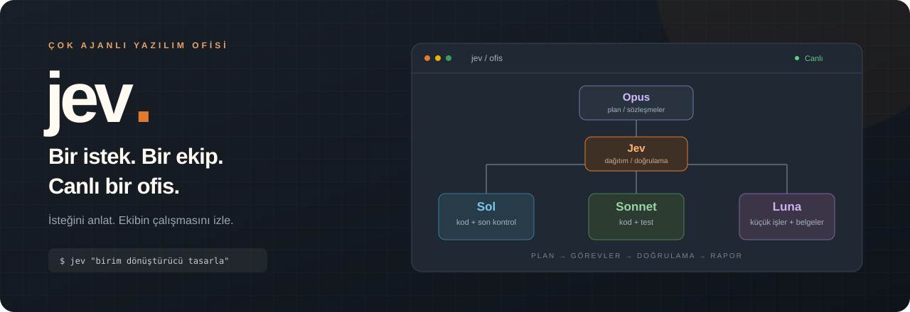
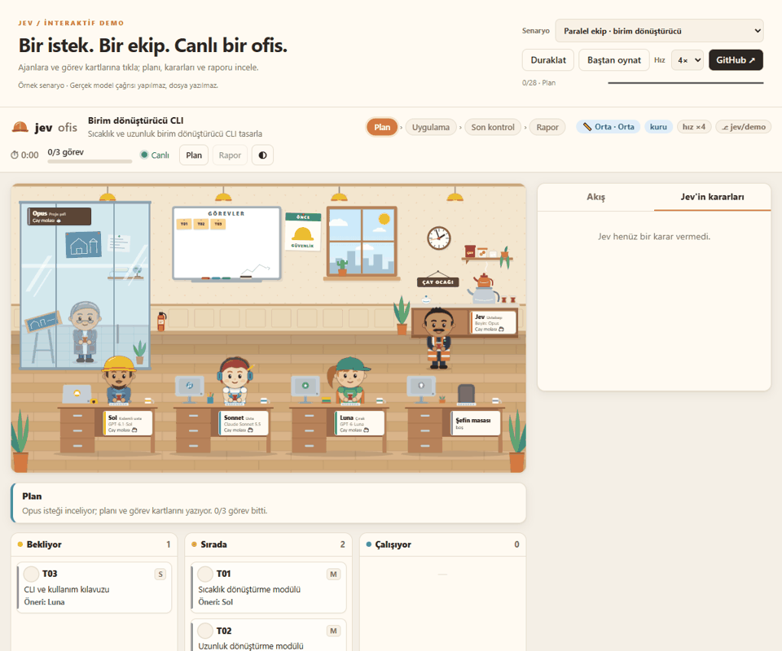
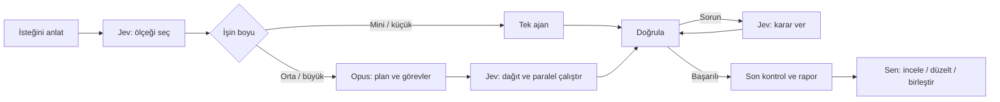

<div align="center">



**İsteğini anlat. Yapay zekâ ekibin planlasın, kodlasın, doğrulasın.**

[](https://nowackk-cp.github.io/jev/)
[](docs/kullanim.md)


</div>

<details>
<summary><b>🇬🇧 English summary</b></summary>

**Jev** is a Windows-first Python orchestrator that turns **Claude Code** and **Codex CLI** agents into a small software team. You describe a task in one sentence; Jev sizes the job, plans it into contract-based task cards, runs up to eight tasks in parallel in their own Git worktrees, verifies each result, decides whether to retry, reassign or split on failure, and hands you a final report. You can watch the team work in a live, animated office.

- No Python dependencies · resumable runs (`jev devam`) · never merges or pushes to your branch
- [Interactive demo](https://nowackk-cp.github.io/jev/): no install, login or API key needed

</details>


Jev, **Codex CLI** ve **Claude Code** üzerinden çalışan ajanları tek bir yazılım ekibine dönüştüren, Windows için geliştirilmiş bir Python orkestratörüdür. Bir cümleyle işe başlarsın; Jev işin ölçeğini seçer, görevleri dağıtır, sonuçları doğrular ve raporu sunar. Ekibin çalışmasını animasyonlu bir ofiste canlı izlersin.

```powershell
jev "Python için sıcaklık ve uzunluk birim dönüştürücü CLI tasarla"
```

## Ofise gir

[](https://nowackk-cp.github.io/jev/)

**[→ İnteraktif demoyu aç](https://nowackk-cp.github.io/jev/)** — kurulum, giriş veya API anahtarı gerekmez.

| Deneyim | Demoda ne göreceksin? |
| --- | --- |
| **Paralel ekip** | Sol ve Sonnet bağımsız modülleri yazarken Luna bağımlılıkların tamamlanmasını bekler. |
| **Hata ve yeniden deneme** | Doğrulama başarısız olur; Jev gerekçeli bir karar verir ve görev yeniden denenir. |
| **Mini iş** | Tek ajan, kısa akış: planlama töreni olmadan uygulama, kontrol ve rapor. |

Ajanlara ve görev kartlarına tıkla, **Plan** ve **Rapor** pencerelerini aç, **Jev'in kararları** sekmesine geç. Akışı duraklatabilir, hızlandırabilir, yeniden oynatabilir ve rapordan örnek bir düzeltme turu başlatabilirsin. Açık ve koyu temalar da hazır.

> Demo, **gerçek ofis arayüzünü örnek senaryolarla** çalıştırır. Model çağrısı yapmaz, kod üretmez ve bilgisayarına dosya yazmaz. Gerçek ajanlar ve doğrulama komutları yerel Jev kurulumunda çalışır.

## Neden Jev?

- **İşin boyuna göre ekip.** Mini ve küçük işlerde tek ajan; orta ve büyük işlerde plan, görev kartları ve paralel çalışma. Büyük işin planı onayını bekler.
- **Sözleşmeli görevler.** Her kartın hedefi, dosyaları, bağımlılıkları, kabul ölçütleri ve doğrulama komutları bellidir. Çakışan dosyalara dokunan işler sıraya girer.
- **Ayrı çalışma kopyaları.** Orta ve büyük işlerde en çok sekiz görev aynı anda kendi Git worktree'sinde çalışabilir.
- **Doğrulama ve izlenebilirlik.** Görev kontrolleri, commit'ler, karar gerekçeleri ve son rapor koşu kayıtlarında saklanır.
- **Sorunda karar, kesintide devam.** Jev yeniden deneme, başka ajana atama veya görevi bölme kararı verebilir; `jev devam` yarım kalan koşuyu sürdürür.
- **Son söz sende.** Son rapordan sonra akış durur. Düzeltme turunu sen başlatırsın; dalı birleştirmek ve yayımlamak sana kalır.

## Ekiple tanış

| | Rol | Görevi |
| --- | --- | --- |
| **Opus** | Proje şefi | Plan, sözleşmeler ve görev kartları; zor görevler ve kararlar. |
| **Jev** | Ustabaşı | Ölçek, dağıtım, doğrulama ve sorun kararları; mini/küçük işlerde rapor. |
| **Sol** | Kıdemli usta | Ana kodlama ve orta/büyük işlerde son kontrol. |
| **Sonnet** | Usta | Kodlama, test ve araştırma görevleri. |
| **Luna** | Çırak | Küçük görevler, belgeler ve ayarlar. |

Model adları ve görev tercihleri [`jev/varsayilan.toml`](jev/varsayilan.toml) içindeki varsayılanlardan gelir; kullanıcı ayarlarıyla değiştirilebilir. Jev, Codex ve Claude abonelik oturumlarını kullanır. TypeSafe Jev modeli kararlar için isteğe bağlıdır; anahtar yoksa kararları Opus, gerektiğinde Sol verir.

## Nasıl çalışır?



Çalışma ayrı bir `jev/<koşu-kimliği>` dalında yürür. Jev kendi görev dallarını koşu dalında birleştirir; **senin dalına merge, push veya rebase yapmaz**.

## Hızlı başlangıç

**Gerekenler:** Windows 10/11, Python 3.11+, Git ve hesaplarına giriş yapılmış [Codex CLI](https://github.com/openai/codex) ile [Claude Code](https://docs.claude.com/claude-code). Gerçek koşular CLI erişimini ve hesabındaki uygun modelleri gerektirir. Kuru koşu için model girişi gerekmez.

```powershell
git clone https://github.com/nowackk-cp/jev.git
cd jev

# Yerel, düzenlenebilir kurulum; Jev'in Python bağımlılığı yoktur.
py -m pip install -e .

# Bulunan CLI'ları ve ajan ayarlarını göster; model çağırmaz.
py -m jev ajanlar

# İlk tur: hazır senaryo, gerçek model çağrısı yok.
py -m jev --kuru --kuru-hiz 5 "Yapılacaklar listesi CLI tasarla"
```

Kuru koşu **yerelde örnek proje dosyaları üretir** ve gerçek ofisi açar. Tarayıcı demosu ise yalnızca görsel akışı oynatır. `jev` komutu PATH'teyse `py -m jev` yerine doğrudan `jev` kullanabilirsin. Kurulum betiği ve giriş adımları: [ayrıntılı kurulum kılavuzu](docs/kullanim.md#kurulum).

<details>
<summary><b>İlk gerçek işi başlat</b></summary>

CLI hesaplarına giriş yap, sonra:

```powershell
py -m jev "Python için sıcaklık ve uzunluk birim dönüştürücü CLI tasarla"

# Mevcut, değişiklikleri commit'lenmiş bir projede çalış:
py -m jev --proje "C:\projeler\uygulamam" "CSV dışa aktarma ekle"
```

TypeSafe anahtarı, model ayarları ve CLI keşfi: [kurulum kılavuzu](docs/kullanim.md#kurulum).

</details>

## Günlük komutlar

| Komut | Ne yapar? |
| --- | --- |
| `jev "isteğin"` | Yeni koşu başlatır. |
| `jev --kuru "isteğin"` | Hazır senaryoyla yerel ofisi dener. |
| `jev ajanlar` | Ajanları, CLI'ları, kota ve model ayarlarını gösterir. |
| `jev durum` | Koşunun durumunu gösterir. |
| `jev ofis` | Mevcut koşunun ofisini açar. |
| `jev devam` | Kesilen veya duraklayan koşuyu sürdürür. |
| `jev duzelt` | Rapordan sonra düzeltme turu başlatır. |

Bütün seçenekler: [komut kılavuzu](docs/kullanim.md#komutlar).

## Çalıştırmadan önce

**Kod yazan ajanlar tam yetkiyle çalışır:** komut çalıştırabilir, dosya yazıp silebilir ve paket kurabilir. Varsayılan ayarda guard kapalıdır (`[guvenlik] koruma = false`). Açıldığında da bir güvenlik sınırı oluşturmaz. İlk gerçek koşuyu ayrı bir kullanıcı hesabında veya sanal makinede dene; önemli projeleri yedekle ve birleştirmeden önce değişiklikleri incele. Ayrıntılar: [güvenlik ve koruma davranışı](docs/kullanim.md#güvenlik-uyarısı).

## Geliştirme ve belgeler

```powershell
# Uzun uçtan uca testleri atlayan hızlı kontrol:
$env:JEV_HIZLI = "1"
py -m unittest discover -s tests

# Tam test seti için JEV_HIZLI değişkenini kaldır.
Remove-Item Env:JEV_HIZLI -ErrorAction SilentlyContinue
py -m unittest discover -s tests

# Gerçek ofis varlıklarından tarayıcı demosunu yeniden üret:
py tools/demo/build.py
py -m http.server 8088 --directory docs
```

Demo yerelde `http://localhost:8088` adresinde açılır. GitHub Pages, `main` dalındaki `docs/` klasörünü yayımlar.

| Belge | İçerik |
| --- | --- |
| [Kullanım kılavuzu](docs/kullanim.md) | Kurulum, ölçekler, ayarlar, kotalar ve sorun giderme |
| [Mimari harita](AI_PROJECT_MAP.md) | Modüller, veri sözleşmeleri ve kod bağımlılıkları |
| [Sistem belirtimi](docs/jev-sistem-promptu.md) | Akış kuralları ve kabul ölçütleri |
| [Tasarım kararları](docs/tasarim.md) | Uygulama tercihleri ve modül haritası |
| [Demo geliştirme](tools/demo/README.md) | Tarayıcı senaryoları ve demo üretimi |

---

<div align="center">

**İsteğini anlat. Ofiste neler olduğunu izle. Sonucu incele.**

[Demoyu dene →](https://nowackk-cp.github.io/jev/)

</div>
